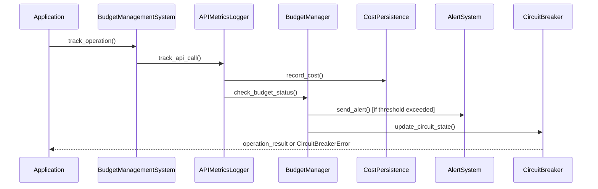

# API Cost Monitoring System - Developer Guide

## Table of Contents

1. [Introduction](#introduction)
2. [Architecture Overview](#architecture-overview)
3. [Core APIs](#core-apis)
4. [Integration Patterns](#integration-patterns)
5. [Extension Points](#extension-points)
6. [Testing Strategies](#testing-strategies)
7. [Performance Optimization](#performance-optimization)
8. [Security Implementation](#security-implementation)
9. [Debugging and Troubleshooting](#debugging-and-troubleshooting)
10. [Best Practices](#best-practices)

---

## Introduction

This developer guide provides comprehensive technical documentation for integrating with and extending the API Cost Monitoring System. It covers APIs, integration patterns, customization options, and best practices for production deployments.

### Prerequisites

- Python 3.8+ (recommended: 3.11+)
- Understanding of async/await patterns
- Familiarity with SQLite and database concepts
- Experience with REST APIs and webhook systems
- Knowledge of monitoring and observability concepts

---

## Architecture Overview

### Component Interaction Flow

```python
# High-level integration flow
from lightrag_integration import BudgetManagementFactory

# 1. Initialize system
system = BudgetManagementFactory.create_complete_system(config)

# 2. Track operations
with system.track_operation("llm_call") as tracker:
    # 3. Execute API call
    result = api_call()
    # 4. Update metrics
    tracker.set_tokens(prompt=100, completion=50)
    tracker.set_cost(0.01)

# 5. System automatically:
#    - Updates cost persistence
#    - Checks budget thresholds
#    - Triggers alerts if needed
#    - Updates circuit breaker state
#    - Records audit trail
```

### Data Flow Architecture



---

## Core APIs

### 1. Budget Management System API

#### System Initialization

```python
from lightrag_integration import BudgetManagementSystem, BudgetManagementConfig
from lightrag_integration.config import LightRAGConfig

# Method 1: Factory creation (Recommended)
system = BudgetManagementFactory.create_complete_system(
    lightrag_config=LightRAGConfig.get_config(),
    daily_budget_limit=50.0,
    monthly_budget_limit=1000.0
)

# Method 2: Manual component initialization
config = BudgetManagementConfig(
    daily_budget_limit=50.0,
    monthly_budget_limit=1000.0,
    enable_alerts=True,
    enable_real_time_monitoring=True
)

system = BudgetManagementSystem(
    lightrag_config=lightrag_config,
    budget_config=config
)
```

#### Operation Tracking

```python
# Context manager approach (Recommended)
async def your_api_function():
    with system.track_operation(
        operation_type="llm_call",
        model="gpt-4o-mini",
        research_category="metabolite_identification"
    ) as tracker:
        try:
            # Make API call
            response = await openai_client.chat.completions.create(
                model="gpt-4o-mini",
                messages=messages,
                max_tokens=500
            )
            
            # Update tracking metrics
            tracker.set_tokens(
                prompt=response.usage.prompt_tokens,
                completion=response.usage.completion_tokens
            )
            tracker.set_cost(calculate_cost(response.usage))
            tracker.set_response_details(
                response_time_ms=response_time * 1000,
                response_size=len(str(response))
            )
            
            return response
            
        except Exception as e:
            tracker.set_error(type(e).__name__, str(e))
            raise

# Manual tracking approach
def manual_tracking_example():
    operation_id = system.start_operation_tracking(
        operation_type="embedding_call",
        model="text-embedding-3-small"
    )
    
    try:
        # Your API call
        result = make_embedding_call()
        
        # Update metrics
        system.update_operation_metrics(
            operation_id=operation_id,
            tokens=1000,
            cost=0.001,
            success=True
        )
        
        return result
        
    except Exception as e:
        system.update_operation_metrics(
            operation_id=operation_id,
            success=False,
            error_type=type(e).__name__,
            error_message=str(e)
        )
        raise
    finally:
        system.complete_operation_tracking(operation_id)
```

### 2. Budget Manager API

```python
from lightrag_integration.budget_manager import BudgetManager, BudgetThreshold

# Initialize budget manager
budget_manager = BudgetManager(
    cost_persistence=cost_persistence,
    daily_budget_limit=50.0,
    monthly_budget_limit=1000.0,
    thresholds=BudgetThreshold(
        warning_percentage=75.0,
        critical_percentage=90.0,
        exceeded_percentage=100.0
    )
)

# Check budget status
status = budget_manager.check_budget_status(
    cost_amount=0.05,
    operation_type="llm_call",
    research_category=ResearchCategory.METABOLITE_IDENTIFICATION
)

print(f"Operation allowed: {status['operation_allowed']}")
print(f"Daily usage: {status['daily_status']['percentage_used']:.1f}%")

# Get comprehensive budget summary
summary = budget_manager.get_budget_summary()

# Update budget limits dynamically
budget_manager.update_budget_limits(
    daily_budget=75.0,
    monthly_budget=1500.0
)

# Analyze spending trends
trends = budget_manager.get_spending_trends(days=30)
print(f"Average daily cost: ${trends['average_daily_cost']:.4f}")
print(f"Trend direction: {trends['trend_direction']}")
```

### 3. API Metrics Logger API

```python
from lightrag_integration.api_metrics_logger import APIUsageMetricsLogger, APIMetric

# Initialize metrics logger
metrics_logger = APIUsageMetricsLogger(
    config=config,
    cost_persistence=cost_persistence,
    budget_manager=budget_manager
)

# Context manager tracking (Recommended)
with metrics_logger.track_api_call(
    operation_name="knowledge_extraction",
    model_name="gpt-4o",
    research_category="pathway_analysis"
) as tracker:
    # Make API call
    result = perform_knowledge_extraction()
    
    # Update metrics
    tracker.set_tokens(prompt=200, completion=150)
    tracker.set_cost(0.02)
    tracker.set_response_details(
        response_time_ms=1500,
        request_size=2048,
        response_size=4096
    )

# Log batch operations
metrics_logger.log_batch_operation(
    operation_name="document_processing",
    batch_size=50,
    total_tokens=10000,
    total_cost=0.50,
    processing_time_ms=30000,
    success_count=48,
    error_count=2,
    research_category="literature_search"
)

# Get performance summary
performance = metrics_logger.get_performance_summary()
print(f"Current hour calls: {performance['current_hour']['total_calls']}")
print(f"Average response time: {performance['current_hour']['avg_response_time_ms']:.1f}ms")
```

### 4. Alert System API

```python
from lightrag_integration.alert_system import (
    AlertNotificationSystem, AlertConfig, EmailAlertConfig, SlackAlertConfig
)

# Configure alert system
alert_config = AlertConfig(
    email_config=EmailAlertConfig(
        smtp_server="smtp.gmail.com",
        smtp_port=587,
        username="alerts@company.com",
        password=os.getenv("EMAIL_PASSWORD"),
        sender_email="alerts@company.com",
        recipient_emails=["admin@company.com", "research@company.com"]
    ),
    slack_config=SlackAlertConfig(
        webhook_url=os.getenv("SLACK_WEBHOOK_URL"),
        channel="#budget-alerts",
        username="Budget Monitor"
    ),
    enabled_channels={AlertChannel.EMAIL, AlertChannel.SLACK, AlertChannel.LOGGING}
)

alert_system = AlertNotificationSystem(alert_config)

# Send manual alert
from lightrag_integration.budget_manager import BudgetAlert, AlertLevel

alert = BudgetAlert(
    timestamp=time.time(),
    alert_level=AlertLevel.WARNING,
    period_type="daily",
    period_key="2025-08-06",
    current_cost=37.50,
    budget_limit=50.0,
    percentage_used=75.0,
    threshold_percentage=75.0,
    message="Daily budget warning: 75% of budget used"
)

delivery_result = alert_system.send_alert(alert)

# Test alert channels
test_results = alert_system.test_channels()
```

### 5. Circuit Breaker API

```python
from lightrag_integration.cost_based_circuit_breaker import (
    CostCircuitBreakerManager, CostThresholdRule, CostThresholdType
)

# Initialize circuit breaker manager
cb_manager = CostCircuitBreakerManager(
    budget_manager=budget_manager,
    cost_persistence=cost_persistence
)

# Create custom threshold rules
custom_rules = [
    CostThresholdRule(
        rule_id="high_cost_llm_protection",
        threshold_type=CostThresholdType.OPERATION_COST,
        threshold_value=0.50,  # $0.50 per operation
        action="throttle",
        throttle_factor=0.5,
        applies_to_operations=["llm_call"]
    ),
    CostThresholdRule(
        rule_id="daily_budget_protection",
        threshold_type=CostThresholdType.PERCENTAGE_DAILY,
        threshold_value=95.0,  # 95% of daily budget
        action="block",
        cooldown_minutes=5.0
    )
]

# Create circuit breaker with custom rules
circuit_breaker = cb_manager.create_circuit_breaker(
    name="llm_operations",
    threshold_rules=custom_rules
)

# Use circuit breaker protection
def protected_api_call():
    return cb_manager.execute_with_protection(
        breaker_name="llm_operations",
        operation_callable=your_api_function,
        operation_type="llm_call",
        model_name="gpt-4o",
        estimated_tokens={"input": 100, "output": 50}
    )

try:
    result = protected_api_call()
except CircuitBreakerError as e:
    print(f"Operation blocked by circuit breaker: {e}")
```

### 6. Dashboard API

```python
from lightrag_integration.budget_dashboard import BudgetDashboardAPI

# Initialize dashboard API
dashboard = BudgetDashboardAPI(
    budget_manager=budget_manager,
    api_metrics_logger=metrics_logger,
    cost_persistence=cost_persistence,
    alert_system=alert_system,
    real_time_monitor=monitor,
    circuit_breaker_manager=cb_manager
)

# Get dashboard overview
overview = dashboard.get_dashboard_overview()
if overview['status'] == 'success':
    metrics = overview['data']['metrics']
    print(f"Budget health: {metrics['budget_health_status']}")
    print(f"Daily usage: {metrics['daily_percentage']:.1f}%")

# Get cost analytics
analytics = dashboard.get_cost_analytics(
    time_range="last_7_days",
    granularity="daily",
    include_categories=True
)

# Get alert dashboard
alert_data = dashboard.get_alert_dashboard(
    time_range="last_24_hours",
    include_escalation=True
)

# Generate cost report
report = dashboard.get_cost_report(
    start_date="2025-08-01T00:00:00Z",
    end_date="2025-08-07T23:59:59Z",
    format="json"
)
```

---

## Integration Patterns

### 1. Decorator Pattern

```python
from functools import wraps
from lightrag_integration import get_budget_system

def track_api_cost(operation_type: str, model: str = None, category: str = None):
    """Decorator for automatic API cost tracking."""
    def decorator(func):
        @wraps(func)
        async def async_wrapper(*args, **kwargs):
            system = get_budget_system()
            with system.track_operation(
                operation_type=operation_type,
                model=model,
                research_category=category
            ) as tracker:
                try:
                    result = await func(*args, **kwargs)
                    # Extract metrics from result if available
                    if hasattr(result, 'usage'):
                        tracker.set_tokens(
                            prompt=result.usage.prompt_tokens,
                            completion=result.usage.completion_tokens
                        )
                        tracker.set_cost(calculate_cost(result.usage, model))
                    return result
                except Exception as e:
                    tracker.set_error(type(e).__name__, str(e))
                    raise
        
        @wraps(func)
        def sync_wrapper(*args, **kwargs):
            system = get_budget_system()
            with system.track_operation(
                operation_type=operation_type,
                model=model,
                research_category=category
            ) as tracker:
                try:
                    result = func(*args, **kwargs)
                    # Extract metrics if available
                    if hasattr(result, 'usage'):
                        tracker.set_tokens(
                            prompt=result.usage.prompt_tokens,
                            completion=result.usage.completion_tokens
                        )
                        tracker.set_cost(calculate_cost(result.usage, model))
                    return result
                except Exception as e:
                    tracker.set_error(type(e).__name__, str(e))
                    raise
        
        return async_wrapper if asyncio.iscoroutinefunction(func) else sync_wrapper
    return decorator

# Usage example
@track_api_cost("llm_call", "gpt-4o-mini", "metabolite_identification")
async def analyze_metabolite(compound_data):
    response = await openai.chat.completions.create(
        model="gpt-4o-mini",
        messages=[{"role": "user", "content": f"Analyze this compound: {compound_data}"}]
    )
    return response
```

### 2. Middleware Pattern

```python
class BudgetTrackingMiddleware:
    """Middleware for automatic budget tracking in web frameworks."""
    
    def __init__(self, app, budget_system):
        self.app = app
        self.budget_system = budget_system
    
    async def __call__(self, scope, receive, send):
        if scope["type"] != "http":
            await self.app(scope, receive, send)
            return
        
        # Extract operation info from request
        path = scope["path"]
        operation_type = self._extract_operation_type(path)
        
        with self.budget_system.track_operation(operation_type) as tracker:
            try:
                # Process request
                await self.app(scope, receive, send)
                # Metrics would be updated by the actual API handlers
            except Exception as e:
                tracker.set_error(type(e).__name__, str(e))
                raise
    
    def _extract_operation_type(self, path: str) -> str:
        """Extract operation type from request path."""
        if "/api/llm/" in path:
            return "llm_call"
        elif "/api/embedding/" in path:
            return "embedding_call"
        else:
            return "api_request"

# FastAPI integration example
from fastapi import FastAPI, Request
from fastapi.middleware.base import BaseHTTPMiddleware

class FastAPIBudgetMiddleware(BaseHTTPMiddleware):
    def __init__(self, app: FastAPI, budget_system):
        super().__init__(app)
        self.budget_system = budget_system
    
    async def dispatch(self, request: Request, call_next):
        operation_type = self._get_operation_type(request.url.path)
        
        with self.budget_system.track_operation(operation_type) as tracker:
            try:
                response = await call_next(request)
                # Update metrics from response headers if available
                if "X-Token-Usage" in response.headers:
                    tokens = json.loads(response.headers["X-Token-Usage"])
                    tracker.set_tokens(**tokens)
                if "X-API-Cost" in response.headers:
                    tracker.set_cost(float(response.headers["X-API-Cost"]))
                return response
            except Exception as e:
                tracker.set_error(type(e).__name__, str(e))
                raise
```

### 3. Context Manager Pattern

```python
from contextlib import contextmanager
from lightrag_integration import BudgetManagementSystem

@contextmanager
def budget_protected_operation(
    operation_type: str,
    estimated_cost: float = None,
    circuit_breaker: str = "default"
):
    """Context manager for budget-protected operations."""
    system = BudgetManagementSystem.get_instance()
    
    # Pre-flight budget check
    if estimated_cost:
        budget_status = system.budget_manager.check_budget_status(
            cost_amount=estimated_cost,
            operation_type=operation_type
        )
        if not budget_status['operation_allowed']:
            raise BudgetExceededException("Operation would exceed budget limits")
    
    # Circuit breaker check
    cb_status = system.circuit_breaker_manager.get_circuit_breaker(circuit_breaker)
    if cb_status and cb_status.state == "open":
        raise CircuitBreakerError(f"Circuit breaker '{circuit_breaker}' is open")
    
    operation_id = None
    try:
        # Start tracking
        operation_id = system.start_operation_tracking(operation_type)
        yield operation_id
        
    except Exception as e:
        # Record failure
        if operation_id:
            system.record_operation_failure(operation_id, str(e))
        raise
    finally:
        # Cleanup
        if operation_id:
            system.complete_operation_tracking(operation_id)

# Usage
with budget_protected_operation("llm_call", estimated_cost=0.05) as op_id:
    result = expensive_ai_operation()
    system.update_operation_cost(op_id, actual_cost=0.03)
```

---

## Extension Points

### 1. Custom Alert Channels

```python
from lightrag_integration.alert_system import AlertChannel
from lightrag_integration.budget_manager import BudgetAlert

class CustomAlertChannel:
    """Custom alert channel implementation."""
    
    def __init__(self, config: Dict[str, Any]):
        self.config = config
        self.channel_name = "custom_channel"
    
    def send_alert(self, alert: BudgetAlert) -> Dict[str, Any]:
        """Send alert through custom channel."""
        try:
            # Implement your custom alert logic
            self._send_to_custom_service(alert)
            
            return {
                'success': True,
                'channel': self.channel_name,
                'timestamp': time.time()
            }
        except Exception as e:
            return {
                'success': False,
                'channel': self.channel_name,
                'error': str(e),
                'timestamp': time.time()
            }
    
    def _send_to_custom_service(self, alert: BudgetAlert):
        """Implement custom service integration."""
        # Example: Send to Microsoft Teams, Discord, PagerDuty, etc.
        pass

# Register custom channel
def register_custom_channel():
    from lightrag_integration.alert_system import AlertNotificationSystem
    
    # Extend alert system with custom channel
    original_send_to_channel = AlertNotificationSystem._send_to_channel
    
    def enhanced_send_to_channel(self, alert, channel):
        if channel.value == "custom_channel":
            custom_channel = CustomAlertChannel(self.config.custom_config)
            return custom_channel.send_alert(alert)
        return original_send_to_channel(self, alert, channel)
    
    AlertNotificationSystem._send_to_channel = enhanced_send_to_channel
```

### 2. Custom Research Categories

```python
from enum import Enum
from lightrag_integration.cost_persistence import ResearchCategory

class CustomResearchCategory(Enum):
    """Extended research categories for specialized domains."""
    
    # Existing categories from base system
    METABOLITE_IDENTIFICATION = "metabolite_identification"
    PATHWAY_ANALYSIS = "pathway_analysis"
    
    # Custom categories
    DRUG_INTERACTION_ANALYSIS = "drug_interaction_analysis"
    BIOMARKER_VALIDATION = "biomarker_validation"
    CLINICAL_TRIAL_ANALYSIS = "clinical_trial_analysis"
    REGULATORY_COMPLIANCE = "regulatory_compliance"

# Custom categorizer
class AdvancedResearchCategorizer:
    """Advanced research categorization with ML-based classification."""
    
    def __init__(self):
        # Initialize ML model for categorization
        self.model = self._load_categorization_model()
    
    def categorize_query(self, query_text: str, context: Dict[str, Any] = None) -> CustomResearchCategory:
        """Use ML to categorize research queries."""
        # Implement ML-based categorization
        features = self._extract_features(query_text, context)
        category_prediction = self.model.predict(features)
        
        return CustomResearchCategory(category_prediction)
    
    def _load_categorization_model(self):
        """Load pre-trained categorization model."""
        # Implement model loading
        pass
    
    def _extract_features(self, query_text: str, context: Dict[str, Any]) -> Dict[str, Any]:
        """Extract features for categorization."""
        return {
            'query_length': len(query_text),
            'keyword_matches': self._extract_keywords(query_text),
            'context_features': context or {}
        }
```

### 3. Custom Cost Models

```python
from lightrag_integration.cost_based_circuit_breaker import OperationCostEstimator

class AdvancedCostEstimator(OperationCostEstimator):
    """Enhanced cost estimation with dynamic pricing and usage patterns."""
    
    def __init__(self, cost_persistence, pricing_api_url=None):
        super().__init__(cost_persistence)
        self.pricing_api_url = pricing_api_url
        self._pricing_cache = {}
        self._cache_expiry = 3600  # 1 hour
    
    def estimate_operation_cost(self, 
                              operation_type: str,
                              model_name: str = None,
                              estimated_tokens: Dict[str, int] = None,
                              **kwargs) -> Dict[str, Any]:
        """Enhanced cost estimation with dynamic pricing."""
        
        # Get base estimate
        base_estimate = super().estimate_operation_cost(
            operation_type, model_name, estimated_tokens, **kwargs
        )
        
        # Apply dynamic pricing adjustments
        if self.pricing_api_url and model_name:
            dynamic_rate = self._get_dynamic_pricing(model_name)
            if dynamic_rate:
                base_estimate['estimated_cost'] *= dynamic_rate['multiplier']
                base_estimate['pricing_source'] = 'dynamic'
                base_estimate['pricing_timestamp'] = dynamic_rate['timestamp']
        
        # Apply usage pattern adjustments
        usage_multiplier = self._get_usage_pattern_multiplier(operation_type)
        base_estimate['estimated_cost'] *= usage_multiplier
        
        return base_estimate
    
    def _get_dynamic_pricing(self, model_name: str) -> Optional[Dict[str, Any]]:
        """Fetch dynamic pricing from external API."""
        cache_key = f"pricing_{model_name}"
        cached_data = self._pricing_cache.get(cache_key)
        
        if cached_data and (time.time() - cached_data['timestamp']) < self._cache_expiry:
            return cached_data
        
        try:
            # Fetch from pricing API
            response = requests.get(f"{self.pricing_api_url}/pricing/{model_name}")
            if response.status_code == 200:
                pricing_data = response.json()
                pricing_data['timestamp'] = time.time()
                self._pricing_cache[cache_key] = pricing_data
                return pricing_data
        except Exception:
            pass
        
        return None
    
    def _get_usage_pattern_multiplier(self, operation_type: str) -> float:
        """Calculate multiplier based on usage patterns."""
        # Implement logic based on time of day, load, etc.
        current_hour = datetime.now().hour
        
        # Example: Higher costs during peak hours
        if 9 <= current_hour <= 17:  # Business hours
            return 1.2
        elif 22 <= current_hour <= 6:  # Late night/early morning
            return 0.8
        else:
            return 1.0
```

---

## Testing Strategies

### 1. Unit Testing

```python
import pytest
from unittest.mock import Mock, patch
from lightrag_integration.budget_manager import BudgetManager, BudgetThreshold

class TestBudgetManager:
    """Comprehensive unit tests for BudgetManager."""
    
    @pytest.fixture
    def mock_cost_persistence(self):
        """Mock cost persistence for testing."""
        mock = Mock()
        mock.get_daily_budget_status.return_value = {
            'total_cost': 25.0,
            'percentage_used': 50.0,
            'budget_limit': 50.0,
            'over_budget': False
        }
        return mock
    
    @pytest.fixture
    def budget_manager(self, mock_cost_persistence):
        """Create budget manager instance for testing."""
        return BudgetManager(
            cost_persistence=mock_cost_persistence,
            daily_budget_limit=50.0,
            monthly_budget_limit=1000.0,
            thresholds=BudgetThreshold()
        )
    
    def test_budget_status_within_limits(self, budget_manager):
        """Test budget status when within limits."""
        status = budget_manager.check_budget_status(
            cost_amount=5.0,
            operation_type="llm_call"
        )
        
        assert status['operation_allowed'] is True
        assert status['budget_health'] in ['healthy', 'warning']
    
    def test_budget_threshold_alerts(self, budget_manager, mock_cost_persistence):
        """Test alert generation when thresholds are exceeded."""
        # Mock high usage
        mock_cost_persistence.get_daily_budget_status.return_value = {
            'total_cost': 40.0,
            'percentage_used': 80.0,
            'budget_limit': 50.0,
            'over_budget': False
        }
        
        status = budget_manager.check_budget_status(
            cost_amount=5.0,
            operation_type="llm_call"
        )
        
        assert len(status['alerts_generated']) > 0
        assert status['alerts_generated'][0].alert_level.value in ['warning', 'critical']
    
    @pytest.mark.asyncio
    async def test_concurrent_budget_checks(self, budget_manager):
        """Test thread safety of concurrent budget checks."""
        import asyncio
        import threading
        
        results = []
        
        def check_budget():
            status = budget_manager.check_budget_status(1.0, "test")
            results.append(status['operation_allowed'])
        
        # Run multiple concurrent checks
        threads = [threading.Thread(target=check_budget) for _ in range(10)]
        for t in threads:
            t.start()
        for t in threads:
            t.join()
        
        # All should succeed (assuming budget allows)
        assert all(results)
```

### 2. Integration Testing

```python
import pytest
import tempfile
from pathlib import Path
from lightrag_integration import BudgetManagementFactory
from lightrag_integration.config import LightRAGConfig

class TestBudgetSystemIntegration:
    """Integration tests for complete budget system."""
    
    @pytest.fixture
    def temp_config(self):
        """Create temporary configuration for testing."""
        with tempfile.TemporaryDirectory() as temp_dir:
            config = LightRAGConfig(
                api_key="test-key-for-testing",
                working_dir=Path(temp_dir),
                daily_budget_limit=10.0,
                monthly_budget_limit=100.0,
                enable_cost_tracking=True,
                cost_db_path=Path(temp_dir) / "test_costs.db"
            )
            yield config
    
    def test_end_to_end_operation_tracking(self, temp_config):
        """Test complete operation tracking flow."""
        # Initialize system
        system = BudgetManagementFactory.create_complete_system(
            lightrag_config=temp_config,
            daily_budget_limit=10.0
        )
        
        try:
            system.start()
            
            # Track operation
            with system.track_operation("llm_call", model="gpt-4o-mini") as tracker:
                # Simulate API call
                tracker.set_tokens(prompt=100, completion=50)
                tracker.set_cost(0.05)
            
            # Verify data persistence
            summary = system.budget_manager.get_budget_summary()
            assert summary['daily_budget']['total_cost'] == 0.05
            
            # Verify metrics
            performance = system.api_metrics_logger.get_performance_summary()
            assert performance['current_day']['total_calls'] == 1
            
        finally:
            system.shutdown()
    
    def test_budget_threshold_integration(self, temp_config):
        """Test budget threshold and alert integration."""
        system = BudgetManagementFactory.create_complete_system(
            lightrag_config=temp_config,
            daily_budget_limit=1.0  # Low limit to trigger alerts
        )
        
        alert_received = []
        
        def alert_callback(alert):
            alert_received.append(alert)
        
        system.budget_manager.set_alert_callback(alert_callback)
        
        try:
            system.start()
            
            # Perform operations to exceed threshold
            for i in range(3):
                with system.track_operation("test_call") as tracker:
                    tracker.set_cost(0.30)  # 30% each
            
            # Check if alert was triggered
            assert len(alert_received) > 0
            assert alert_received[0].alert_level.value in ['warning', 'critical', 'exceeded']
            
        finally:
            system.shutdown()
```

### 3. Performance Testing

```python
import pytest
import time
import threading
import statistics
from concurrent.futures import ThreadPoolExecutor

class TestPerformance:
    """Performance and load testing."""
    
    def test_tracking_throughput(self, budget_system):
        """Test operation tracking throughput."""
        num_operations = 1000
        start_time = time.time()
        
        def track_operation():
            with budget_system.track_operation("perf_test") as tracker:
                tracker.set_tokens(prompt=10, completion=5)
                tracker.set_cost(0.001)
        
        # Run operations
        with ThreadPoolExecutor(max_workers=10) as executor:
            futures = [executor.submit(track_operation) for _ in range(num_operations)]
            for future in futures:
                future.result()
        
        duration = time.time() - start_time
        throughput = num_operations / duration
        
        # Should handle at least 100 ops/second
        assert throughput > 100, f"Throughput too low: {throughput:.1f} ops/sec"
    
    def test_memory_usage_stability(self, budget_system):
        """Test memory usage under load."""
        import psutil
        import gc
        
        process = psutil.Process()
        initial_memory = process.memory_info().rss
        
        # Perform many operations
        for i in range(10000):
            with budget_system.track_operation(f"test_{i}") as tracker:
                tracker.set_cost(0.001)
            
            if i % 1000 == 0:
                gc.collect()  # Force garbage collection
        
        final_memory = process.memory_info().rss
        memory_growth = final_memory - initial_memory
        
        # Memory growth should be reasonable (< 100MB)
        assert memory_growth < 100 * 1024 * 1024, f"Excessive memory growth: {memory_growth / 1024 / 1024:.1f}MB"
    
    def test_database_performance(self, budget_system):
        """Test database operation performance."""
        latencies = []
        
        for i in range(100):
            start = time.time()
            
            # Record cost operation
            budget_system.cost_persistence.record_cost(
                cost_usd=0.001,
                operation_type="perf_test",
                model_name="test-model",
                token_usage={'prompt_tokens': 10, 'completion_tokens': 5}
            )
            
            latencies.append((time.time() - start) * 1000)  # Convert to ms
        
        avg_latency = statistics.mean(latencies)
        p95_latency = statistics.quantiles(latencies, n=20)[18]  # 95th percentile
        
        # Database operations should be fast
        assert avg_latency < 10, f"Average DB latency too high: {avg_latency:.1f}ms"
        assert p95_latency < 50, f"P95 DB latency too high: {p95_latency:.1f}ms"
```

---

## Performance Optimization

### 1. Database Optimization

```python
from lightrag_integration.cost_persistence import CostDatabase

class OptimizedCostDatabase(CostDatabase):
    """Optimized database with connection pooling and batch operations."""
    
    def __init__(self, db_path, pool_size=5):
        super().__init__(db_path)
        self._connection_pool = self._create_connection_pool(pool_size)
        self._batch_buffer = []
        self._batch_size = 100
        self._batch_lock = threading.Lock()
    
    def _create_connection_pool(self, pool_size):
        """Create connection pool for better concurrency."""
        import queue
        
        pool = queue.Queue(maxsize=pool_size)
        for _ in range(pool_size):
            conn = sqlite3.connect(str(self.db_path))
            conn.row_factory = sqlite3.Row
            pool.put(conn)
        return pool
    
    @contextmanager
    def _get_pooled_connection(self):
        """Get connection from pool."""
        conn = self._connection_pool.get()
        try:
            yield conn
        finally:
            self._connection_pool.put(conn)
    
    def batch_insert_cost_records(self, records: List[CostRecord]) -> List[int]:
        """Batch insert for better performance."""
        with self._get_pooled_connection() as conn:
            cursor = conn.cursor()
            
            # Prepare batch insert
            placeholders = ', '.join(['?'] * len(records[0].to_dict()))
            columns = ', '.join(records[0].to_dict().keys())
            
            query = f"INSERT INTO cost_records ({columns}) VALUES ({placeholders})"
            
            # Execute batch
            data = [list(record.to_dict().values()) for record in records]
            cursor.executemany(query, data)
            
            # Get inserted IDs
            first_id = cursor.lastrowid - len(records) + 1
            conn.commit()
            
            return list(range(first_id, first_id + len(records)))
    
    def add_to_batch(self, record: CostRecord):
        """Add record to batch buffer."""
        with self._batch_lock:
            self._batch_buffer.append(record)
            
            if len(self._batch_buffer) >= self._batch_size:
                # Flush batch
                records_to_insert = self._batch_buffer.copy()
                self._batch_buffer.clear()
                
                # Insert in background thread
                threading.Thread(
                    target=self.batch_insert_cost_records,
                    args=(records_to_insert,)
                ).start()
```

### 2. Caching Strategies

```python
from functools import lru_cache
import time

class CachedBudgetManager(BudgetManager):
    """Budget manager with intelligent caching."""
    
    def __init__(self, *args, **kwargs):
        super().__init__(*args, **kwargs)
        self._cache = {}
        self._cache_ttl = 30  # 30 seconds
    
    @lru_cache(maxsize=1000)
    def _get_cached_budget_status(self, date_key: str, cache_time: int) -> Dict[str, Any]:
        """Cached budget status with TTL."""
        # cache_time is included to invalidate cache based on time
        return self.cost_persistence.get_daily_budget_status(
            datetime.fromisoformat(date_key), 
            self.daily_budget_limit
        )
    
    def check_budget_status(self, cost_amount: float, operation_type: str, **kwargs):
        """Optimized budget status check with caching."""
        now = datetime.now(timezone.utc)
        date_key = now.strftime('%Y-%m-%d')
        cache_time = int(time.time() // self._cache_ttl)
        
        # Get cached status
        try:
            cached_status = self._get_cached_budget_status(date_key, cache_time)
            
            # Apply projected cost
            projected_status = cached_status.copy()
            projected_status['projected_cost'] = cached_status['total_cost'] + cost_amount
            projected_status['projected_percentage'] = (
                projected_status['projected_cost'] / self.daily_budget_limit * 100
                if self.daily_budget_limit > 0 else 0
            )
            
            return {
                'operation_allowed': not projected_status.get('over_budget', False),
                'daily_status': projected_status,
                'cached': True
            }
            
        except Exception:
            # Fallback to uncached operation
            return super().check_budget_status(cost_amount, operation_type, **kwargs)
```

### 3. Async Operations

```python
import asyncio
from typing import AsyncContextManager

class AsyncBudgetSystem:
    """Async-aware budget system for high-throughput applications."""
    
    def __init__(self, budget_system):
        self.budget_system = budget_system
        self._operation_queue = asyncio.Queue(maxsize=1000)
        self._processing_task = None
    
    async def start_async_processing(self):
        """Start background processing of operations."""
        self._processing_task = asyncio.create_task(self._process_operations())
    
    async def stop_async_processing(self):
        """Stop background processing."""
        if self._processing_task:
            self._processing_task.cancel()
            try:
                await self._processing_task
            except asyncio.CancelledError:
                pass
    
    async def _process_operations(self):
        """Background task to process operations."""
        while True:
            try:
                operation_data = await self._operation_queue.get()
                
                # Process operation in thread pool
                loop = asyncio.get_event_loop()
                await loop.run_in_executor(
                    None, 
                    self._process_single_operation, 
                    operation_data
                )
                
                self._operation_queue.task_done()
                
            except asyncio.CancelledError:
                break
            except Exception as e:
                # Log error and continue processing
                logger.error(f"Error processing operation: {e}")
    
    def _process_single_operation(self, operation_data):
        """Process single operation synchronously."""
        with self.budget_system.track_operation(**operation_data['params']) as tracker:
            tracker.set_tokens(**operation_data['tokens'])
            tracker.set_cost(operation_data['cost'])
    
    @asynccontextmanager
    async def track_async_operation(self, **kwargs) -> AsyncContextManager:
        """Async context manager for operation tracking."""
        operation_data = {
            'params': kwargs,
            'tokens': {},
            'cost': 0.0,
            'completed': False
        }
        
        class AsyncTracker:
            def __init__(self, data, queue):
                self.data = data
                self.queue = queue
            
            def set_tokens(self, **tokens):
                self.data['tokens'] = tokens
            
            def set_cost(self, cost):
                self.data['cost'] = cost
            
            async def complete(self):
                if not self.data['completed']:
                    await self.queue.put(self.data)
                    self.data['completed'] = True
        
        tracker = AsyncTracker(operation_data, self._operation_queue)
        
        try:
            yield tracker
        finally:
            await tracker.complete()

# Usage example
async def async_api_call():
    async_system = AsyncBudgetSystem(budget_system)
    await async_system.start_async_processing()
    
    try:
        async with async_system.track_async_operation(
            operation_type="llm_call",
            model="gpt-4o-mini"
        ) as tracker:
            # Make async API call
            result = await openai_async_client.chat.completions.create(...)
            tracker.set_tokens(prompt=100, completion=50)
            tracker.set_cost(0.01)
            return result
    finally:
        await async_system.stop_async_processing()
```

---

## Security Implementation

### 1. API Key Management

```python
import os
import base64
from cryptography.fernet import Fernet
from cryptography.hazmat.primitives import hashes
from cryptography.hazmat.primitives.kdf.pbkdf2 import PBKDF2HMAC

class SecureKeyManager:
    """Secure API key management with encryption."""
    
    def __init__(self, password: str = None):
        self.password = password or os.getenv("BUDGET_SYSTEM_PASSWORD")
        if not self.password:
            raise ValueError("Password required for key encryption")
        
        self.fernet = self._create_cipher()
    
    def _create_cipher(self) -> Fernet:
        """Create encryption cipher from password."""
        password_bytes = self.password.encode()
        salt = b"budget_system_salt"  # In production, use random salt
        
        kdf = PBKDF2HMAC(
            algorithm=hashes.SHA256(),
            length=32,
            salt=salt,
            iterations=100000,
        )
        
        key = base64.urlsafe_b64encode(kdf.derive(password_bytes))
        return Fernet(key)
    
    def encrypt_api_key(self, api_key: str) -> str:
        """Encrypt API key for storage."""
        return self.fernet.encrypt(api_key.encode()).decode()
    
    def decrypt_api_key(self, encrypted_key: str) -> str:
        """Decrypt API key for use."""
        return self.fernet.decrypt(encrypted_key.encode()).decode()
    
    def store_encrypted_key(self, key_name: str, api_key: str, storage_path: str):
        """Store encrypted API key to file."""
        encrypted_key = self.encrypt_api_key(api_key)
        with open(storage_path, 'w') as f:
            json.dump({key_name: encrypted_key}, f)
    
    def load_encrypted_key(self, key_name: str, storage_path: str) -> str:
        """Load and decrypt API key from file."""
        with open(storage_path, 'r') as f:
            data = json.load(f)
        return self.decrypt_api_key(data[key_name])

# Integration with config system
class SecureLightRAGConfig(LightRAGConfig):
    """Enhanced config with secure key management."""
    
    def __init__(self, *args, **kwargs):
        # Load encrypted API key if available
        key_manager = SecureKeyManager()
        if not kwargs.get('api_key') and os.path.exists('.encrypted_keys.json'):
            try:
                kwargs['api_key'] = key_manager.load_encrypted_key(
                    'openai_api_key', 
                    '.encrypted_keys.json'
                )
            except Exception:
                pass  # Fall back to environment variable
        
        super().__init__(*args, **kwargs)
```

### 2. Audit and Compliance

```python
import hashlib
import hmac
from datetime import datetime, timezone

class ComplianceAuditTrail(AuditTrail):
    """Enhanced audit trail with compliance features."""
    
    def __init__(self, *args, **kwargs):
        super().__init__(*args, **kwargs)
        self.integrity_key = os.getenv("AUDIT_INTEGRITY_KEY")
        if not self.integrity_key:
            self.integrity_key = self._generate_integrity_key()
    
    def _generate_integrity_key(self) -> str:
        """Generate integrity verification key."""
        return base64.b64encode(os.urandom(32)).decode()
    
    def _calculate_record_hash(self, record_data: Dict[str, Any]) -> str:
        """Calculate tamper-proof hash for audit record."""
        # Serialize record data consistently
        serialized = json.dumps(record_data, sort_keys=True)
        
        # Create HMAC signature
        signature = hmac.new(
            self.integrity_key.encode(),
            serialized.encode(),
            hashlib.sha256
        ).hexdigest()
        
        return signature
    
    def record_event(self, 
                    event_type: str, 
                    event_data: Dict[str, Any],
                    user_id: str = None,
                    session_id: str = None,
                    compliance_level: str = "standard"):
        """Record audit event with integrity verification."""
        
        # Create audit record
        audit_record = {
            'timestamp': time.time(),
            'event_type': event_type,
            'event_data': event_data,
            'user_id': user_id,
            'session_id': session_id,
            'compliance_level': compliance_level,
            'system_info': {
                'hostname': socket.gethostname(),
                'process_id': os.getpid(),
                'python_version': sys.version
            }
        }
        
        # Add integrity hash
        audit_record['integrity_hash'] = self._calculate_record_hash(audit_record)
        
        # Store in database with additional compliance metadata
        super().record_event(
            event_type=f"compliance_{event_type}",
            event_data=audit_record,
            user_id=user_id,
            session_id=session_id
        )
    
    def verify_record_integrity(self, record_id: int) -> bool:
        """Verify integrity of audit record."""
        try:
            record = self.get_audit_record(record_id)
            if not record:
                return False
            
            stored_hash = record.pop('integrity_hash', None)
            if not stored_hash:
                return False
            
            calculated_hash = self._calculate_record_hash(record)
            return hmac.compare_digest(stored_hash, calculated_hash)
            
        except Exception:
            return False
    
    def generate_compliance_report(self, 
                                 start_date: datetime, 
                                 end_date: datetime) -> Dict[str, Any]:
        """Generate compliance report for audit purposes."""
        
        # Get all audit records in time range
        records = self.get_audit_records_by_date_range(start_date, end_date)
        
        # Analyze compliance
        compliance_summary = {
            'report_period': {
                'start': start_date.isoformat(),
                'end': end_date.isoformat()
            },
            'total_events': len(records),
            'events_by_type': Counter(r['event_type'] for r in records),
            'compliance_levels': Counter(r.get('compliance_level', 'unknown') for r in records),
            'integrity_verification': {
                'total_checked': 0,
                'verified': 0,
                'failed': 0
            },
            'generated_at': datetime.now(timezone.utc).isoformat()
        }
        
        # Verify record integrity
        for i, record in enumerate(records):
            if i % 100 == 0:  # Check every 100th record
                compliance_summary['integrity_verification']['total_checked'] += 1
                if self.verify_record_integrity(record['id']):
                    compliance_summary['integrity_verification']['verified'] += 1
                else:
                    compliance_summary['integrity_verification']['failed'] += 1
        
        return compliance_summary
```

---

## Debugging and Troubleshooting

### 1. Diagnostic Tools

```python
class BudgetSystemDiagnostics:
    """Diagnostic tools for budget system troubleshooting."""
    
    def __init__(self, budget_system):
        self.budget_system = budget_system
    
    def run_health_check(self) -> Dict[str, Any]:
        """Comprehensive system health check."""
        health_report = {
            'timestamp': time.time(),
            'overall_status': 'healthy',
            'components': {},
            'issues': [],
            'recommendations': []
        }
        
        # Check each component
        components = [
            ('budget_manager', self.budget_system.budget_manager),
            ('cost_persistence', self.budget_system.cost_persistence),
            ('api_metrics_logger', self.budget_system.api_metrics_logger),
            ('alert_system', self.budget_system.alert_system),
            ('circuit_breaker_manager', self.budget_system.circuit_breaker_manager)
        ]
        
        for name, component in components:
            if component:
                status = self._check_component_health(name, component)
                health_report['components'][name] = status
                
                if status['status'] != 'healthy':
                    health_report['overall_status'] = 'degraded'
                    health_report['issues'].extend(status.get('issues', []))
            else:
                health_report['components'][name] = {
                    'status': 'missing',
                    'message': f'{name} not initialized'
                }
                health_report['issues'].append(f'{name} component missing')
        
        return health_report
    
    def _check_component_health(self, name: str, component) -> Dict[str, Any]:
        """Check health of individual component."""
        try:
            if hasattr(component, 'get_status'):
                status = component.get_status()
                return {
                    'status': 'healthy',
                    'details': status
                }
            else:
                return {
                    'status': 'healthy',
                    'message': 'Component operational'
                }
        except Exception as e:
            return {
                'status': 'error',
                'error': str(e),
                'issues': [f'{name} component error: {e}']
            }
    
    def analyze_performance(self, duration_minutes: int = 60) -> Dict[str, Any]:
        """Analyze system performance over time period."""
        end_time = datetime.now(timezone.utc)
        start_time = end_time - timedelta(minutes=duration_minutes)
        
        # Get performance metrics
        if hasattr(self.budget_system, 'api_metrics_logger'):
            performance = self.budget_system.api_metrics_logger.get_performance_summary()
        else:
            performance = {}
        
        # Analyze cost trends
        if hasattr(self.budget_system, 'cost_persistence'):
            cost_report = self.budget_system.cost_persistence.generate_cost_report(
                start_time, end_time
            )
        else:
            cost_report = {}
        
        return {
            'analysis_period': {
                'start': start_time.isoformat(),
                'end': end_time.isoformat(),
                'duration_minutes': duration_minutes
            },
            'performance_metrics': performance,
            'cost_analysis': cost_report,
            'alerts_generated': self._get_recent_alerts(duration_minutes),
            'recommendations': self._generate_performance_recommendations(performance, cost_report)
        }
    
    def _get_recent_alerts(self, minutes: int) -> List[Dict[str, Any]]:
        """Get alerts from recent time period."""
        # Implementation depends on alert storage mechanism
        return []
    
    def _generate_performance_recommendations(self, performance: Dict, cost_data: Dict) -> List[str]:
        """Generate performance improvement recommendations."""
        recommendations = []
        
        # Analyze response times
        if performance.get('current_hour', {}).get('avg_response_time_ms', 0) > 5000:
            recommendations.append("High API response times detected - consider optimizing requests")
        
        # Analyze error rates
        error_rate = performance.get('current_hour', {}).get('error_rate_percent', 0)
        if error_rate > 5:
            recommendations.append(f"High error rate ({error_rate}%) - investigate API reliability")
        
        # Analyze cost trends
        if cost_data.get('summary', {}).get('success_rate', 100) < 95:
            recommendations.append("Low API success rate affecting cost efficiency")
        
        return recommendations
    
    def export_debug_data(self, output_path: str) -> str:
        """Export comprehensive debug data."""
        debug_data = {
            'health_check': self.run_health_check(),
            'performance_analysis': self.analyze_performance(60),
            'configuration': self._get_sanitized_config(),
            'system_info': {
                'python_version': sys.version,
                'platform': sys.platform,
                'memory_usage': self._get_memory_usage(),
                'disk_usage': self._get_disk_usage()
            },
            'export_timestamp': datetime.now(timezone.utc).isoformat()
        }
        
        with open(output_path, 'w') as f:
            json.dump(debug_data, f, indent=2, default=str)
        
        return f"Debug data exported to {output_path}"
    
    def _get_sanitized_config(self) -> Dict[str, Any]:
        """Get configuration with sensitive data masked."""
        if hasattr(self.budget_system, 'config'):
            config_dict = self.budget_system.config.to_dict()
            # Mask sensitive fields
            if 'api_key' in config_dict:
                config_dict['api_key'] = '***masked***'
            return config_dict
        return {}
    
    def _get_memory_usage(self) -> Dict[str, Any]:
        """Get current memory usage."""
        try:
            import psutil
            process = psutil.Process()
            memory_info = process.memory_info()
            return {
                'rss_mb': memory_info.rss / 1024 / 1024,
                'vms_mb': memory_info.vms / 1024 / 1024,
                'percent': process.memory_percent()
            }
        except ImportError:
            return {'error': 'psutil not available'}
    
    def _get_disk_usage(self) -> Dict[str, Any]:
        """Get disk usage for system directories."""
        try:
            import psutil
            working_dir = self.budget_system.config.working_dir if hasattr(self.budget_system, 'config') else Path.cwd()
            usage = psutil.disk_usage(str(working_dir))
            return {
                'total_gb': usage.total / 1024**3,
                'used_gb': usage.used / 1024**3,
                'free_gb': usage.free / 1024**3,
                'percent_used': (usage.used / usage.total) * 100
            }
        except (ImportError, OSError):
            return {'error': 'disk usage unavailable'}

# Usage example
diagnostics = BudgetSystemDiagnostics(budget_system)
health_report = diagnostics.run_health_check()

if health_report['overall_status'] != 'healthy':
    print("System health issues detected:")
    for issue in health_report['issues']:
        print(f"- {issue}")
    
    # Export debug data for investigation
    debug_file = diagnostics.export_debug_data("debug_data.json")
    print(f"Debug data exported: {debug_file}")
```

---

## Best Practices

### 1. Configuration Management

```python
# Use configuration validation
config = LightRAGConfig.get_config(
    validate_config=True,  # Always validate in production
    ensure_dirs=True       # Ensure directories exist
)

# Environment-specific configurations
class EnvironmentConfig:
    @classmethod
    def get_production_config(cls) -> LightRAGConfig:
        return LightRAGConfig.get_config(
            daily_budget_limit=100.0,
            monthly_budget_limit=2000.0,
            enable_budget_alerts=True,
            log_level="INFO"
        )
    
    @classmethod
    def get_development_config(cls) -> LightRAGConfig:
        return LightRAGConfig.get_config(
            daily_budget_limit=10.0,
            monthly_budget_limit=200.0,
            enable_budget_alerts=False,
            log_level="DEBUG"
        )
    
    @classmethod
    def get_testing_config(cls) -> LightRAGConfig:
        return LightRAGConfig.get_config(
            daily_budget_limit=1.0,
            monthly_budget_limit=20.0,
            enable_budget_alerts=False,
            cost_db_path=":memory:",  # Use in-memory DB for testing
            log_level="WARNING"
        )
```

### 2. Error Handling Patterns

```python
from contextlib import contextmanager
import logging

@contextmanager
def budget_error_handler(operation_name: str, logger: logging.Logger):
    """Context manager for consistent error handling."""
    try:
        yield
    except CircuitBreakerError as e:
        logger.warning(f"Operation {operation_name} blocked by circuit breaker: {e}")
        raise
    except BudgetExceededException as e:
        logger.error(f"Operation {operation_name} exceeded budget: {e}")
        raise
    except Exception as e:
        logger.error(f"Unexpected error in {operation_name}: {e}", exc_info=True)
        raise

# Usage
with budget_error_handler("metabolite_analysis", logger):
    with budget_system.track_operation("llm_call") as tracker:
        result = perform_analysis()
        tracker.set_tokens(prompt=100, completion=50)
        tracker.set_cost(0.05)
```

### 3. Monitoring Integration

```python
class PrometheusMetricsExporter:
    """Export budget metrics to Prometheus."""
    
    def __init__(self, budget_system, port: int = 8000):
        self.budget_system = budget_system
        self.port = port
        
        # Initialize Prometheus metrics
        from prometheus_client import Counter, Histogram, Gauge, start_http_server
        
        self.api_calls_total = Counter('budget_api_calls_total', 'Total API calls', ['operation_type', 'model'])
        self.api_cost_total = Counter('budget_api_cost_total', 'Total API cost in USD', ['operation_type'])
        self.budget_usage = Gauge('budget_usage_percent', 'Budget usage percentage', ['period_type'])
        self.response_time = Histogram('budget_api_response_time_ms', 'API response time in ms')
        
        start_http_server(self.port)
    
    def update_metrics(self):
        """Update Prometheus metrics from budget system."""
        try:
            # Get performance summary
            performance = self.budget_system.api_metrics_logger.get_performance_summary()
            
            # Update budget usage metrics
            if hasattr(self.budget_system, 'budget_manager'):
                summary = self.budget_system.budget_manager.get_budget_summary()
                
                if 'daily_budget' in summary:
                    self.budget_usage.labels(period_type='daily').set(
                        summary['daily_budget'].get('percentage_used', 0)
                    )
                
                if 'monthly_budget' in summary:
                    self.budget_usage.labels(period_type='monthly').set(
                        summary['monthly_budget'].get('percentage_used', 0)
                    )
            
            # Additional metrics would be updated here
            
        except Exception as e:
            logging.error(f"Error updating Prometheus metrics: {e}")

# Start metrics exporter
metrics_exporter = PrometheusMetricsExporter(budget_system)

# Schedule regular updates
import threading
def update_metrics_periodically():
    while True:
        metrics_exporter.update_metrics()
        time.sleep(60)  # Update every minute

threading.Thread(target=update_metrics_periodically, daemon=True).start()
```

---

This comprehensive Developer Guide provides detailed technical documentation for integrating with and extending the API Cost Monitoring System. For additional resources, see the [User Guide](./API_COST_MONITORING_USER_GUIDE.md) for practical usage examples and the [API Reference](./API_COST_MONITORING_API_REFERENCE.md) for complete endpoint documentation.