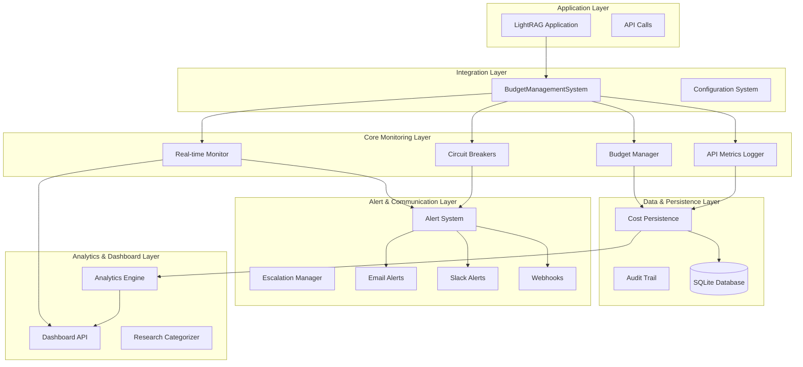

# API Cost Monitoring System - Master Documentation

## Table of Contents

1. [Overview](#overview)
2. [System Architecture](#system-architecture)
3. [Core Components](#core-components)
4. [Key Features](#key-features)
5. [Quick Start](#quick-start)
6. [Documentation Suite](#documentation-suite)
7. [System Requirements](#system-requirements)
8. [Security Considerations](#security-considerations)
9. [Performance Characteristics](#performance-characteristics)
10. [Support and Maintenance](#support-and-maintenance)

---

## Overview

The **API Cost Monitoring System** is a comprehensive, production-ready solution for tracking, managing, and controlling API usage costs in the Clinical Metabolomics Oracle LightRAG environment. This enterprise-grade system provides real-time monitoring, predictive analytics, automated alerting, and cost-based circuit breakers to ensure optimal resource utilization while maintaining budget compliance.

### Key Benefits

- **Cost Control**: Real-time budget monitoring with automated circuit breakers
- **Predictive Analytics**: AI-powered cost forecasting and trend analysis
- **Multi-Channel Alerting**: Email, Slack, webhooks, and logging notifications
- **Research-Specific**: Metabolomics research categorization and analytics
- **Enterprise-Ready**: Audit trails, compliance logging, and dashboard APIs
- **Production-Grade**: Thread-safe, scalable, and highly configurable

---

## System Architecture

The system follows a modular, layered architecture designed for scalability, maintainability, and enterprise deployment:



### Architecture Principles

1. **Separation of Concerns**: Each component has a single, well-defined responsibility
2. **Dependency Injection**: Components are loosely coupled through interfaces
3. **Thread Safety**: All components support concurrent access
4. **Error Isolation**: Failures in one component don't cascade to others
5. **Configuration-Driven**: Behavior controlled through comprehensive configuration
6. **Audit-First**: All actions logged for compliance and debugging

---

## Core Components

### 1. Budget Manager (`BudgetManager`)
- **Purpose**: Central budget tracking and threshold management
- **Features**: Daily/monthly budgets, progressive alerting, thread-safe operations
- **Integration**: Cost persistence, alert system, real-time monitoring

### 2. Cost Persistence (`CostPersistence`)
- **Purpose**: Persistent storage of cost data with SQLite database
- **Features**: Historical analysis, data retention, research categorization
- **Schema**: Cost records, budget tracking, audit logs with indexes

### 3. API Metrics Logger (`APIUsageMetricsLogger`)
- **Purpose**: Comprehensive API usage tracking and metrics collection
- **Features**: Token counting, performance metrics, structured logging
- **Integration**: Cost persistence, budget management, circuit breakers

### 4. Alert System (`AlertNotificationSystem`)
- **Purpose**: Multi-channel alert delivery with escalation
- **Features**: Email, Slack, webhooks, rate limiting, templating
- **Channels**: Configurable delivery channels with retry logic

### 5. Real-time Monitor (`RealTimeBudgetMonitor`)
- **Purpose**: Continuous budget monitoring with predictive analytics
- **Features**: Cost projections, anomaly detection, health scoring
- **Analytics**: Trend analysis, forecasting, optimization recommendations

### 6. Circuit Breakers (`CostBasedCircuitBreaker`)
- **Purpose**: Cost-aware operation protection and throttling
- **Features**: Multi-tier protection, graceful degradation, cost estimation
- **Rules**: Configurable threshold rules with different actions

### 7. Dashboard API (`BudgetDashboardAPI`)
- **Purpose**: RESTful API for monitoring and analytics
- **Features**: Real-time metrics, historical reports, system health
- **Endpoints**: Budget status, cost analytics, alert management

### 8. Integration System (`BudgetManagementSystem`)
- **Purpose**: Unified initialization and lifecycle management
- **Features**: Configuration-driven setup, health monitoring, graceful shutdown
- **Factory**: Automated component creation and wiring

---

## Key Features

### Real-time Budget Monitoring
- Continuous cost tracking with configurable intervals
- Predictive cost analysis and budget forecasting
- Automatic threshold-based alerting
- Integration with circuit breakers for protection

### Multi-Channel Alerting
- **Email**: SMTP with HTML/text templates and authentication
- **Slack**: Rich formatting with mentions and attachments
- **Webhooks**: Customizable HTTP notifications with retries
- **Logging**: Structured logs for SIEM integration

### Cost-Based Circuit Breakers
- **Budget Protection**: Automatic operation blocking when budgets exceeded
- **Throttling**: Gradual slowdown before hard limits
- **Cost Estimation**: Predictive cost analysis before operations
- **Recovery**: Intelligent recovery and testing mechanisms

### Research-Specific Analytics
- **Metabolomics Categories**: Specialized research area tracking
- **Usage Patterns**: Analysis by research type and methodology
- **Cost Optimization**: Recommendations based on usage patterns
- **Trend Analysis**: Historical and predictive analytics

### Enterprise Features
- **Audit Trails**: Comprehensive compliance logging
- **Role-Based Access**: Integration with existing security systems
- **Data Retention**: Configurable retention policies
- **Performance Monitoring**: System health and performance metrics

---

## Quick Start

### 1. Installation and Setup

```python
from lightrag_integration import BudgetManagementFactory, LightRAGConfig

# Create configuration from environment variables
config = LightRAGConfig.get_config()

# Initialize budget management system
budget_system = BudgetManagementFactory.create_complete_system(
    lightrag_config=config,
    daily_budget_limit=50.0,
    monthly_budget_limit=1000.0
)

# Start monitoring
budget_system.start()
```

### 2. Basic Usage

```python
# Track an API call
with budget_system.track_operation("llm_call", model="gpt-4o-mini") as tracker:
    # Make API call
    result = your_api_call()
    
    # Update metrics
    tracker.set_tokens(prompt=100, completion=50)
    tracker.set_cost(0.01)

# Check budget status
status = budget_system.get_budget_status()
print(f"Daily usage: {status['daily']['percentage_used']:.1f}%")

# Get dashboard metrics
metrics = budget_system.dashboard.get_dashboard_overview()
```

### 3. Environment Configuration

```bash
# Required
export OPENAI_API_KEY="your-api-key"

# Budget limits
export LIGHTRAG_DAILY_BUDGET_LIMIT="50.0"
export LIGHTRAG_MONTHLY_BUDGET_LIMIT="1000.0"

# Alert configuration
export LIGHTRAG_ENABLE_BUDGET_ALERTS="true"

# Optional: Email alerts
export ALERT_EMAIL_SMTP_SERVER="smtp.gmail.com"
export ALERT_EMAIL_SMTP_PORT="587"
export ALERT_EMAIL_USERNAME="alerts@yourcompany.com"
export ALERT_EMAIL_PASSWORD="your-app-password"
export ALERT_EMAIL_RECIPIENTS="admin@yourcompany.com,research@yourcompany.com"

# Optional: Slack alerts
export ALERT_SLACK_WEBHOOK_URL="https://hooks.slack.com/services/..."
export ALERT_SLACK_CHANNEL="#budget-alerts"
```

---

## Documentation Suite

This master document is part of a comprehensive documentation suite:

### 📖 [Developer Guide](./API_COST_MONITORING_DEVELOPER_GUIDE.md)
**Target Audience**: Software developers and system integrators
- Detailed API reference with examples
- Integration patterns and best practices
- Extension and customization guides
- Testing strategies and debugging

### 👥 [User Guide](./API_COST_MONITORING_USER_GUIDE.md)
**Target Audience**: Researchers and system administrators
- Step-by-step setup instructions
- Dashboard usage and interpretation
- Alert management and response
- Budget planning and optimization

### ⚙️ [Configuration Reference](./API_COST_MONITORING_CONFIGURATION_REFERENCE.md)
**Target Audience**: DevOps engineers and system administrators
- Complete configuration parameter reference
- Environment variable documentation
- Configuration templates and examples
- Validation rules and constraints

### 🔌 [API Reference](./API_COST_MONITORING_API_REFERENCE.md)
**Target Audience**: API consumers and integration developers
- REST endpoint documentation
- Request/response schemas
- Authentication and authorization
- Rate limiting and error handling

### 🚀 [Deployment Guide](./API_COST_MONITORING_DEPLOYMENT_GUIDE.md)
**Target Audience**: DevOps engineers and platform teams
- Production deployment strategies
- Container orchestration (Docker, Kubernetes)
- Monitoring and observability setup
- Security hardening and compliance

### 🔧 [Troubleshooting Guide](./API_COST_MONITORING_TROUBLESHOOTING_GUIDE.md)
**Target Audience**: Support teams and system administrators
- Common issues and solutions
- Performance tuning guidelines
- Log analysis and debugging
- Recovery procedures and maintenance

---

## System Requirements

### Minimum Requirements
- **Python**: 3.8+ (recommended: 3.11+)
- **Memory**: 512MB RAM for basic monitoring
- **Storage**: 100MB for SQLite database and logs
- **Network**: HTTPS access for API calls and alerts

### Production Requirements
- **Python**: 3.11+ with virtual environment
- **Memory**: 2GB+ RAM for comprehensive monitoring
- **Storage**: 10GB+ SSD for database and log retention
- **CPU**: 2+ cores for concurrent monitoring
- **Network**: Reliable internet with SSL/TLS support

### Dependencies
- **Core**: `sqlite3`, `threading`, `logging`, `pathlib`
- **HTTP**: `requests`, `urllib3`
- **Analytics**: `numpy`, `statistics`
- **Templates**: `jinja2`
- **System**: `psutil` for resource monitoring

---

## Security Considerations

### API Key Management
- Store API keys in environment variables or secure key management systems
- Never log or expose API keys in plain text
- Use role-based access for key rotation and management
- Implement key expiration and rotation policies

### Data Protection
- SQLite database encryption at rest (optional)
- Secure transmission of alert data (TLS)
- Audit trail integrity and tamper detection
- Personal data anonymization and retention policies

### Network Security
- HTTPS-only communication for all external services
- Webhook signature validation and authentication
- Rate limiting and DDoS protection
- Firewall configuration for monitoring endpoints

### Access Control
- Principle of least privilege for system accounts
- Role-based dashboard access controls
- Audit logging for administrative actions
- Integration with existing authentication systems

---

## Performance Characteristics

### Scalability Metrics
- **Throughput**: 1000+ API calls/minute tracking
- **Latency**: <10ms overhead per API call
- **Concurrency**: 100+ concurrent monitoring threads
- **Database**: Millions of cost records with indexed queries

### Resource Usage
- **Memory**: Linear growth with monitoring window size
- **CPU**: Minimal impact during steady-state operation
- **Storage**: Configurable retention with automatic cleanup
- **Network**: Burst patterns for alert delivery

### Optimization Features
- **Caching**: Intelligent caching for dashboard queries
- **Batching**: Bulk operations for database writes
- **Compression**: Log rotation with compression
- **Pooling**: Connection pooling for external services

---

## Support and Maintenance

### Monitoring and Alerting
The system includes comprehensive self-monitoring:
- Health check endpoints for external monitoring
- Performance metrics collection and reporting
- Error rate tracking and alerting
- Resource usage monitoring and alerts

### Maintenance Tasks
- **Daily**: Monitor system health and alert delivery
- **Weekly**: Review cost trends and budget utilization
- **Monthly**: Database maintenance and log rotation
- **Quarterly**: Security updates and dependency upgrades

### Upgrade Path
The system is designed for zero-downtime upgrades:
- Database schema migrations with rollback support
- Configuration backward compatibility
- Graceful shutdown and restart procedures
- Blue-green deployment support for critical systems

### Community and Support
- **Documentation**: Comprehensive guides and references
- **Examples**: Real-world integration examples
- **Best Practices**: Production deployment patterns
- **Troubleshooting**: Common issues and solutions

---

## Next Steps

1. **Quick Start**: Follow the [User Guide](./API_COST_MONITORING_USER_GUIDE.md) for immediate setup
2. **Integration**: Review the [Developer Guide](./API_COST_MONITORING_DEVELOPER_GUIDE.md) for custom integrations
3. **Production**: Use the [Deployment Guide](./API_COST_MONITORING_DEPLOYMENT_GUIDE.md) for production deployment
4. **Optimization**: Leverage the [Configuration Reference](./API_COST_MONITORING_CONFIGURATION_REFERENCE.md) for tuning

---

*This documentation is part of the Clinical Metabolomics Oracle API Cost Monitoring System - a comprehensive solution for intelligent cost management and budget compliance in AI-powered research environments.*