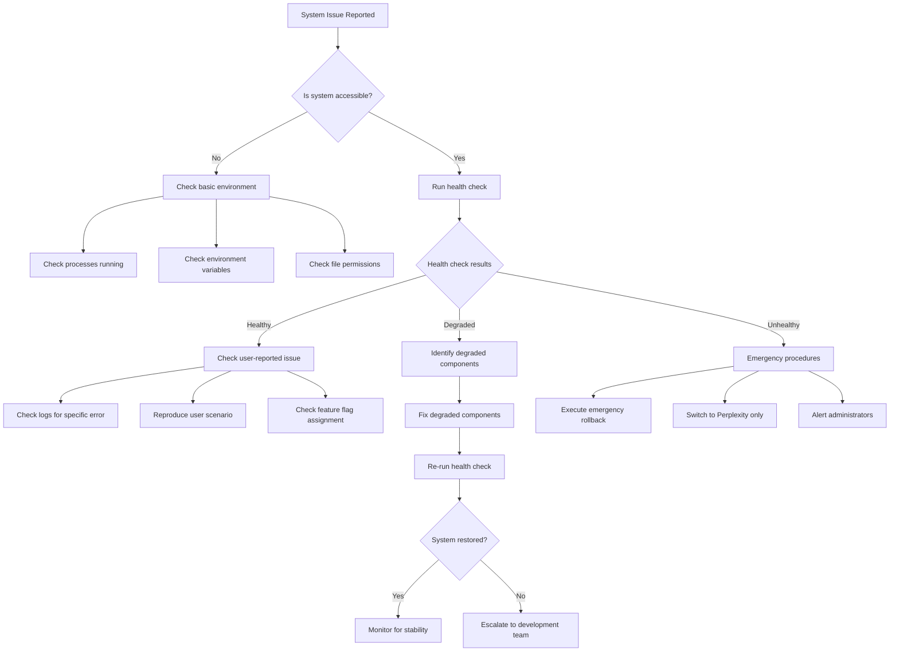

# Clinical Metabolomics Oracle - LightRAG Integration: Comprehensive Troubleshooting Guide

## Table of Contents

1. [Quick Reference Section](#quick-reference-section)
2. [Common Issues by Category](#common-issues-by-category)
3. [Diagnostic Procedures](#diagnostic-procedures)
4. [Environment Setup Issues](#environment-setup-issues)
5. [Performance Troubleshooting](#performance-troubleshooting)
6. [API and Connectivity Issues](#api-and-connectivity-issues)
7. [Recovery Procedures](#recovery-procedures)
8. [Preventive Maintenance](#preventive-maintenance)
9. [FAQ Section](#faq-section)

---

## Quick Reference Section

### Emergency Commands and Common Fixes

```bash
# EMERGENCY DISABLE - Use when system is failing
export LIGHTRAG_INTEGRATION_ENABLED=false
export LIGHTRAG_ROLLOUT_PERCENTAGE=0.0
export LIGHTRAG_FORCE_USER_COHORT=perplexity

# Quick system restart
pkill -f chainlit && sleep 2 && chainlit run src/app.py --port 8000

# Health check one-liner
python -c "from lightrag_integration.clinical_metabolomics_rag import ClinicalMetabolomicsRAG; print('System OK' if ClinicalMetabolomicsRAG else 'System FAIL')"

# Clear all caches
rm -rf ./lightrag_storage/cache/* ./logs/* ./cost_tracking.db

# Reset permissions
chmod -R 755 ./lightrag_storage ./papers ./logs
```

### Critical Environment Variables
```bash
# Required variables - check these first
OPENAI_API_KEY=sk-...              # Your OpenAI API key
LIGHTRAG_WORKING_DIR=./lightrag_storage
LIGHTRAG_PAPERS_DIR=./papers
LIGHTRAG_INTEGRATION_ENABLED=true
LIGHTRAG_ROLLOUT_PERCENTAGE=25.0
```

### Status Indicators
- ✅ **Green**: System working normally
- ⚠️ **Yellow**: System working but with warnings
- ❌ **Red**: System failure requiring immediate attention
- 🚨 **Critical**: Emergency intervention required

---

## Common Issues by Category

### A. LightRAG Initialization Failures

#### Symptom: "Failed to initialize LightRAG" on startup
**Quick Fix:**
```bash
# Check basic requirements
ls -la ./lightrag_storage ./papers
echo "API Key: ${OPENAI_API_KEY:0:10}..."
python -c "import lightrag; print(f'LightRAG version: {lightrag.__version__}')"
```

**Root Causes & Solutions:**

1. **Missing directories**
   ```bash
   mkdir -p ./lightrag_storage ./papers ./logs
   chmod 755 ./lightrag_storage ./papers ./logs
   ```

2. **Invalid API key**
   ```bash
   # Test API key
   curl -H "Authorization: Bearer $OPENAI_API_KEY" \
        https://api.openai.com/v1/models | head -20
   ```

3. **LightRAG version incompatibility**
   ```bash
   pip install lightrag-hku>=1.4.6
   # or specific version
   pip install lightrag-hku==1.4.6
   ```

4. **Memory constraints**
   ```bash
   # Reduce memory usage
   export LIGHTRAG_CHUNK_SIZE=800
   export LIGHTRAG_MAX_TOKENS=4000
   free -h  # Check available memory
   ```

#### Symptom: "LightRAG working directory not writable"
**Immediate Action:**
```bash
sudo chown -R $(whoami):$(id -gn) ./lightrag_storage
chmod -R 755 ./lightrag_storage
```

#### Symptom: Knowledge base corruption
**Recovery Steps:**
```bash
# Backup current state
cp -r ./lightrag_storage ./lightrag_storage_backup_$(date +%Y%m%d_%H%M%S)

# Force rebuild
rm -rf ./lightrag_storage/*
python -c "
import asyncio
from lightrag_integration.clinical_metabolomics_rag import ClinicalMetabolomicsRAG
async def rebuild():
    rag = ClinicalMetabolomicsRAG()
    await rag.initialize_knowledge_base(force_rebuild=True)
asyncio.run(rebuild())
"
```

### B. LLM Function Errors

#### Symptom: "OpenAI API error: rate limit exceeded"
**Immediate Response:**
```bash
# Enable rate limiting
export LIGHTRAG_ENABLE_RATE_LIMITING=true
export LIGHTRAG_REQUESTS_PER_MINUTE=60
export LIGHTRAG_TOKENS_PER_MINUTE=40000

# Check current usage
python -c "
import openai
client = openai.OpenAI()
try:
    response = client.models.list()
    print('API accessible')
except Exception as e:
    print(f'API Error: {e}')
"
```

**Long-term Solution:**
```python
# Add to lightrag_integration/config.py
RATE_LIMITING_CONFIG = {
    'requests_per_minute': 60,
    'tokens_per_minute': 40000,
    'retry_after_rate_limit': True,
    'max_retries': 3,
    'backoff_factor': 2.0
}
```

#### Symptom: "Embedding function failed"
**Diagnostic Steps:**
```python
# Test embedding function directly
python -c "
import asyncio
from lightrag_integration.clinical_metabolomics_rag import ClinicalMetabolomicsRAG

async def test_embedding():
    rag = ClinicalMetabolomicsRAG()
    try:
        result = await rag._get_embedding_function()('test text')
        print(f'Embedding success: {len(result)} dimensions')
    except Exception as e:
        print(f'Embedding failed: {e}')

asyncio.run(test_embedding())
"
```

### C. Storage and File System Issues

#### Symptom: "Permission denied" errors
**Comprehensive Fix:**
```bash
# Fix ownership and permissions
sudo chown -R $(whoami):$(id -gn) ./lightrag_storage ./papers ./logs
find ./lightrag_storage -type d -exec chmod 755 {} \;
find ./lightrag_storage -type f -exec chmod 644 {} \;
find ./papers -type f -exec chmod 644 {} \;
find ./logs -type f -exec chmod 666 {} \;
```

#### Symptom: Disk space issues
**Space Management:**
```bash
# Check disk space
df -h ./lightrag_storage ./logs

# Clean up logs older than 7 days
find ./logs -name "*.log" -mtime +7 -delete
find ./logs -name "claude_output_*.json" -mtime +3 -delete

# Compress old knowledge base backups
find . -name "*_backup_*" -type d -mtime +30 -exec tar czf {}.tar.gz {} \; -exec rm -rf {} \;

# Clear response cache if enabled
rm -rf ./lightrag_storage/cache/*
```

#### Symptom: File corruption in knowledge base
**Recovery Protocol:**
```bash
# 1. Stop all processes
pkill -f chainlit

# 2. Backup current state
cp -r ./lightrag_storage ./lightrag_storage_corrupted_$(date +%Y%m%d_%H%M%S)

# 3. Validate PDF files
python -c "
import os
from pathlib import Path
for pdf_file in Path('./papers').glob('*.pdf'):
    try:
        with open(pdf_file, 'rb') as f:
            header = f.read(4)
            if header != b'%PDF':
                print(f'Corrupted PDF: {pdf_file}')
    except Exception as e:
        print(f'Cannot read PDF {pdf_file}: {e}')
"

# 4. Reinitialize knowledge base
rm -rf ./lightrag_storage/graph_chunk_entity_relation.json
rm -rf ./lightrag_storage/kv_store_*.json
```

### D. API Integration Problems

#### Symptom: Inconsistent OpenAI responses
**Diagnosis Script:**
```python
# Save as diagnose_api_consistency.py
import asyncio
import json
from datetime import datetime
from lightrag_integration.clinical_metabolomics_rag import ClinicalMetabolomicsRAG

async def test_api_consistency():
    """Test API response consistency"""
    rag = ClinicalMetabolomicsRAG()
    test_query = "What is clinical metabolomics?"
    
    results = []
    for i in range(5):
        try:
            start_time = datetime.now()
            response = await rag.query(test_query)
            end_time = datetime.now()
            
            results.append({
                'iteration': i + 1,
                'response_length': len(response),
                'response_time': (end_time - start_time).total_seconds(),
                'success': True
            })
            print(f"Test {i+1}: ✅ {len(response)} chars in {results[-1]['response_time']:.2f}s")
            
        except Exception as e:
            results.append({
                'iteration': i + 1,
                'error': str(e),
                'success': False
            })
            print(f"Test {i+1}: ❌ {e}")
    
    # Analysis
    successful_tests = [r for r in results if r['success']]
    if len(successful_tests) >= 3:
        avg_time = sum(r['response_time'] for r in successful_tests) / len(successful_tests)
        print(f"\n📊 Average response time: {avg_time:.2f}s")
        print(f"Success rate: {len(successful_tests)}/5 ({len(successful_tests)*20}%)")
    else:
        print("\n❌ API consistency test failed - manual intervention required")

if __name__ == "__main__":
    asyncio.run(test_api_consistency())
```

### E. Configuration Management Issues

#### Symptom: Feature flags not working
**Validation Script:**
```python
# feature_flag_validator.py
import os
from lightrag_integration.feature_flag_manager import FeatureFlagManager

def validate_feature_flags():
    """Validate feature flag configuration"""
    
    print("🚩 Validating feature flag configuration...")
    
    # Check environment variables
    required_vars = [
        'LIGHTRAG_INTEGRATION_ENABLED',
        'LIGHTRAG_ROLLOUT_PERCENTAGE'
    ]
    
    missing_vars = []
    for var in required_vars:
        value = os.getenv(var)
        if value is None:
            missing_vars.append(var)
        else:
            print(f"✅ {var}={value}")
    
    if missing_vars:
        print(f"❌ Missing environment variables: {missing_vars}")
        return False
    
    # Test feature flag manager
    try:
        feature_flags = FeatureFlagManager()
        test_assignment = feature_flags.get_user_assignment("test_user")
        print(f"✅ Feature flags working: user gets {test_assignment.group}")
        return True
    except Exception as e:
        print(f"❌ Feature flag error: {e}")
        return False

if __name__ == "__main__":
    validate_feature_flags()
```

---

## Diagnostic Procedures

### Comprehensive System Health Check

```python
# comprehensive_health_check.py
import asyncio
import os
import psutil
import json
from datetime import datetime
from pathlib import Path

async def comprehensive_health_check():
    """Complete system health assessment"""
    
    health_report = {
        'timestamp': datetime.now().isoformat(),
        'overall_status': 'unknown',
        'checks': {}
    }
    
    print("🏥 Clinical Metabolomics Oracle - LightRAG Health Check")
    print("=" * 60)
    
    # 1. Environment Variables
    print("\n1. Environment Variables Check...")
    env_check = check_environment_variables()
    health_report['checks']['environment'] = env_check
    print_status(env_check)
    
    # 2. File System
    print("\n2. File System Check...")
    fs_check = check_file_system()
    health_report['checks']['filesystem'] = fs_check
    print_status(fs_check)
    
    # 3. Dependencies
    print("\n3. Python Dependencies Check...")
    deps_check = check_dependencies()
    health_report['checks']['dependencies'] = deps_check
    print_status(deps_check)
    
    # 4. API Connectivity
    print("\n4. OpenAI API Check...")
    api_check = await check_api_connectivity()
    health_report['checks']['api'] = api_check
    print_status(api_check)
    
    # 5. System Resources
    print("\n5. System Resources Check...")
    resource_check = check_system_resources()
    health_report['checks']['resources'] = resource_check
    print_status(resource_check)
    
    # 6. Knowledge Base
    print("\n6. Knowledge Base Check...")
    kb_check = check_knowledge_base()
    health_report['checks']['knowledge_base'] = kb_check
    print_status(kb_check)
    
    # 7. LightRAG System
    print("\n7. LightRAG Integration Check...")
    lightrag_check = await check_lightrag_system()
    health_report['checks']['lightrag'] = lightrag_check
    print_status(lightrag_check)
    
    # Overall assessment
    all_checks = health_report['checks'].values()
    healthy_checks = sum(1 for check in all_checks if check['status'] == 'healthy')
    total_checks = len(all_checks)
    
    if healthy_checks == total_checks:
        health_report['overall_status'] = 'healthy'
        print(f"\n✅ Overall Status: HEALTHY ({healthy_checks}/{total_checks})")
    elif healthy_checks >= total_checks * 0.8:
        health_report['overall_status'] = 'degraded'
        print(f"\n⚠️  Overall Status: DEGRADED ({healthy_checks}/{total_checks})")
    else:
        health_report['overall_status'] = 'unhealthy'
        print(f"\n❌ Overall Status: UNHEALTHY ({healthy_checks}/{total_checks})")
    
    # Save report
    report_file = f"health_check_report_{datetime.now().strftime('%Y%m%d_%H%M%S')}.json"
    with open(report_file, 'w') as f:
        json.dump(health_report, f, indent=2)
    
    print(f"\n📄 Full report saved to: {report_file}")
    return health_report

def check_environment_variables():
    """Check required environment variables"""
    required_vars = {
        'OPENAI_API_KEY': {'required': True, 'check_format': lambda x: x.startswith('sk-') and len(x) > 40},
        'LIGHTRAG_WORKING_DIR': {'required': True, 'default': './lightrag_storage'},
        'LIGHTRAG_PAPERS_DIR': {'required': True, 'default': './papers'},
        'LIGHTRAG_INTEGRATION_ENABLED': {'required': False, 'default': 'true'},
        'LIGHTRAG_ROLLOUT_PERCENTAGE': {'required': False, 'default': '0.0'}
    }
    
    issues = []
    for var, config in required_vars.items():
        value = os.getenv(var)
        if value is None:
            if config['required']:
                issues.append(f"Missing required variable: {var}")
            else:
                print(f"  ℹ️  {var} not set, using default: {config.get('default', 'N/A')}")
        else:
            if 'check_format' in config and not config['check_format'](value):
                issues.append(f"Invalid format for {var}")
            else:
                print(f"  ✅ {var}={'*' * min(10, len(value))}...")
    
    return {
        'status': 'healthy' if not issues else 'unhealthy',
        'issues': issues
    }

def check_file_system():
    """Check file system permissions and structure"""
    required_dirs = ['./lightrag_storage', './papers', './logs']
    issues = []
    
    for dir_path in required_dirs:
        path = Path(dir_path)
        if not path.exists():
            issues.append(f"Directory missing: {dir_path}")
        elif not path.is_dir():
            issues.append(f"Not a directory: {dir_path}")
        elif not os.access(path, os.R_OK | os.W_OK):
            issues.append(f"Permission denied: {dir_path}")
        else:
            print(f"  ✅ Directory OK: {dir_path}")
    
    return {
        'status': 'healthy' if not issues else 'unhealthy',
        'issues': issues
    }

def check_dependencies():
    """Check Python package dependencies"""
    required_packages = [
        ('lightrag', 'lightrag-hku>=1.4.6'),
        ('openai', 'openai>=1.0.0'),
        ('chainlit', 'chainlit>=1.0.0'),
        ('asyncio', 'built-in'),
        ('aiohttp', 'aiohttp>=3.8.0')
    ]
    
    issues = []
    for package, requirement in required_packages:
        try:
            __import__(package)
            print(f"  ✅ {package} imported successfully")
        except ImportError:
            issues.append(f"Missing package: {requirement}")
    
    return {
        'status': 'healthy' if not issues else 'unhealthy',
        'issues': issues
    }

async def check_api_connectivity():
    """Check OpenAI API connectivity"""
    try:
        import openai
        client = openai.OpenAI()
        
        # Test API call
        response = await client.chat.completions.acreate(
            model="gpt-3.5-turbo",
            messages=[{"role": "user", "content": "Hello"}],
            max_tokens=10
        )
        
        print(f"  ✅ API connectivity working")
        return {'status': 'healthy', 'issues': []}
        
    except Exception as e:
        error_msg = f"API connectivity failed: {e}"
        print(f"  ❌ {error_msg}")
        return {'status': 'unhealthy', 'issues': [error_msg]}

def check_system_resources():
    """Check system resource availability"""
    memory = psutil.virtual_memory()
    disk = psutil.disk_usage('.')
    
    issues = []
    
    # Memory check (need at least 2GB available)
    if memory.available < 2 * 1024 * 1024 * 1024:
        issues.append(f"Low memory: {memory.available / 1024 / 1024 / 1024:.1f}GB available (need 2GB+)")
    else:
        print(f"  ✅ Memory OK: {memory.available / 1024 / 1024 / 1024:.1f}GB available")
    
    # Disk check (need at least 1GB free)
    if disk.free < 1024 * 1024 * 1024:
        issues.append(f"Low disk space: {disk.free / 1024 / 1024 / 1024:.1f}GB free (need 1GB+)")
    else:
        print(f"  ✅ Disk space OK: {disk.free / 1024 / 1024 / 1024:.1f}GB free")
    
    return {
        'status': 'healthy' if not issues else 'unhealthy',
        'issues': issues,
        'memory_gb': memory.available / 1024 / 1024 / 1024,
        'disk_gb': disk.free / 1024 / 1024 / 1024
    }

def check_knowledge_base():
    """Check knowledge base integrity"""
    papers_dir = Path(os.getenv('LIGHTRAG_PAPERS_DIR', './papers'))
    storage_dir = Path(os.getenv('LIGHTRAG_WORKING_DIR', './lightrag_storage'))
    
    issues = []
    
    # Check for PDF files
    pdf_files = list(papers_dir.glob('*.pdf'))
    if not pdf_files:
        issues.append("No PDF files found in papers directory")
    else:
        print(f"  ✅ Found {len(pdf_files)} PDF files")
        
        # Validate PDF files
        corrupted_pdfs = []
        for pdf_file in pdf_files:
            try:
                with open(pdf_file, 'rb') as f:
                    header = f.read(4)
                    if header != b'%PDF':
                        corrupted_pdfs.append(str(pdf_file))
            except Exception:
                corrupted_pdfs.append(str(pdf_file))
        
        if corrupted_pdfs:
            issues.append(f"Corrupted PDF files: {corrupted_pdfs}")
    
    # Check storage integrity
    required_storage_files = [
        'kv_store_full_docs.json',
        'kv_store_text_chunks.json',
        'kv_store_entities.json'
    ]
    
    missing_storage = []
    for file_name in required_storage_files:
        if not (storage_dir / file_name).exists():
            missing_storage.append(file_name)
    
    if missing_storage:
        issues.append(f"Missing storage files (may need reinitialization): {missing_storage}")
    else:
        print(f"  ✅ Knowledge base storage intact")
    
    return {
        'status': 'healthy' if not issues else 'degraded',
        'issues': issues,
        'pdf_count': len(pdf_files) if pdf_files else 0
    }

async def check_lightrag_system():
    """Check LightRAG system integration"""
    try:
        from lightrag_integration.clinical_metabolomics_rag import ClinicalMetabolomicsRAG
        
        # Test initialization
        rag = ClinicalMetabolomicsRAG()
        
        # Test basic functionality
        test_query = "What is metabolomics?"
        response = await rag.query(test_query)
        
        if response and len(response) > 50:
            print(f"  ✅ LightRAG system working (response: {len(response)} chars)")
            return {'status': 'healthy', 'issues': []}
        else:
            issue = "LightRAG system returns empty/short responses"
            print(f"  ❌ {issue}")
            return {'status': 'unhealthy', 'issues': [issue]}
    
    except Exception as e:
        issue = f"LightRAG system error: {e}"
        print(f"  ❌ {issue}")
        return {'status': 'unhealthy', 'issues': [issue]}

def print_status(check_result):
    """Print status with appropriate emoji"""
    if check_result['status'] == 'healthy':
        print("  ✅ Status: HEALTHY")
    elif check_result['status'] == 'degraded':
        print("  ⚠️  Status: DEGRADED")
        for issue in check_result.get('issues', []):
            print(f"    • {issue}")
    else:
        print("  ❌ Status: UNHEALTHY")
        for issue in check_result.get('issues', []):
            print(f"    • {issue}")

if __name__ == "__main__":
    asyncio.run(comprehensive_health_check())
```

### Step-by-Step Troubleshooting Workflow



---

## Environment Setup Issues

### Fresh Installation Checklist

```bash
#!/bin/bash
# fresh_install_validator.sh

echo "🛠️  Clinical Metabolomics Oracle - Fresh Installation Validator"
echo "============================================================="

# 1. Python environment
echo -e "\n1. Checking Python environment..."
python_version=$(python --version 2>&1)
echo "Python version: $python_version"

if python -c "import sys; exit(0 if sys.version_info >= (3, 8) else 1)"; then
    echo "✅ Python version OK"
else
    echo "❌ Python 3.8+ required"
    exit 1
fi

# 2. Virtual environment (recommended)
if [[ "$VIRTUAL_ENV" != "" ]]; then
    echo "✅ Virtual environment active: $VIRTUAL_ENV"
else
    echo "⚠️  No virtual environment detected (recommended but not required)"
fi

# 3. Install dependencies
echo -e "\n2. Installing dependencies..."
if pip install -r requirements.txt; then
    echo "✅ Dependencies installed successfully"
else
    echo "❌ Dependency installation failed"
    echo "Try: pip install --upgrade pip && pip install -r requirements.txt"
    exit 1
fi

# 4. Create directories
echo -e "\n3. Creating required directories..."
mkdir -p lightrag_storage papers logs
chmod 755 lightrag_storage papers logs
echo "✅ Directories created"

# 5. Environment variables
echo -e "\n4. Setting up environment variables..."
if [[ -f ".env" ]]; then
    echo "✅ .env file found"
    source .env
else
    echo "⚠️  No .env file found, creating template..."
    cat > .env << EOF
# OpenAI Configuration
OPENAI_API_KEY=your_openai_api_key_here

# LightRAG Configuration  
LIGHTRAG_WORKING_DIR=./lightrag_storage
LIGHTRAG_PAPERS_DIR=./papers
LIGHTRAG_INTEGRATION_ENABLED=true
LIGHTRAG_ROLLOUT_PERCENTAGE=25.0

# Performance Settings
LIGHTRAG_CHUNK_SIZE=1200
LIGHTRAG_CHUNK_OVERLAP=100
LIGHTRAG_MAX_TOKENS=8000

# Feature Flags
LIGHTRAG_ENABLE_RATE_LIMITING=true
LIGHTRAG_ENABLE_CACHING=true
LIGHTRAG_ENABLE_QUALITY_ASSESSMENT=true
EOF
    echo "⚠️  Please edit .env file with your configuration"
fi

# 6. Test OpenAI API
echo -e "\n5. Testing OpenAI API connection..."
if [[ -z "$OPENAI_API_KEY" ]]; then
    echo "❌ OPENAI_API_KEY not set"
    echo "Please set your OpenAI API key in .env file"
    exit 1
fi

if python -c "
import openai
import os
client = openai.OpenAI(api_key=os.getenv('OPENAI_API_KEY'))
try:
    models = client.models.list()
    print('✅ OpenAI API connection successful')
except Exception as e:
    print(f'❌ OpenAI API connection failed: {e}')
    exit(1)
"; then
    echo "API test passed"
else
    exit 1
fi

# 7. Initialize knowledge base (if PDFs present)
echo -e "\n6. Checking for PDF documents..."
pdf_count=$(ls papers/*.pdf 2>/dev/null | wc -l)
if [[ $pdf_count -gt 0 ]]; then
    echo "✅ Found $pdf_count PDF documents"
    echo "Initializing knowledge base..."
    python -c "
import asyncio
from lightrag_integration.clinical_metabolomics_rag import ClinicalMetabolomicsRAG

async def init_kb():
    rag = ClinicalMetabolomicsRAG()
    await rag.initialize_knowledge_base()
    print('✅ Knowledge base initialized')

asyncio.run(init_kb())
    "
else
    echo "⚠️  No PDF documents found in papers/ directory"
    echo "Add PDF documents to papers/ directory and run knowledge base initialization"
fi

# 8. Final system test
echo -e "\n7. Running final system test..."
python -c "
import asyncio
from lightrag_integration.clinical_metabolomics_rag import ClinicalMetabolomicsRAG

async def test_system():
    try:
        rag = ClinicalMetabolomicsRAG()
        response = await rag.query('What is clinical metabolomics?')
        print(f'✅ System test passed - Response length: {len(response)} characters')
        return True
    except Exception as e:
        print(f'❌ System test failed: {e}')
        return False

if asyncio.run(test_system()):
    exit(0)
else:
    exit(1)
"

if [[ $? -eq 0 ]]; then
    echo -e "\n🎉 Installation completed successfully!"
    echo "You can now start the application with: chainlit run src/app.py"
else
    echo -e "\n❌ Installation validation failed"
    echo "Please check the errors above and retry"
    exit 1
fi
```

### Common Environment Variable Issues

| Variable | Common Issues | Solution |
|----------|---------------|----------|
| `OPENAI_API_KEY` | Invalid format, expired key | Verify format: `sk-...` (51 chars), test with API call |
| `LIGHTRAG_WORKING_DIR` | Path doesn't exist, no permissions | Create directory: `mkdir -p ./lightrag_storage && chmod 755 ./lightrag_storage` |
| `LIGHTRAG_PAPERS_DIR` | Empty directory, corrupted PDFs | Add valid PDF files, validate with `file *.pdf` |
| `LIGHTRAG_ROLLOUT_PERCENTAGE` | Invalid value, not numeric | Set to valid percentage: `0.0` to `100.0` |
| `LIGHTRAG_INTEGRATION_ENABLED` | Case sensitivity, boolean parsing | Use lowercase: `true` or `false` |

---

## Performance Troubleshooting

### Performance Monitoring Dashboard

```python
# performance_monitor.py
import asyncio
import time
import psutil
import json
from datetime import datetime, timedelta
from collections import deque
from lightrag_integration.clinical_metabolomics_rag import ClinicalMetabolomicsRAG

class PerformanceMonitor:
    def __init__(self, window_size=100):
        self.window_size = window_size
        self.query_times = deque(maxlen=window_size)
        self.memory_usage = deque(maxlen=window_size)
        self.error_count = 0
        self.total_queries = 0
        self.start_time = time.time()
        
    async def monitor_query_performance(self, query: str):
        """Monitor single query performance"""
        start_time = time.time()
        start_memory = psutil.Process().memory_info().rss
        
        try:
            rag = ClinicalMetabolomicsRAG()
            response = await rag.query(query)
            
            end_time = time.time()
            end_memory = psutil.Process().memory_info().rss
            
            query_time = end_time - start_time
            memory_delta = end_memory - start_memory
            
            self.query_times.append(query_time)
            self.memory_usage.append(end_memory)
            self.total_queries += 1
            
            return {
                'success': True,
                'query_time': query_time,
                'memory_delta': memory_delta,
                'response_length': len(response),
                'timestamp': datetime.now().isoformat()
            }
            
        except Exception as e:
            self.error_count += 1
            return {
                'success': False,
                'error': str(e),
                'timestamp': datetime.now().isoformat()
            }
    
    def get_performance_stats(self):
        """Get comprehensive performance statistics"""
        if not self.query_times:
            return {'error': 'No performance data available'}
        
        current_memory = psutil.Process().memory_info().rss
        system_memory = psutil.virtual_memory()
        
        stats = {
            'timestamp': datetime.now().isoformat(),
            'uptime_seconds': time.time() - self.start_time,
            'query_performance': {
                'total_queries': self.total_queries,
                'error_count': self.error_count,
                'success_rate': ((self.total_queries - self.error_count) / self.total_queries * 100) if self.total_queries > 0 else 0,
                'avg_query_time': sum(self.query_times) / len(self.query_times),
                'min_query_time': min(self.query_times),
                'max_query_time': max(self.query_times),
                'p50_query_time': sorted(self.query_times)[len(self.query_times)//2],
                'p95_query_time': sorted(self.query_times)[int(len(self.query_times)*0.95)]
            },
            'memory_usage': {
                'current_mb': current_memory / 1024 / 1024,
                'system_total_mb': system_memory.total / 1024 / 1024,
                'system_available_mb': system_memory.available / 1024 / 1024,
                'system_usage_percent': system_memory.percent
            },
            'performance_alerts': []
        }
        
        # Generate alerts
        if stats['query_performance']['avg_query_time'] > 30:
            stats['performance_alerts'].append('High average query time (>30s)')
        
        if stats['query_performance']['success_rate'] < 95:
            stats['performance_alerts'].append(f"Low success rate ({stats['query_performance']['success_rate']:.1f}%)")
        
        if stats['memory_usage']['system_usage_percent'] > 85:
            stats['performance_alerts'].append('High system memory usage (>85%)')
        
        if current_memory > 2 * 1024 * 1024 * 1024:  # 2GB
            stats['performance_alerts'].append('High process memory usage (>2GB)')
        
        return stats

async def run_performance_test_suite():
    """Run comprehensive performance test suite"""
    
    print("🚀 Clinical Metabolomics Oracle - Performance Test Suite")
    print("=" * 60)
    
    monitor = PerformanceMonitor()
    
    # Test scenarios
    test_scenarios = [
        # Simple queries
        ("simple", [
            "What is metabolomics?",
            "Define biomarker",
            "What is clinical research?"
        ]),
        # Medium complexity
        ("medium", [
            "How are biomarkers used in metabolic diseases?",
            "What are the applications of mass spectrometry in metabolomics?",
            "Explain the relationship between genetics and metabolism"
        ]),
        # Complex queries  
        ("complex", [
            "Describe the comprehensive workflow for metabolomics data analysis including sample preparation, data acquisition, processing, and statistical analysis",
            "How do environmental factors interact with genetic predisposition to influence metabolic phenotypes in cardiovascular disease?",
            "Compare and contrast targeted versus untargeted metabolomics approaches in clinical biomarker discovery"
        ])
    ]
    
    all_results = {}
    
    for scenario_name, queries in test_scenarios:
        print(f"\n📊 Testing {scenario_name} queries...")
        scenario_results = []
        
        for i, query in enumerate(queries, 1):
            print(f"  {i}/{len(queries)}: {query[:50]}...")
            result = await monitor.monitor_query_performance(query)
            scenario_results.append(result)
            
            if result['success']:
                print(f"    ✅ {result['query_time']:.2f}s, {result['response_length']} chars")
            else:
                print(f"    ❌ Error: {result['error']}")
        
        all_results[scenario_name] = scenario_results
    
    # Performance analysis
    print(f"\n📈 Performance Analysis")
    print("-" * 30)
    stats = monitor.get_performance_stats()
    
    print(f"Total Queries: {stats['query_performance']['total_queries']}")
    print(f"Success Rate: {stats['query_performance']['success_rate']:.1f}%")
    print(f"Average Response Time: {stats['query_performance']['avg_query_time']:.2f}s")
    print(f"95th Percentile: {stats['query_performance']['p95_query_time']:.2f}s")
    print(f"Memory Usage: {stats['memory_usage']['current_mb']:.1f}MB")
    
    # Alerts
    if stats['performance_alerts']:
        print(f"\n⚠️  Performance Alerts:")
        for alert in stats['performance_alerts']:
            print(f"  • {alert}")
    else:
        print(f"\n✅ No performance alerts")
    
    # Recommendations
    print(f"\n💡 Performance Recommendations:")
    
    if stats['query_performance']['avg_query_time'] > 20:
        print("  • Consider enabling response caching")
        print("  • Reduce LIGHTRAG_MAX_TOKENS for faster responses")
        print("  • Use 'local' mode instead of 'hybrid' for simple queries")
    
    if stats['memory_usage']['current_mb'] > 1500:
        print("  • Reduce LIGHTRAG_CHUNK_SIZE to lower memory usage")
        print("  • Implement periodic memory cleanup")
        print("  • Consider limiting concurrent queries")
    
    if stats['query_performance']['success_rate'] < 98:
        print("  • Enable retry logic for failed queries")
        print("  • Check API rate limits and implement throttling")
        print("  • Review error logs for common failure patterns")
    
    # Save detailed report
    report = {
        'test_timestamp': datetime.now().isoformat(),
        'performance_stats': stats,
        'detailed_results': all_results
    }
    
    report_file = f"performance_report_{datetime.now().strftime('%Y%m%d_%H%M%S')}.json"
    with open(report_file, 'w') as f:
        json.dump(report, f, indent=2)
    
    print(f"\n📄 Detailed report saved to: {report_file}")

if __name__ == "__main__":
    asyncio.run(run_performance_test_suite())
```

### Performance Optimization Quick Fixes

```bash
# performance_quick_fixes.sh

echo "⚡ Performance Quick Fixes for CMO-LightRAG"

# 1. Memory optimization
echo "1. Applying memory optimizations..."
export LIGHTRAG_CHUNK_SIZE=800                    # Reduce from 1200
export LIGHTRAG_CHUNK_OVERLAP=50                  # Reduce from 100
export LIGHTRAG_MAX_TOKENS=4000                   # Reduce from 8000

# 2. Enable caching
echo "2. Enabling response caching..."
export LIGHTRAG_ENABLE_CACHING=true
export LIGHTRAG_CACHE_SIZE_MB=256
export LIGHTRAG_CACHE_TTL_SECONDS=3600

# 3. API optimization
echo "3. Optimizing API calls..."
export LIGHTRAG_ENABLE_RATE_LIMITING=true
export LIGHTRAG_REQUESTS_PER_MINUTE=60
export LIGHTRAG_ENABLE_CONNECTION_POOLING=true

# 4. Query optimization
echo "4. Setting optimal query parameters..."
export LIGHTRAG_DEFAULT_MODE=local               # Faster than hybrid
export LIGHTRAG_DEFAULT_TOP_K=8                  # Reduce from 10

# 5. Clean up resources
echo "5. Cleaning up resources..."
# Clear old logs
find ./logs -name "*.log" -mtime +7 -delete
find ./logs -name "claude_output_*.json" -mtime +3 -delete

# Clear response cache
rm -rf ./lightrag_storage/cache/*

# Force garbage collection
python -c "import gc; collected = gc.collect(); print(f'Garbage collected: {collected} objects')"

echo "✅ Performance optimizations applied"
echo "Restart the application to apply changes: chainlit run src/app.py"
```

### Memory Usage Optimization

```python
# memory_optimizer.py
import gc
import os
import psutil
from lightrag_integration.clinical_metabolomics_rag import ClinicalMetabolomicsRAG

class MemoryOptimizer:
    def __init__(self):
        self.initial_memory = psutil.Process().memory_info().rss
        self.cleanup_threshold_mb = 1500  # Cleanup when exceeding 1.5GB
        self.query_count = 0
        
    def check_memory_usage(self):
        """Check current memory usage and recommend actions"""
        current_memory = psutil.Process().memory_info().rss
        current_mb = current_memory / 1024 / 1024
        
        system_memory = psutil.virtual_memory()
        
        print(f"Memory Status:")
        print(f"  Process: {current_mb:.1f}MB")
        print(f"  System: {system_memory.percent}% used ({system_memory.available / 1024 / 1024 / 1024:.1f}GB available)")
        
        recommendations = []
        
        if current_mb > self.cleanup_threshold_mb:
            recommendations.append("Immediate memory cleanup needed")
        
        if system_memory.percent > 85:
            recommendations.append("High system memory usage - consider reducing chunk size")
        
        if current_memory > self.initial_memory * 2:
            recommendations.append("Memory usage doubled since startup - possible leak")
        
        return {
            'current_mb': current_mb,
            'system_percent': system_memory.percent,
            'recommendations': recommendations
        }
    
    async def optimize_memory_usage(self):
        """Implement memory optimization strategies"""
        print("🧠 Optimizing memory usage...")
        
        # 1. Force garbage collection
        collected = gc.collect()
        print(f"  Garbage collected: {collected} objects")
        
        # 2. Clear Python caches
        import sys
        if hasattr(sys, '_clear_type_cache'):
            sys._clear_type_cache()
            print("  Type cache cleared")
        
        # 3. Optimize environment variables
        memory_optimizations = {
            'LIGHTRAG_CHUNK_SIZE': '600',
            'LIGHTRAG_CHUNK_OVERLAP': '25',
            'LIGHTRAG_MAX_TOKENS': '3000',
            'LIGHTRAG_CACHE_SIZE_MB': '128'
        }
        
        for var, value in memory_optimizations.items():
            os.environ[var] = value
            print(f"  Set {var}={value}")
        
        # 4. Clear temporary data
        cache_dir = os.path.join(os.getenv('LIGHTRAG_WORKING_DIR', './lightrag_storage'), 'cache')
        if os.path.exists(cache_dir):
            import shutil
            shutil.rmtree(cache_dir)
            os.makedirs(cache_dir)
            print("  Response cache cleared")
        
        print("✅ Memory optimization completed")

def monitor_memory_continuously():
    """Continuous memory monitoring with automatic optimization"""
    optimizer = MemoryOptimizer()
    
    while True:
        status = optimizer.check_memory_usage()
        
        if status['recommendations']:
            print(f"⚠️  Memory Alert: {status['current_mb']:.1f}MB used")
            for rec in status['recommendations']:
                print(f"  • {rec}")
            
            if status['current_mb'] > optimizer.cleanup_threshold_mb:
                print("🔄 Initiating automatic memory cleanup...")
                asyncio.run(optimizer.optimize_memory_usage())
        
        time.sleep(60)  # Check every minute

if __name__ == "__main__":
    import asyncio
    import time
    
    optimizer = MemoryOptimizer()
    status = optimizer.check_memory_usage()
    
    if status['recommendations']:
        print("Memory optimization recommended")
        asyncio.run(optimizer.optimize_memory_usage())
    else:
        print("Memory usage within acceptable limits")
```

---

## API and Connectivity Issues

### OpenAI API Troubleshooting

```python
# api_troubleshooter.py
import asyncio
import openai
import time
import json
from datetime import datetime

class OpenAIAPITroubleshooter:
    def __init__(self):
        self.client = openai.OpenAI()
        self.test_results = []
    
    async def diagnose_api_issues(self):
        """Comprehensive OpenAI API diagnosis"""
        
        print("🔗 OpenAI API Troubleshooting")
        print("=" * 40)
        
        # Test 1: API Key Validation
        print("\n1. Testing API Key...")
        await self._test_api_key()
        
        # Test 2: Model Availability
        print("\n2. Testing Model Availability...")
        await self._test_model_availability()
        
        # Test 3: Chat Completion
        print("\n3. Testing Chat Completion...")
        await self._test_chat_completion()
        
        # Test 4: Embeddings
        print("\n4. Testing Embeddings...")
        await self._test_embeddings()
        
        # Test 5: Rate Limits
        print("\n5. Testing Rate Limits...")
        await self._test_rate_limits()
        
        # Test 6: Error Handling
        print("\n6. Testing Error Handling...")
        await self._test_error_scenarios()
        
        # Generate report
        self._generate_api_report()
    
    async def _test_api_key(self):
        """Test API key validity"""
        try:
            response = await self.client.models.alist()
            models = [model.id async for model in response]
            
            if models:
                print("  ✅ API key valid, found {} models".format(len(models)))
                self.test_results.append({"test": "api_key", "status": "pass", "details": f"{len(models)} models accessible"})
            else:
                print("  ❌ API key valid but no models accessible")
                self.test_results.append({"test": "api_key", "status": "fail", "details": "No models accessible"})
                
        except openai.AuthenticationError:
            print("  ❌ Invalid API key")
            self.test_results.append({"test": "api_key", "status": "fail", "details": "Invalid API key"})
        except Exception as e:
            print(f"  ❌ API key test failed: {e}")
            self.test_results.append({"test": "api_key", "status": "error", "details": str(e)})
    
    async def _test_model_availability(self):
        """Test availability of required models"""
        required_models = [
            "gpt-3.5-turbo",
            "gpt-4",
            "text-embedding-ada-002"
        ]
        
        try:
            response = await self.client.models.alist()
            available_models = [model.id async for model in response]
            
            for model in required_models:
                if model in available_models:
                    print(f"  ✅ Model available: {model}")
                else:
                    print(f"  ❌ Model not available: {model}")
            
            self.test_results.append({
                "test": "model_availability",
                "status": "pass" if all(model in available_models for model in required_models) else "partial",
                "details": f"Available: {len(available_models)}, Required: {len(required_models)}"
            })
            
        except Exception as e:
            print(f"  ❌ Model availability test failed: {e}")
            self.test_results.append({"test": "model_availability", "status": "error", "details": str(e)})
    
    async def _test_chat_completion(self):
        """Test chat completion functionality"""
        try:
            start_time = time.time()
            response = await self.client.chat.completions.acreate(
                model="gpt-3.5-turbo",
                messages=[{"role": "user", "content": "Say 'API test successful'"}],
                max_tokens=10
            )
            end_time = time.time()
            
            if response.choices and response.choices[0].message.content:
                response_time = end_time - start_time
                print(f"  ✅ Chat completion working ({response_time:.2f}s)")
                print(f"    Response: {response.choices[0].message.content.strip()}")
                self.test_results.append({
                    "test": "chat_completion",
                    "status": "pass",
                    "details": f"Response time: {response_time:.2f}s"
                })
            else:
                print("  ❌ Chat completion returned empty response")
                self.test_results.append({"test": "chat_completion", "status": "fail", "details": "Empty response"})
        
        except openai.RateLimitError:
            print("  ❌ Rate limit exceeded")
            self.test_results.append({"test": "chat_completion", "status": "fail", "details": "Rate limit exceeded"})
        except Exception as e:
            print(f"  ❌ Chat completion failed: {e}")
            self.test_results.append({"test": "chat_completion", "status": "error", "details": str(e)})
    
    async def _test_embeddings(self):
        """Test embedding functionality"""
        try:
            start_time = time.time()
            response = await self.client.embeddings.acreate(
                model="text-embedding-ada-002",
                input="Test embedding"
            )
            end_time = time.time()
            
            if response.data and len(response.data[0].embedding) > 0:
                response_time = end_time - start_time
                embedding_dim = len(response.data[0].embedding)
                print(f"  ✅ Embeddings working ({response_time:.2f}s, {embedding_dim} dimensions)")
                self.test_results.append({
                    "test": "embeddings",
                    "status": "pass",
                    "details": f"Response time: {response_time:.2f}s, dimensions: {embedding_dim}"
                })
            else:
                print("  ❌ Embeddings returned empty response")
                self.test_results.append({"test": "embeddings", "status": "fail", "details": "Empty response"})
        
        except Exception as e:
            print(f"  ❌ Embeddings failed: {e}")
            self.test_results.append({"test": "embeddings", "status": "error", "details": str(e)})
    
    async def _test_rate_limits(self):
        """Test rate limiting behavior"""
        print("  Testing rate limits (this may take a moment)...")
        
        requests_count = 0
        start_time = time.time()
        
        try:
            # Make rapid requests to test rate limiting
            for i in range(10):
                await self.client.chat.completions.acreate(
                    model="gpt-3.5-turbo",
                    messages=[{"role": "user", "content": f"Test {i}"}],
                    max_tokens=1
                )
                requests_count += 1
            
            end_time = time.time()
            avg_time = (end_time - start_time) / requests_count
            
            print(f"  ✅ Rate limiting test passed ({requests_count} requests, {avg_time:.2f}s avg)")
            self.test_results.append({
                "test": "rate_limits",
                "status": "pass", 
                "details": f"{requests_count} requests completed"
            })
            
        except openai.RateLimitError:
            print("  ⚠️  Rate limit encountered (this is normal)")
            self.test_results.append({"test": "rate_limits", "status": "pass", "details": "Rate limit properly enforced"})
        except Exception as e:
            print(f"  ❌ Rate limit test failed: {e}")
            self.test_results.append({"test": "rate_limits", "status": "error", "details": str(e)})
    
    async def _test_error_scenarios(self):
        """Test error handling scenarios"""
        error_tests = [
            ("Invalid model", {"model": "invalid-model", "messages": [{"role": "user", "content": "test"}]}),
            ("Empty messages", {"model": "gpt-3.5-turbo", "messages": []}),
            ("Excessive tokens", {"model": "gpt-3.5-turbo", "messages": [{"role": "user", "content": "test"}], "max_tokens": 999999})
        ]
        
        for test_name, params in error_tests:
            try:
                await self.client.chat.completions.acreate(**params)
                print(f"  ❌ {test_name}: Expected error but got response")
            except openai.BadRequestError:
                print(f"  ✅ {test_name}: Properly handled bad request")
            except openai.NotFoundError:
                print(f"  ✅ {test_name}: Properly handled not found")
            except Exception as e:
                print(f"  ⚠️  {test_name}: Unexpected error type: {type(e).__name__}")
    
    def _generate_api_report(self):
        """Generate comprehensive API test report"""
        print("\n📊 API Test Summary")
        print("-" * 30)
        
        passed = sum(1 for test in self.test_results if test["status"] == "pass")
        failed = sum(1 for test in self.test_results if test["status"] == "fail")
        errors = sum(1 for test in self.test_results if test["status"] == "error")
        partial = sum(1 for test in self.test_results if test["status"] == "partial")
        
        print(f"Tests Passed: {passed}")
        print(f"Tests Failed: {failed}")
        print(f"Errors: {errors}")
        print(f"Partial: {partial}")
        
        if failed == 0 and errors == 0:
            print("✅ All API tests passed - system ready")
        elif failed > 0 or errors > 0:
            print("❌ Some API tests failed - review issues above")
            
            # Provide specific recommendations
            print("\n💡 Recommendations:")
            for test in self.test_results:
                if test["status"] in ["fail", "error"]:
                    if test["test"] == "api_key":
                        print("  • Verify OPENAI_API_KEY environment variable")
                        print("  • Check API key format (should start with 'sk-')")
                        print("  • Verify API key has not expired")
                    elif test["test"] == "chat_completion":
                        print("  • Check account billing status")
                        print("  • Verify model access permissions")
                        print("  • Consider rate limiting")
                    elif test["test"] == "embeddings":
                        print("  • Verify embedding model access")
                        print("  • Check input text length limits")
        
        # Save detailed report
        report = {
            "timestamp": datetime.now().isoformat(),
            "summary": {
                "passed": passed,
                "failed": failed,
                "errors": errors,
                "partial": partial
            },
            "detailed_results": self.test_results
        }
        
        report_file = f"api_test_report_{datetime.now().strftime('%Y%m%d_%H%M%S')}.json"
        with open(report_file, 'w') as f:
            json.dump(report, f, indent=2)
        
        print(f"\n📄 Detailed report saved to: {report_file}")

if __name__ == "__main__":
    troubleshooter = OpenAIAPITroubleshooter()
    asyncio.run(troubleshooter.diagnose_api_issues())
```

### Network Connectivity Solutions

```bash
# network_diagnostics.sh
#!/bin/bash

echo "🌐 Network Connectivity Diagnostics"
echo "=================================="

# 1. Basic connectivity
echo -e "\n1. Testing basic connectivity..."
if ping -c 3 8.8.8.8 > /dev/null 2>&1; then
    echo "✅ Internet connectivity: OK"
else
    echo "❌ Internet connectivity: FAILED"
    echo "Check your network connection"
    exit 1
fi

# 2. DNS resolution
echo -e "\n2. Testing DNS resolution..."
if nslookup api.openai.com > /dev/null 2>&1; then
    echo "✅ DNS resolution: OK"
else
    echo "❌ DNS resolution: FAILED"
    echo "Try using different DNS servers (8.8.8.8, 1.1.1.1)"
fi

# 3. OpenAI API endpoint connectivity
echo -e "\n3. Testing OpenAI API endpoint..."
if curl -s --connect-timeout 10 https://api.openai.com/v1/models > /dev/null; then
    echo "✅ OpenAI API endpoint: Reachable"
else
    echo "❌ OpenAI API endpoint: Unreachable"
    echo "Check firewall settings or proxy configuration"
fi

# 4. SSL certificate validation
echo -e "\n4. Testing SSL certificate..."
if openssl s_client -connect api.openai.com:443 -verify_return_error < /dev/null > /dev/null 2>&1; then
    echo "✅ SSL certificate: Valid"
else
    echo "❌ SSL certificate: Issues detected"
    echo "May be caused by firewall or proxy interference"
fi

# 5. Proxy detection
echo -e "\n5. Checking proxy configuration..."
if [[ -n "$HTTP_PROXY" ]] || [[ -n "$HTTPS_PROXY" ]] || [[ -n "$http_proxy" ]] || [[ -n "$https_proxy" ]]; then
    echo "⚠️  Proxy detected:"
    echo "  HTTP_PROXY: ${HTTP_PROXY:-${http_proxy:-Not set}}"
    echo "  HTTPS_PROXY: ${HTTPS_PROXY:-${https_proxy:-Not set}}"
    echo "  Verify proxy allows OpenAI API access"
else
    echo "✅ No proxy configuration detected"
fi

# 6. Port connectivity
echo -e "\n6. Testing port connectivity..."
if timeout 5 bash -c '</dev/tcp/api.openai.com/443' > /dev/null 2>&1; then
    echo "✅ Port 443 (HTTPS): Open"
else
    echo "❌ Port 443 (HTTPS): Blocked"
    echo "Check firewall settings"
fi

# 7. Response time test
echo -e "\n7. Testing response times..."
response_time=$(curl -o /dev/null -s -w "%{time_total}" https://api.openai.com/v1/models)
if (( $(echo "$response_time < 5" | bc -l) )); then
    echo "✅ Response time: ${response_time}s (Good)"
elif (( $(echo "$response_time < 10" | bc -l) )); then
    echo "⚠️  Response time: ${response_time}s (Acceptable)"
else
    echo "❌ Response time: ${response_time}s (Slow)"
    echo "Network latency may affect performance"
fi

echo -e "\n8. Network diagnostics complete"
```

---

## Recovery Procedures

### System Recovery Workflow

```python
# system_recovery.py
import asyncio
import os
import shutil
import json
from datetime import datetime
from pathlib import Path

class SystemRecovery:
    def __init__(self):
        self.recovery_log = []
        self.backup_dir = Path("./recovery_backups")
        self.backup_dir.mkdir(exist_ok=True)
    
    def log_action(self, action, status="info", details=None):
        """Log recovery actions"""
        entry = {
            "timestamp": datetime.now().isoformat(),
            "action": action,
            "status": status,
            "details": details
        }
        self.recovery_log.append(entry)
        
        status_emoji = {"info": "ℹ️", "success": "✅", "warning": "⚠️", "error": "❌"}
        print(f"{status_emoji.get(status, 'ℹ️')} {action}")
        if details:
            print(f"   {details}")
    
    async def emergency_recovery(self, issue_type="general"):
        """Execute emergency recovery procedures"""
        
        self.log_action("Starting emergency recovery procedure", "info", f"Issue type: {issue_type}")
        
        try:
            # 1. Create backup of current state
            await self._create_emergency_backup()
            
            # 2. Stop all running processes
            await self._stop_system_processes()
            
            # 3. Issue-specific recovery
            if issue_type == "knowledge_base_corruption":
                await self._recover_knowledge_base()
            elif issue_type == "api_failures":
                await self._recover_api_configuration()
            elif issue_type == "memory_issues":
                await self._recover_memory_issues()
            elif issue_type == "permission_errors":
                await self._recover_permissions()
            else:
                await self._general_recovery()
            
            # 4. Validate system health
            await self._validate_recovery()
            
            # 5. Save recovery report
            await self._save_recovery_report()
            
            self.log_action("Emergency recovery completed", "success")
            return True
            
        except Exception as e:
            self.log_action(f"Emergency recovery failed: {e}", "error")
            return False
    
    async def _create_emergency_backup(self):
        """Create backup of current system state"""
        timestamp = datetime.now().strftime("%Y%m%d_%H%M%S")
        backup_path = self.backup_dir / f"emergency_backup_{timestamp}"
        
        try:
            # Backup configuration
            config_files = [".env", "requirements.txt", "chainlit.md"]
            for config_file in config_files:
                if Path(config_file).exists():
                    shutil.copy2(config_file, backup_path / config_file)
            
            # Backup lightrag storage (selective)
            storage_dir = Path(os.getenv("LIGHTRAG_WORKING_DIR", "./lightrag_storage"))
            if storage_dir.exists():
                backup_storage = backup_path / "lightrag_storage"
                backup_storage.mkdir(parents=True, exist_ok=True)
                
                # Only backup essential files, not the full knowledge base
                essential_files = ["*.json", "*.db"]
                for pattern in essential_files:
                    for file in storage_dir.glob(pattern):
                        shutil.copy2(file, backup_storage)
            
            # Backup recent logs
            log_dir = Path("./logs")
            if log_dir.exists():
                backup_logs = backup_path / "logs"
                shutil.copytree(log_dir, backup_logs, ignore=shutil.ignore_patterns("*.log"))
            
            self.log_action(f"Emergency backup created", "success", f"Location: {backup_path}")
            
        except Exception as e:
            self.log_action(f"Backup creation failed: {e}", "warning")
    
    async def _stop_system_processes(self):
        """Stop all system processes gracefully"""
        try:
            # Kill chainlit processes
            os.system("pkill -f chainlit")
            
            # Wait for processes to stop
            await asyncio.sleep(2)
            
            self.log_action("System processes stopped", "success")
            
        except Exception as e:
            self.log_action(f"Error stopping processes: {e}", "warning")
    
    async def _recover_knowledge_base(self):
        """Recover corrupted knowledge base"""
        storage_dir = Path(os.getenv("LIGHTRAG_WORKING_DIR", "./lightrag_storage"))
        papers_dir = Path(os.getenv("LIGHTRAG_PAPERS_DIR", "./papers"))
        
        try:
            # 1. Check for backup
            latest_backup = self._find_latest_backup()
            if latest_backup:
                self.log_action("Restoring from backup", "info", f"Backup: {latest_backup}")
                shutil.copytree(latest_backup / "lightrag_storage", storage_dir, dirs_exist_ok=True)
            
            # 2. Clear corrupted data
            corrupted_files = [
                "graph_chunk_entity_relation.json",
                "kv_store_full_docs.json", 
                "kv_store_text_chunks.json"
            ]
            
            for file in corrupted_files:
                file_path = storage_dir / file
                if file_path.exists():
                    file_path.unlink()
                    self.log_action(f"Removed corrupted file: {file}", "info")
            
            # 3. Validate PDF files
            pdf_files = list(papers_dir.glob("*.pdf"))
            corrupted_pdfs = []
            
            for pdf_file in pdf_files:
                try:
                    with open(pdf_file, 'rb') as f:
                        header = f.read(4)
                        if header != b'%PDF':
                            corrupted_pdfs.append(pdf_file)
                except Exception:
                    corrupted_pdfs.append(pdf_file)
            
            if corrupted_pdfs:
                self.log_action(f"Found corrupted PDFs: {corrupted_pdfs}", "warning")
                # Move corrupted PDFs to quarantine
                quarantine_dir = papers_dir / "quarantine"
                quarantine_dir.mkdir(exist_ok=True)
                for pdf in corrupted_pdfs:
                    shutil.move(pdf, quarantine_dir / pdf.name)
            
            # 4. Reinitialize knowledge base
            self.log_action("Reinitializing knowledge base", "info")
            from lightrag_integration.clinical_metabolomics_rag import ClinicalMetabolomicsRAG
            rag = ClinicalMetabolomicsRAG()
            await rag.initialize_knowledge_base(force_rebuild=True)
            
            self.log_action("Knowledge base recovery completed", "success")
            
        except Exception as e:
            self.log_action(f"Knowledge base recovery failed: {e}", "error")
    
    async def _recover_api_configuration(self):
        """Recover API configuration issues"""
        try:
            # 1. Check API key
            api_key = os.getenv("OPENAI_API_KEY")
            if not api_key:
                self.log_action("OPENAI_API_KEY not found", "error")
                return
            
            if not api_key.startswith("sk-"):
                self.log_action("Invalid API key format", "error")
                return
            
            # 2. Test API connectivity
            import openai
            client = openai.OpenAI()
            
            try:
                await client.chat.completions.acreate(
                    model="gpt-3.5-turbo",
                    messages=[{"role": "user", "content": "test"}],
                    max_tokens=1
                )
                self.log_action("API connectivity restored", "success")
            except openai.RateLimitError:
                self.log_action("Rate limit detected - implementing throttling", "warning")
                os.environ["LIGHTRAG_ENABLE_RATE_LIMITING"] = "true"
                os.environ["LIGHTRAG_REQUESTS_PER_MINUTE"] = "30"
            except Exception as e:
                self.log_action(f"API test failed: {e}", "error")
            
        except Exception as e:
            self.log_action(f"API recovery failed: {e}", "error")
    
    async def _recover_memory_issues(self):
        """Recover from memory-related issues"""
        try:
            # 1. Force garbage collection
            import gc
            collected = gc.collect()
            self.log_action(f"Garbage collection: {collected} objects freed", "info")
            
            # 2. Optimize memory settings
            memory_settings = {
                "LIGHTRAG_CHUNK_SIZE": "600",
                "LIGHTRAG_CHUNK_OVERLAP": "25", 
                "LIGHTRAG_MAX_TOKENS": "3000",
                "LIGHTRAG_CACHE_SIZE_MB": "64"
            }
            
            for var, value in memory_settings.items():
                os.environ[var] = value
                self.log_action(f"Set {var}={value}", "info")
            
            # 3. Clear caches
            cache_dir = Path(os.getenv("LIGHTRAG_WORKING_DIR", "./lightrag_storage")) / "cache"
            if cache_dir.exists():
                shutil.rmtree(cache_dir)
                cache_dir.mkdir()
                self.log_action("Response cache cleared", "success")
            
        except Exception as e:
            self.log_action(f"Memory recovery failed: {e}", "error")
    
    async def _recover_permissions(self):
        """Recover from permission errors"""
        try:
            critical_dirs = [
                os.getenv("LIGHTRAG_WORKING_DIR", "./lightrag_storage"),
                os.getenv("LIGHTRAG_PAPERS_DIR", "./papers"),
                "./logs"
            ]
            
            for dir_path in critical_dirs:
                path = Path(dir_path)
                if path.exists():
                    # Fix ownership
                    os.system(f"chown -R $(whoami):$(id -gn) {path}")
                    
                    # Fix permissions
                    os.system(f"find {path} -type d -exec chmod 755 {{}} \\;")
                    os.system(f"find {path} -type f -exec chmod 644 {{}} \\;")
                    
                    self.log_action(f"Fixed permissions for {dir_path}", "success")
                else:
                    # Create missing directory
                    path.mkdir(parents=True, exist_ok=True)
                    path.chmod(0o755)
                    self.log_action(f"Created missing directory: {dir_path}", "success")
            
        except Exception as e:
            self.log_action(f"Permission recovery failed: {e}", "error")
    
    async def _general_recovery(self):
        """General recovery procedures"""
        try:
            # 1. Clean temporary files
            temp_patterns = ["*.tmp", "*.temp", ".*~", "__pycache__"]
            for pattern in temp_patterns:
                for temp_file in Path(".").rglob(pattern):
                    if temp_file.is_file():
                        temp_file.unlink()
                    elif temp_file.is_dir():
                        shutil.rmtree(temp_file)
            
            self.log_action("Temporary files cleaned", "success")
            
            # 2. Reset environment to defaults
            default_settings = {
                "LIGHTRAG_INTEGRATION_ENABLED": "true",
                "LIGHTRAG_ROLLOUT_PERCENTAGE": "25.0",
                "LIGHTRAG_CHUNK_SIZE": "1200",
                "LIGHTRAG_MAX_TOKENS": "8000"
            }
            
            for var, value in default_settings.items():
                if not os.getenv(var):
                    os.environ[var] = value
                    self.log_action(f"Set default {var}={value}", "info")
            
        except Exception as e:
            self.log_action(f"General recovery failed: {e}", "error")
    
    async def _validate_recovery(self):
        """Validate that recovery was successful"""
        try:
            from lightrag_integration.clinical_metabolomics_rag import ClinicalMetabolomicsRAG
            
            # Test basic functionality
            rag = ClinicalMetabolomicsRAG()
            response = await rag.query("Test query")
            
            if response and len(response) > 20:
                self.log_action("Recovery validation successful", "success", f"Response length: {len(response)}")
                return True
            else:
                self.log_action("Recovery validation failed", "error", "Empty or short response")
                return False
            
        except Exception as e:
            self.log_action(f"Recovery validation failed: {e}", "error")
            return False
    
    async def _save_recovery_report(self):
        """Save detailed recovery report"""
        report = {
            "recovery_timestamp": datetime.now().isoformat(),
            "actions_taken": self.recovery_log,
            "system_state": {
                "environment_variables": dict(os.environ),
                "directory_structure": self._get_directory_structure()
            }
        }
        
        report_file = f"recovery_report_{datetime.now().strftime('%Y%m%d_%H%M%S')}.json"
        with open(report_file, 'w') as f:
            json.dump(report, f, indent=2)
        
        self.log_action(f"Recovery report saved: {report_file}", "success")
    
    def _find_latest_backup(self):
        """Find the most recent backup"""
        backups = list(self.backup_dir.glob("emergency_backup_*"))
        if backups:
            return max(backups, key=lambda p: p.stat().st_mtime)
        return None
    
    def _get_directory_structure(self):
        """Get current directory structure"""
        structure = {}
        for path in ["./lightrag_storage", "./papers", "./logs"]:
            if Path(path).exists():
                structure[path] = list(str(p) for p in Path(path).glob("*"))
        return structure

# Command-line interface for emergency recovery
if __name__ == "__main__":
    import sys
    
    recovery = SystemRecovery()
    
    if len(sys.argv) > 1:
        issue_type = sys.argv[1]
    else:
        issue_type = "general"
    
    print(f"🚨 Starting emergency recovery for: {issue_type}")
    success = asyncio.run(recovery.emergency_recovery(issue_type))
    
    if success:
        print("✅ Recovery completed successfully")
        sys.exit(0)
    else:
        print("❌ Recovery failed - manual intervention required")
        sys.exit(1)
```

### Automated Backup and Restore

```bash
# backup_restore.sh
#!/bin/bash

BACKUP_DIR="./system_backups"
TIMESTAMP=$(date +"%Y%m%d_%H%M%S")
BACKUP_NAME="cmo_backup_$TIMESTAMP"

function create_backup() {
    echo "📦 Creating system backup: $BACKUP_NAME"
    
    mkdir -p "$BACKUP_DIR/$BACKUP_NAME"
    
    # Backup configuration files
    echo "  Backing up configuration..."
    cp .env "$BACKUP_DIR/$BACKUP_NAME/" 2>/dev/null || echo "    No .env file found"
    cp requirements.txt "$BACKUP_DIR/$BACKUP_NAME/"
    cp chainlit.md "$BACKUP_DIR/$BACKUP_NAME/" 2>/dev/null || echo "    No chainlit.md file found"
    
    # Backup LightRAG storage (selective)
    echo "  Backing up LightRAG storage..."
    if [ -d "./lightrag_storage" ]; then
        mkdir -p "$BACKUP_DIR/$BACKUP_NAME/lightrag_storage"
        # Only backup configuration and metadata, not large data files
        find ./lightrag_storage -name "*.json" -exec cp {} "$BACKUP_DIR/$BACKUP_NAME/lightrag_storage/" \;
        find ./lightrag_storage -name "*.db" -exec cp {} "$BACKUP_DIR/$BACKUP_NAME/lightrag_storage/" \;
    fi
    
    # Backup logs (recent only)
    echo "  Backing up recent logs..."
    if [ -d "./logs" ]; then
        mkdir -p "$BACKUP_DIR/$BACKUP_NAME/logs"
        find ./logs -name "*.log" -mtime -7 -exec cp {} "$BACKUP_DIR/$BACKUP_NAME/logs/" \;
        find ./logs -name "*.json" -mtime -3 -exec cp {} "$BACKUP_DIR/$BACKUP_NAME/logs/" \;
    fi
    
    # Create backup manifest
    echo "  Creating backup manifest..."
    cat > "$BACKUP_DIR/$BACKUP_NAME/backup_manifest.json" << EOF
{
    "backup_name": "$BACKUP_NAME",
    "timestamp": "$TIMESTAMP",
    "backup_type": "system_backup",
    "contents": {
        "configuration": true,
        "lightrag_metadata": true,
        "recent_logs": true,
        "full_knowledge_base": false
    },
    "restore_instructions": "Use restore_backup.sh script or manual restore procedures"
}
EOF
    
    # Compress backup
    echo "  Compressing backup..."
    tar -czf "$BACKUP_DIR/$BACKUP_NAME.tar.gz" -C "$BACKUP_DIR" "$BACKUP_NAME"
    rm -rf "$BACKUP_DIR/$BACKUP_NAME"
    
    echo "✅ Backup created: $BACKUP_DIR/$BACKUP_NAME.tar.gz"
}

function restore_backup() {
    local backup_file="$1"
    
    if [ -z "$backup_file" ]; then
        echo "Available backups:"
        ls -la "$BACKUP_DIR"/*.tar.gz 2>/dev/null || echo "No backups found"
        echo "Usage: $0 restore <backup_file>"
        exit 1
    fi
    
    if [ ! -f "$backup_file" ]; then
        echo "❌ Backup file not found: $backup_file"
        exit 1
    fi
    
    echo "🔄 Restoring from backup: $backup_file"
    
    # Create restore point
    echo "  Creating restore point..."
    create_backup  # Create current backup before restore
    
    # Extract backup
    echo "  Extracting backup..."
    temp_dir=$(mktemp -d)
    tar -xzf "$backup_file" -C "$temp_dir"
    
    backup_name=$(basename "$backup_file" .tar.gz)
    restore_path="$temp_dir/$backup_name"
    
    if [ ! -d "$restore_path" ]; then
        echo "❌ Invalid backup structure"
        rm -rf "$temp_dir"
        exit 1
    fi
    
    # Stop system
    echo "  Stopping system..."
    pkill -f chainlit
    sleep 2
    
    # Restore files
    echo "  Restoring configuration..."
    cp "$restore_path/.env" . 2>/dev/null || echo "    No .env in backup"
    cp "$restore_path/chainlit.md" . 2>/dev/null || echo "    No chainlit.md in backup"
    
    echo "  Restoring LightRAG storage..."
    if [ -d "$restore_path/lightrag_storage" ]; then
        mkdir -p ./lightrag_storage
        cp -r "$restore_path/lightrag_storage/"* ./lightrag_storage/
    fi
    
    echo "  Restoring logs..."
    if [ -d "$restore_path/logs" ]; then
        mkdir -p ./logs
        cp -r "$restore_path/logs/"* ./logs/
    fi
    
    # Fix permissions
    echo "  Fixing permissions..."
    chmod -R 755 ./lightrag_storage ./logs 2>/dev/null
    
    # Cleanup
    rm -rf "$temp_dir"
    
    echo "✅ Restore completed successfully"
    echo "You can now restart the system with: chainlit run src/app.py"
}

function list_backups() {
    echo "📋 Available backups:"
    if ls "$BACKUP_DIR"/*.tar.gz >/dev/null 2>&1; then
        for backup in "$BACKUP_DIR"/*.tar.gz; do
            size=$(du -h "$backup" | cut -f1)
            date=$(stat -c %y "$backup" | cut -d'.' -f1)
            echo "  $(basename "$backup") - $size - $date"
        done
    else
        echo "  No backups found in $BACKUP_DIR"
    fi
}

function cleanup_old_backups() {
    echo "🧹 Cleaning up old backups (keeping last 10)..."
    
    backup_count=$(ls "$BACKUP_DIR"/*.tar.gz 2>/dev/null | wc -l)
    
    if [ "$backup_count" -gt 10 ]; then
        ls -t "$BACKUP_DIR"/*.tar.gz | tail -n +11 | xargs rm -f
        echo "✅ Removed $((backup_count - 10)) old backups"
    else
        echo "✅ No cleanup needed ($backup_count backups)"
    fi
}

# Main script logic
case "$1" in
    "backup"|"create")
        create_backup
        ;;
    "restore")
        restore_backup "$2"
        ;;
    "list")
        list_backups
        ;;
    "cleanup")
        cleanup_old_backups
        ;;
    *)
        echo "Usage: $0 {backup|restore|list|cleanup}"
        echo "  backup/create - Create a new system backup"
        echo "  restore <file> - Restore from a backup file"
        echo "  list - List available backups"
        echo "  cleanup - Remove old backups (keep last 10)"
        exit 1
        ;;
esac
```

---

## Preventive Maintenance

### Scheduled Maintenance Tasks

```python
# maintenance_scheduler.py
import asyncio
import schedule
import time
import threading
from datetime import datetime, timedelta
import logging

class MaintenanceScheduler:
    def __init__(self):
        self.logger = logging.getLogger("maintenance")
        self.maintenance_log = []
        self.is_running = False
        
    def setup_logging(self):
        """Setup maintenance logging"""
        handler = logging.FileHandler("maintenance.log")
        formatter = logging.Formatter('%(asctime)s - %(levelname)s - %(message)s')
        handler.setFormatter(formatter)
        self.logger.addHandler(handler)
        self.logger.setLevel(logging.INFO)
    
    def schedule_maintenance_tasks(self):
        """Schedule all maintenance tasks"""
        
        # Daily tasks
        schedule.every().day.at("02:00").do(self.daily_maintenance)
        schedule.every().day.at("06:00").do(self.health_check_routine)
        schedule.every().day.at("18:00").do(self.performance_check)
        
        # Weekly tasks
        schedule.every().sunday.at("03:00").do(self.weekly_maintenance)
        
        # Monthly tasks
        schedule.every().month.do(self.monthly_maintenance)
        
        # Hourly checks
        schedule.every().hour.do(self.hourly_system_check)
        
        self.logger.info("Maintenance tasks scheduled")
        print("📅 Maintenance scheduler initialized")
        print("  • Daily: 02:00 (maintenance), 06:00 (health), 18:00 (performance)")
        print("  • Weekly: Sunday 03:00")
        print("  • Monthly: First of month")
        print("  • Hourly: System checks")
    
    async def daily_maintenance(self):
        """Daily maintenance routine"""
        self.logger.info("Starting daily maintenance")
        
        tasks = [
            ("Log cleanup", self.cleanup_logs),
            ("Cache optimization", self.optimize_caches),
            ("Temp file cleanup", self.cleanup_temp_files),
            ("Database maintenance", self.maintain_databases)
        ]
        
        for task_name, task_func in tasks:
            try:
                await task_func()
                self.logger.info(f"Daily maintenance - {task_name}: Completed")
            except Exception as e:
                self.logger.error(f"Daily maintenance - {task_name}: Failed - {e}")
        
        self.maintenance_log.append({
            "type": "daily",
            "timestamp": datetime.now().isoformat(),
            "status": "completed"
        })
    
    async def weekly_maintenance(self):
        """Weekly maintenance routine"""
        self.logger.info("Starting weekly maintenance")
        
        tasks = [
            ("Full system backup", self.create_system_backup),
            ("Knowledge base optimization", self.optimize_knowledge_base),
            ("Performance analysis", self.analyze_performance_trends),
            ("Security check", self.security_check)
        ]
        
        for task_name, task_func in tasks:
            try:
                await task_func()
                self.logger.info(f"Weekly maintenance - {task_name}: Completed")
            except Exception as e:
                self.logger.error(f"Weekly maintenance - {task_name}: Failed - {e}")
        
        self.maintenance_log.append({
            "type": "weekly",
            "timestamp": datetime.now().isoformat(),
            "status": "completed"
        })
    
    async def monthly_maintenance(self):
        """Monthly maintenance routine"""
        self.logger.info("Starting monthly maintenance")
        
        tasks = [
            ("Archive old data", self.archive_old_data),
            ("Update dependencies", self.check_dependency_updates),
            ("Capacity planning", self.capacity_planning_analysis),
            ("Backup validation", self.validate_backups)
        ]
        
        for task_name, task_func in tasks:
            try:
                await task_func()
                self.logger.info(f"Monthly maintenance - {task_name}: Completed")
            except Exception as e:
                self.logger.error(f"Monthly maintenance - {task_name}: Failed - {e}")
        
        self.maintenance_log.append({
            "type": "monthly",
            "timestamp": datetime.now().isoformat(),
            "status": "completed"
        })
    
    async def hourly_system_check(self):
        """Hourly system health check"""
        try:
            # Quick health indicators
            import psutil
            
            # Memory check
            memory = psutil.virtual_memory()
            if memory.percent > 90:
                self.logger.warning(f"High memory usage: {memory.percent}%")
            
            # Disk check
            disk = psutil.disk_usage('.')
            if disk.percent > 85:
                self.logger.warning(f"High disk usage: {disk.percent}%")
            
            # Process check
            try:
                import subprocess
                result = subprocess.run(['pgrep', '-f', 'chainlit'], capture_output=True)
                if result.returncode != 0:
                    self.logger.error("Chainlit process not running")
            except Exception:
                pass
            
        except Exception as e:
            self.logger.error(f"Hourly check failed: {e}")
    
    async def cleanup_logs(self):
        """Clean up old log files"""
        import os
        from pathlib import Path
        
        log_dir = Path("./logs")
        if not log_dir.exists():
            return
        
        # Remove logs older than 30 days
        cutoff_date = datetime.now() - timedelta(days=30)
        
        cleaned_count = 0
        for log_file in log_dir.glob("*.log"):
            if log_file.stat().st_mtime < cutoff_date.timestamp():
                log_file.unlink()
                cleaned_count += 1
        
        # Remove old JSON outputs (keep last 50)
        json_files = sorted(log_dir.glob("claude_output_*.json"), key=lambda x: x.stat().st_mtime)
        if len(json_files) > 50:
            for old_file in json_files[:-50]:
                old_file.unlink()
                cleaned_count += 1
        
        self.logger.info(f"Cleaned up {cleaned_count} log files")
    
    async def optimize_caches(self):
        """Optimize system caches"""
        import os
        from pathlib import Path
        
        # Clear response cache if too large
        cache_dir = Path(os.getenv("LIGHTRAG_WORKING_DIR", "./lightrag_storage")) / "cache"
        if cache_dir.exists():
            cache_size = sum(f.stat().st_size for f in cache_dir.rglob("*") if f.is_file())
            cache_size_mb = cache_size / 1024 / 1024
            
            if cache_size_mb > 500:  # If cache > 500MB
                import shutil
                shutil.rmtree(cache_dir)
                cache_dir.mkdir()
                self.logger.info(f"Cleared cache ({cache_size_mb:.1f}MB)")
    
    async def cleanup_temp_files(self):
        """Clean up temporary files"""
        import os
        from pathlib import Path
        
        temp_patterns = ["*.tmp", "*.temp", ".*~"]
        cleaned_count = 0
        
        for pattern in temp_patterns:
            for temp_file in Path(".").rglob(pattern):
                try:
                    if temp_file.is_file():
                        temp_file.unlink()
                        cleaned_count += 1
                except Exception:
                    pass
        
        # Clean Python cache
        for cache_dir in Path(".").rglob("__pycache__"):
            try:
                import shutil
                shutil.rmtree(cache_dir)
                cleaned_count += 1
            except Exception:
                pass
        
        self.logger.info(f"Cleaned up {cleaned_count} temporary files")
    
    async def maintain_databases(self):
        """Maintain database files"""
        import os
        from pathlib import Path
        
        # Vacuum SQLite databases
        db_files = list(Path(".").rglob("*.db"))
        for db_file in db_files:
            try:
                import sqlite3
                with sqlite3.connect(db_file) as conn:
                    conn.execute("VACUUM")
                    conn.commit()
                self.logger.info(f"Vacuumed database: {db_file}")
            except Exception as e:
                self.logger.error(f"Database maintenance failed for {db_file}: {e}")
    
    async def create_system_backup(self):
        """Create weekly system backup"""
        import subprocess
        
        try:
            result = subprocess.run(['./backup_restore.sh', 'backup'], 
                                  capture_output=True, text=True)
            if result.returncode == 0:
                self.logger.info("Weekly backup created successfully")
            else:
                self.logger.error(f"Backup failed: {result.stderr}")
        except Exception as e:
            self.logger.error(f"Backup creation failed: {e}")
    
    async def optimize_knowledge_base(self):
        """Optimize knowledge base performance"""
        try:
            from lightrag_integration.clinical_metabolomics_rag import ClinicalMetabolomicsRAG
            
            # This could include reindexing, compacting, etc.
            # For now, just verify integrity
            rag = ClinicalMetabolomicsRAG()
            test_response = await rag.query("test query")
            
            if test_response:
                self.logger.info("Knowledge base optimization completed")
            else:
                self.logger.warning("Knowledge base may need attention")
                
        except Exception as e:
            self.logger.error(f"Knowledge base optimization failed: {e}")
    
    def run_scheduler(self):
        """Run the maintenance scheduler"""
        self.is_running = True
        self.logger.info("Maintenance scheduler started")
        
        while self.is_running:
            schedule.run_pending()
            time.sleep(60)  # Check every minute
    
    def start(self):
        """Start maintenance scheduler in background thread"""
        if not self.is_running:
            self.setup_logging()
            self.schedule_maintenance_tasks()
            
            scheduler_thread = threading.Thread(target=self.run_scheduler, daemon=True)
            scheduler_thread.start()
            
            print("🔧 Maintenance scheduler started")
    
    def stop(self):
        """Stop maintenance scheduler"""
        self.is_running = False
        self.logger.info("Maintenance scheduler stopped")
        print("🔧 Maintenance scheduler stopped")

# Standalone maintenance script
if __name__ == "__main__":
    import sys
    
    scheduler = MaintenanceScheduler()
    
    if len(sys.argv) > 1:
        task = sys.argv[1]
        
        if task == "daily":
            asyncio.run(scheduler.daily_maintenance())
        elif task == "weekly":
            asyncio.run(scheduler.weekly_maintenance())
        elif task == "monthly":
            asyncio.run(scheduler.monthly_maintenance())
        elif task == "start":
            try:
                scheduler.start()
                print("Press Ctrl+C to stop...")
                while True:
                    time.sleep(1)
            except KeyboardInterrupt:
                scheduler.stop()
        else:
            print("Usage: python maintenance_scheduler.py {daily|weekly|monthly|start}")
    else:
        print("Clinical Metabolomics Oracle - Maintenance Scheduler")
        print("Usage: python maintenance_scheduler.py {daily|weekly|monthly|start}")
        print("")
        print("Commands:")
        print("  daily   - Run daily maintenance tasks")
        print("  weekly  - Run weekly maintenance tasks")
        print("  monthly - Run monthly maintenance tasks")
        print("  start   - Start continuous scheduler")
```

### System Monitoring Configuration

```bash
# system_monitor_setup.sh
#!/bin/bash

echo "📊 Setting up Clinical Metabolomics Oracle monitoring"

# Create monitoring directories
mkdir -p ./monitoring/scripts
mkdir -p ./monitoring/logs
mkdir -p ./monitoring/alerts

# 1. Health Check Script
cat > ./monitoring/scripts/health_check.sh << 'EOF'
#!/bin/bash

# Clinical Metabolomics Oracle - Health Check Script
TIMESTAMP=$(date +"%Y-%m-%d %H:%M:%S")
LOG_FILE="./monitoring/logs/health_check.log"

echo "[$TIMESTAMP] Starting health check..." >> "$LOG_FILE"

# Check if chainlit is running
if pgrep -f "chainlit" > /dev/null; then
    echo "[$TIMESTAMP] ✅ Chainlit process: Running" >> "$LOG_FILE"
    CHAINLIT_STATUS="UP"
else
    echo "[$TIMESTAMP] ❌ Chainlit process: Not running" >> "$LOG_FILE"
    CHAINLIT_STATUS="DOWN"
fi

# Check API connectivity
if python3 -c "
import openai
import os
try:
    client = openai.OpenAI()
    response = client.models.list()
    print('API_OK')
except Exception as e:
    print(f'API_ERROR: {e}')
" 2>/dev/null | grep -q "API_OK"; then
    echo "[$TIMESTAMP] ✅ OpenAI API: Connected" >> "$LOG_FILE"
    API_STATUS="UP"
else
    echo "[$TIMESTAMP] ❌ OpenAI API: Connection failed" >> "$LOG_FILE"
    API_STATUS="DOWN"
fi

# Check disk space
DISK_USAGE=$(df . | awk 'NR==2 {print $5}' | sed 's/%//')
if [ "$DISK_USAGE" -lt 85 ]; then
    echo "[$TIMESTAMP] ✅ Disk space: OK ($DISK_USAGE%)" >> "$LOG_FILE"
    DISK_STATUS="OK"
else
    echo "[$TIMESTAMP] ⚠️  Disk space: High ($DISK_USAGE%)" >> "$LOG_FILE"
    DISK_STATUS="WARNING"
fi

# Check memory usage
MEMORY_USAGE=$(free | awk '/^Mem:/ {printf "%.0f", $3/$2 * 100.0}')
if [ "$MEMORY_USAGE" -lt 85 ]; then
    echo "[$TIMESTAMP] ✅ Memory usage: OK ($MEMORY_USAGE%)" >> "$LOG_FILE"
    MEMORY_STATUS="OK"
else
    echo "[$TIMESTAMP] ⚠️  Memory usage: High ($MEMORY_USAGE%)" >> "$LOG_FILE"
    MEMORY_STATUS="WARNING"
fi

# Overall status
if [ "$CHAINLIT_STATUS" = "UP" ] && [ "$API_STATUS" = "UP" ] && [ "$DISK_STATUS" = "OK" ] && [ "$MEMORY_STATUS" = "OK" ]; then
    OVERALL_STATUS="HEALTHY"
    EXIT_CODE=0
elif [ "$CHAINLIT_STATUS" = "DOWN" ] || [ "$API_STATUS" = "DOWN" ]; then
    OVERALL_STATUS="CRITICAL"
    EXIT_CODE=2
else
    OVERALL_STATUS="WARNING"
    EXIT_CODE=1
fi

echo "[$TIMESTAMP] Overall status: $OVERALL_STATUS" >> "$LOG_FILE"

# Create status file for monitoring systems
cat > ./monitoring/logs/current_status.json << EOL
{
    "timestamp": "$TIMESTAMP",
    "overall_status": "$OVERALL_STATUS",
    "components": {
        "chainlit": "$CHAINLIT_STATUS",
        "openai_api": "$API_STATUS",
        "disk_usage": "$DISK_STATUS",
        "memory_usage": "$MEMORY_STATUS"
    },
    "metrics": {
        "disk_usage_percent": $DISK_USAGE,
        "memory_usage_percent": $MEMORY_USAGE
    }
}
EOL

exit $EXIT_CODE
EOF

chmod +x ./monitoring/scripts/health_check.sh

# 2. Performance Monitor Script
cat > ./monitoring/scripts/performance_monitor.py << 'EOF'
#!/usr/bin/env python3
"""Performance monitoring for Clinical Metabolomics Oracle"""

import asyncio
import json
import time
import psutil
from datetime import datetime
from pathlib import Path

async def monitor_performance():
    """Monitor system performance metrics"""
    
    metrics = {
        "timestamp": datetime.now().isoformat(),
        "system": {},
        "application": {},
        "lightrag": {}
    }
    
    # System metrics
    memory = psutil.virtual_memory()
    cpu_percent = psutil.cpu_percent(interval=1)
    disk = psutil.disk_usage('.')
    
    metrics["system"] = {
        "cpu_percent": cpu_percent,
        "memory_percent": memory.percent,
        "memory_available_gb": memory.available / 1024 / 1024 / 1024,
        "disk_free_gb": disk.free / 1024 / 1024 / 1024,
        "disk_percent": (disk.used / disk.total) * 100
    }
    
    # Application metrics
    try:
        # Find chainlit process
        for proc in psutil.process_iter(['pid', 'name', 'memory_info', 'cpu_percent']):
            if 'chainlit' in proc.info['name'].lower():
                metrics["application"] = {
                    "pid": proc.info['pid'],
                    "memory_mb": proc.info['memory_info'].rss / 1024 / 1024,
                    "cpu_percent": proc.info['cpu_percent']
                }
                break
    except Exception as e:
        metrics["application"] = {"error": str(e)}
    
    # LightRAG metrics
    try:
        storage_dir = Path("./lightrag_storage")
        if storage_dir.exists():
            total_size = sum(f.stat().st_size for f in storage_dir.rglob("*") if f.is_file())
            metrics["lightrag"] = {
                "storage_size_mb": total_size / 1024 / 1024,
                "file_count": len(list(storage_dir.rglob("*")))
            }
    except Exception as e:
        metrics["lightrag"] = {"error": str(e)}
    
    # Save metrics
    metrics_file = Path("./monitoring/logs") / f"performance_{datetime.now().strftime('%Y%m%d')}.jsonl"
    with open(metrics_file, 'a') as f:
        f.write(json.dumps(metrics) + '\n')
    
    # Check for alerts
    alerts = []
    if metrics["system"]["cpu_percent"] > 80:
        alerts.append(f"High CPU usage: {metrics['system']['cpu_percent']:.1f}%")
    
    if metrics["system"]["memory_percent"] > 85:
        alerts.append(f"High memory usage: {metrics['system']['memory_percent']:.1f}%")
    
    if metrics["system"]["disk_percent"] > 90:
        alerts.append(f"High disk usage: {metrics['system']['disk_percent']:.1f}%")
    
    if alerts:
        alert_data = {
            "timestamp": datetime.now().isoformat(),
            "alerts": alerts,
            "metrics": metrics
        }
        
        alert_file = Path("./monitoring/alerts") / f"alert_{int(time.time())}.json"
        with open(alert_file, 'w') as f:
            json.dump(alert_data, f, indent=2)

if __name__ == "__main__":
    asyncio.run(monitor_performance())
EOF

chmod +x ./monitoring/scripts/performance_monitor.py

# 3. Setup cron jobs
echo "Setting up monitoring cron jobs..."

# Create cron jobs
(crontab -l 2>/dev/null; echo "# Clinical Metabolomics Oracle Monitoring") | crontab -
(crontab -l 2>/dev/null; echo "*/5 * * * * cd $(pwd) && ./monitoring/scripts/health_check.sh") | crontab -
(crontab -l 2>/dev/null; echo "*/15 * * * * cd $(pwd) && python3 ./monitoring/scripts/performance_monitor.py") | crontab -

echo "✅ Monitoring setup completed!"
echo ""
echo "📊 Monitoring Configuration:"
echo "  • Health checks: Every 5 minutes"
echo "  • Performance monitoring: Every 15 minutes"
echo "  • Logs directory: ./monitoring/logs/"
echo "  • Alerts directory: ./monitoring/alerts/"
echo ""
echo "🔍 To check status:"
echo "  • Health: cat ./monitoring/logs/current_status.json"
echo "  • Performance: tail -f ./monitoring/logs/performance_$(date +%Y%m%d).jsonl"
echo "  • Alerts: ls -la ./monitoring/alerts/"
```

---

## FAQ Section

### General Questions

**Q: How do I know if LightRAG is working correctly?**

A: Run this quick test:
```bash
python -c "
import asyncio
from lightrag_integration.clinical_metabolomics_rag import ClinicalMetabolomicsRAG

async def test():
    rag = ClinicalMetabolomicsRAG()
    response = await rag.query('What is metabolomics?')
    print(f'✅ LightRAG working: {len(response)} chars response')

asyncio.run(test())
"
```

**Q: Why are my queries taking so long?**

A: Common causes and solutions:
1. **Large knowledge base**: Reduce `LIGHTRAG_CHUNK_SIZE` to 800
2. **Complex queries**: Use `mode="local"` instead of `"hybrid"`
3. **API rate limits**: Enable rate limiting with `LIGHTRAG_ENABLE_RATE_LIMITING=true`
4. **Memory constraints**: Clear cache with `rm -rf ./lightrag_storage/cache/*`

**Q: How do I switch between LightRAG and Perplexity?**

A: Use environment variables:
```bash
# Force all users to Perplexity
export LIGHTRAG_ROLLOUT_PERCENTAGE=0.0

# 50/50 split
export LIGHTRAG_ROLLOUT_PERCENTAGE=50.0

# Force specific user to LightRAG
export LIGHTRAG_FORCE_USER_COHORT=lightrag
```

### Configuration Questions

**Q: What are the optimal configuration settings?**

A: Depends on your use case:

**For Speed (Fast responses):**
```bash
export LIGHTRAG_CHUNK_SIZE=800
export LIGHTRAG_MAX_TOKENS=4000
export LIGHTRAG_DEFAULT_MODE=local
export LIGHTRAG_ENABLE_CACHING=true
```

**For Quality (Better responses):**
```bash
export LIGHTRAG_CHUNK_SIZE=1200
export LIGHTRAG_MAX_TOKENS=8000
export LIGHTRAG_DEFAULT_MODE=hybrid
export LIGHTRAG_DEFAULT_TOP_K=15
```

**For Low Memory:**
```bash
export LIGHTRAG_CHUNK_SIZE=600
export LIGHTRAG_MAX_TOKENS=3000
export LIGHTRAG_CACHE_SIZE_MB=64
```

**Q: How do I add new PDF documents?**

A: Follow these steps:
```bash
# 1. Copy PDFs to papers directory
cp /path/to/new/papers/*.pdf ./papers/

# 2. Validate PDFs
python -c "
from pathlib import Path
for pdf in Path('./papers').glob('*.pdf'):
    with open(pdf, 'rb') as f:
        if f.read(4) != b'%PDF':
            print(f'Invalid PDF: {pdf}')
"

# 3. Reinitialize knowledge base
python -c "
import asyncio
from lightrag_integration.clinical_metabolomics_rag import ClinicalMetabolomicsRAG

async def update_kb():
    rag = ClinicalMetabolomicsRAG()
    await rag.initialize_knowledge_base(force_rebuild=True)
    print('Knowledge base updated')

asyncio.run(update_kb())
"
```

### Error Resolution Questions

**Q: I get "OpenAI API key invalid" errors. What should I check?**

A: Step-by-step validation:
```bash
# 1. Check if API key is set
echo "API Key: ${OPENAI_API_KEY:0:10}..."

# 2. Validate format
echo $OPENAI_API_KEY | grep -E '^sk-[A-Za-z0-9]{48}$' && echo "Format OK" || echo "Format invalid"

# 3. Test API key
curl -H "Authorization: Bearer $OPENAI_API_KEY" \
     https://api.openai.com/v1/models | head -20

# 4. Check account status
python -c "
import openai
client = openai.OpenAI()
try:
    models = client.models.list()
    print('API key valid')
except openai.AuthenticationError:
    print('API key invalid')
except Exception as e:
    print(f'Other error: {e}')
"
```

**Q: The system runs out of memory. How do I fix this?**

A: Memory optimization steps:
```bash
# 1. Check current usage
python -c "
import psutil
process = psutil.Process()
memory_mb = process.memory_info().rss / 1024 / 1024
print(f'Current memory usage: {memory_mb:.1f}MB')
"

# 2. Apply memory optimizations
export LIGHTRAG_CHUNK_SIZE=600          # Reduce from default 1200
export LIGHTRAG_CHUNK_OVERLAP=25        # Reduce from default 100
export LIGHTRAG_MAX_TOKENS=3000         # Reduce from default 8000
export LIGHTRAG_CACHE_SIZE_MB=64        # Limit cache size

# 3. Clear caches
rm -rf ./lightrag_storage/cache/*

# 4. Force garbage collection
python -c "import gc; print(f'Collected: {gc.collect()} objects')"
```

**Q: Feature flags aren't working. Users all get the same experience.**

A: Debug feature flags:
```python
# Save as debug_feature_flags.py
from lightrag_integration.feature_flag_manager import FeatureFlagManager

def debug_feature_flags():
    feature_flags = FeatureFlagManager()
    
    # Test multiple users
    test_users = ["user1", "user2", "user3", "user4", "user5"]
    
    for user_id in test_users:
        assignment = feature_flags.get_user_assignment(user_id)
        print(f"User {user_id}: {assignment.group} (LightRAG: {assignment.use_lightrag})")

debug_feature_flags()
```

### Performance Questions

**Q: How can I make the system faster?**

A: Performance optimization checklist:
1. **Enable caching**: `export LIGHTRAG_ENABLE_CACHING=true`
2. **Use local mode**: `export LIGHTRAG_DEFAULT_MODE=local`
3. **Reduce token limits**: `export LIGHTRAG_MAX_TOKENS=4000`
4. **Enable rate limiting**: `export LIGHTRAG_ENABLE_RATE_LIMITING=true`
5. **Clear old logs**: `find ./logs -name "*.log" -mtime +7 -delete`

**Q: How do I monitor system performance?**

A: Use the built-in performance monitor:
```bash
# Run performance test
python comprehensive_health_check.py

# Check current status
cat ./monitoring/logs/current_status.json

# Monitor real-time performance
python -c "
import psutil
import time
while True:
    cpu = psutil.cpu_percent()
    memory = psutil.virtual_memory().percent
    print(f'CPU: {cpu}%, Memory: {memory}%')
    time.sleep(5)
"
```

### Deployment Questions

**Q: How do I deploy this in production?**

A: Production deployment checklist:
```bash
# 1. Environment setup
cp .env.example .env
# Edit .env with production values

# 2. Install dependencies in virtual environment
python -m venv venv
source venv/bin/activate
pip install -r requirements.txt

# 3. Setup monitoring
./system_monitor_setup.sh

# 4. Create systemd service (optional)
cat > /etc/systemd/system/cmo-lightrag.service << EOF
[Unit]
Description=Clinical Metabolomics Oracle LightRAG
After=network.target

[Service]
Type=simple
User=cmo
WorkingDirectory=/path/to/your/project
Environment=PATH=/path/to/your/project/venv/bin
ExecStart=/path/to/your/project/venv/bin/chainlit run src/app.py --port 8000 --host 0.0.0.0
Restart=always

[Install]
WantedBy=multi-user.target
EOF

systemctl enable cmo-lightrag
systemctl start cmo-lightrag
```

**Q: How do I backup and restore the system?**

A: Use the backup script:
```bash
# Create backup
./backup_restore.sh backup

# List available backups
./backup_restore.sh list

# Restore from backup
./backup_restore.sh restore ./system_backups/cmo_backup_20241208_143022.tar.gz
```

### Integration Questions

**Q: How do I integrate with external monitoring systems?**

A: The system outputs JSON status that can be consumed:
```bash
# Prometheus metrics endpoint
curl http://localhost:8000/metrics

# JSON health status
cat ./monitoring/logs/current_status.json

# For integration with monitoring tools
python comprehensive_health_check.py > health_status.json
```

**Q: Can I customize the query processing?**

A: Yes, through configuration:
```python
# Custom query parameters
from lightrag import QueryParam

custom_params = QueryParam(
    mode="hybrid",           # local, global, hybrid
    top_k=12,               # Number of chunks to retrieve
    max_total_tokens=6000,  # Context window size
    response_type="Multiple Paragraphs"
)

# Use in query
response = await rag.query("your question", param=custom_params)
```

---

## Decision Trees for Complex Scenarios

### Issue: System Not Responding

```
Is the application accessible?
├─ No
│  ├─ Check if chainlit process is running
│  │  ├─ Not running → Start with: chainlit run src/app.py
│  │  └─ Running → Check port conflicts
│  │     ├─ Port in use → Change port: chainlit run src/app.py --port 8001
│  │     └─ Port free → Check firewall settings
└─ Yes, but slow responses
   ├─ Check system resources
   │  ├─ High CPU → Reduce concurrent queries
   │  ├─ High memory → Clear cache, reduce chunk size
   │  └─ High disk I/O → Check disk space, optimize storage
   └─ Check API connectivity
      ├─ API slow → Enable rate limiting
      └─ API failing → Verify API key, check OpenAI status
```

### Issue: Poor Response Quality

```
Are responses relevant to clinical metabolomics?
├─ No, responses are generic
│  ├─ Check knowledge base
│  │  ├─ No PDFs → Add clinical metabolomics papers to ./papers/
│  │  ├─ PDFs present → Reinitialize KB with force_rebuild=True
│  │  └─ KB corrupted → Run recovery procedure
│  └─ Check query parameters
│     ├─ Using global mode → Switch to hybrid mode
│     └─ Low top_k → Increase to 12-15
└─ Yes, but responses are incomplete/inaccurate
   ├─ Check source quality
   │  ├─ Low quality PDFs → Curate better sources
   │  └─ Good PDFs → Adjust chunk size/overlap
   └─ Check LLM parameters
      ├─ Low max_tokens → Increase to 6000-8000
      └─ Wrong model → Verify using appropriate GPT model
```

This comprehensive troubleshooting guide provides users with practical, actionable solutions for common issues with the Clinical Metabolomics Oracle - LightRAG Integration system. Each section includes specific commands, scripts, and step-by-step procedures that can be immediately implemented to resolve problems and maintain system health.