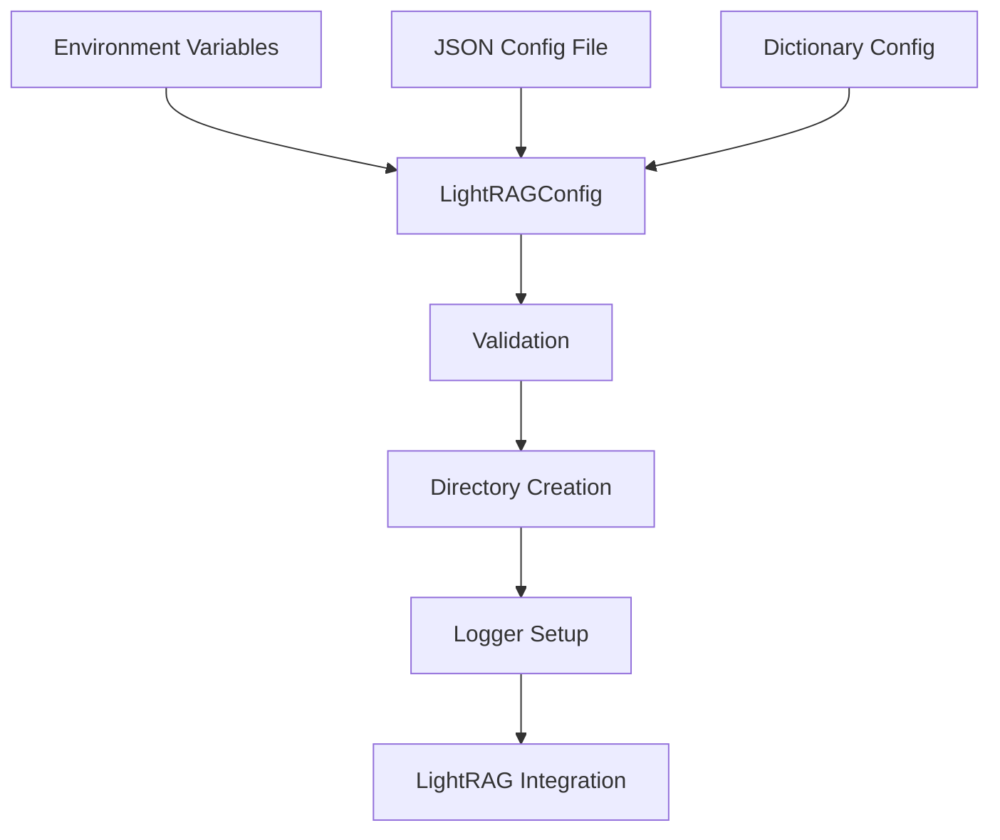

# LightRAG Configuration Guide
## Complete Reference for Clinical Metabolomics Oracle Integration

---

## Table of Contents

1. [Quick Start](#quick-start)
2. [Configuration Overview](#configuration-overview)
3. [Environment Setup](#environment-setup)
4. [Configuration Methods](#configuration-methods)
5. [Common Configuration Patterns](#common-configuration-patterns)
6. [Integration with CMO System](#integration-with-cmo-system)
7. [Troubleshooting](#troubleshooting)
8. [Best Practices](#best-practices)
9. [Advanced Configuration](#advanced-configuration)
10. [Reference Documentation](#reference-documentation)

---

## Quick Start

### Prerequisites
- Python 3.8+
- OpenAI API key ([Get one here](https://platform.openai.com/api-keys))
- Access to Clinical Metabolomics Oracle project

### 5-Minute Setup

1. **Copy environment template:**
   ```bash
   cp .env.example .env
   ```

2. **Set your API key:**
   ```bash
   # Edit .env file
   OPENAI_API_KEY=sk-your_actual_api_key_here
   ```

3. **Basic configuration test:**
   ```python
   from lightrag_integration.config import LightRAGConfig
   
   # This will use environment variables and create directories
   config = LightRAGConfig.get_config()
   print(f"Configuration loaded: {config.model}")
   ```

4. **Initialize your first knowledge graph:**
   ```python
   # Set up logging and create LightRAG instance
   logger = config.setup_lightrag_logging()
   logger.info("LightRAG configuration ready!")
   ```

### Minimal Working Configuration
```bash
# Required
OPENAI_API_KEY=sk-your_key_here

# Recommended
LIGHTRAG_WORKING_DIR=./lightrag_data
LIGHTRAG_MODEL=gpt-4o-mini
```

---

## Configuration Overview

The LightRAG integration uses a comprehensive configuration system built around the `LightRAGConfig` dataclass. It provides:

- **Environment variable integration** - Automatic loading from `.env` files
- **Validation and error handling** - Comprehensive validation with detailed error messages
- **Directory management** - Automatic creation of required directories
- **Logging configuration** - Built-in rotating file and console logging
- **Multiple configuration sources** - Environment, files, or dictionaries

### Architecture



---

## Environment Setup

### Development Environment

For local development with debugging:

```bash
# Core settings
OPENAI_API_KEY=sk-your_dev_key_here
LIGHTRAG_MODEL=gpt-4o-mini
LIGHTRAG_WORKING_DIR=./dev_lightrag

# Performance settings
LIGHTRAG_MAX_ASYNC=4
LIGHTRAG_MAX_TOKENS=16384

# Logging settings
LIGHTRAG_LOG_LEVEL=DEBUG
LIGHTRAG_ENABLE_FILE_LOGGING=true
LIGHTRAG_LOG_DIR=./dev_logs
```

### Staging Environment

For staging with monitoring:

```bash
# Core settings
OPENAI_API_KEY=sk-your_staging_key_here
LIGHTRAG_MODEL=gpt-4o-mini
LIGHTRAG_WORKING_DIR=/opt/lightrag/staging

# Performance settings
LIGHTRAG_MAX_ASYNC=16
LIGHTRAG_MAX_TOKENS=32768

# Logging settings
LIGHTRAG_LOG_LEVEL=INFO
LIGHTRAG_LOG_DIR=/var/log/lightrag-staging
LIGHTRAG_LOG_MAX_BYTES=10485760
LIGHTRAG_LOG_BACKUP_COUNT=5
```

### Production Environment

For production deployment:

```bash
# Core settings (use secrets management)
OPENAI_API_KEY=sk-your_production_key_here
LIGHTRAG_MODEL=gpt-4o
LIGHTRAG_EMBEDDING_MODEL=text-embedding-3-small
LIGHTRAG_WORKING_DIR=/opt/lightrag/production

# Performance settings
LIGHTRAG_MAX_ASYNC=32
LIGHTRAG_MAX_TOKENS=32768

# Logging settings
LIGHTRAG_LOG_LEVEL=INFO
LIGHTRAG_LOG_DIR=/var/log/lightrag
LIGHTRAG_ENABLE_FILE_LOGGING=true
LIGHTRAG_LOG_MAX_BYTES=104857600
LIGHTRAG_LOG_BACKUP_COUNT=10
```

---

## Configuration Methods

### Method 1: Environment Variables (Recommended)

The simplest and most common method:

```python
from lightrag_integration.config import LightRAGConfig

# Loads from environment variables automatically
config = LightRAGConfig.get_config()
```

### Method 2: Configuration File

For complex setups or deployment automation:

```python
# config.json
{
    "model": "gpt-4o",
    "working_dir": "/opt/lightrag/data",
    "max_async": 32,
    "log_level": "INFO"
}

# Python code
config = LightRAGConfig.get_config(source="config.json")
```

### Method 3: Dictionary Configuration

For dynamic configuration or testing:

```python
config_dict = {
    "api_key": "sk-test-key",
    "model": "gpt-4o-mini",
    "working_dir": "./test_data",
    "max_async": 4
}

config = LightRAGConfig.get_config(source=config_dict)
```

### Method 4: Hybrid with Overrides

Combine methods with runtime overrides:

```python
# Load from environment but override specific values
config = LightRAGConfig.get_config(
    source=None,  # Use environment
    max_async=64,  # Override for high-performance scenario
    log_level="DEBUG"  # Override for debugging
)
```

---

## Common Configuration Patterns

### Research Paper Processing

Optimized for academic paper ingestion:

```python
config = LightRAGConfig.get_config(
    model="gpt-4o",  # Better for academic text
    max_tokens=32768,  # Handle longer papers
    max_async=8,  # Moderate concurrency
    working_dir="./research_papers"
)
```

### Real-time Clinical Support

Optimized for fast clinical queries:

```python
config = LightRAGConfig.get_config(
    model="gpt-4o-mini",  # Fast inference
    max_tokens=16384,  # Shorter responses
    max_async=32,  # High concurrency
    working_dir="./clinical_kb"
)
```

### Batch Processing

For large-scale data processing:

```python
config = LightRAGConfig.get_config(
    model="gpt-3.5-turbo",  # Cost-effective
    max_async=64,  # Maximum throughput
    enable_file_logging=True,  # Track progress
    log_level="INFO"
)
```

### Development and Testing

For safe development:

```python
config = LightRAGConfig.get_config(
    model="gpt-4o-mini",  # Lower cost
    max_async=2,  # Avoid rate limits
    working_dir="./test_env",
    log_level="DEBUG",
    validate_config=True
)
```

---

## Integration with CMO System

### Chainlit Integration

Configure LightRAG for the CMO Chainlit application:

```python
# In your Chainlit app
import chainlit as cl
from lightrag_integration.config import LightRAGConfig

@cl.on_chat_start
async def start():
    # Load configuration optimized for chat
    config = LightRAGConfig.get_config(
        working_dir="./chainlit_lightrag",
        max_async=16,  # Balance performance and resources
        log_level="INFO"
    )
    
    # Set up logging for the session
    logger = config.setup_lightrag_logging("chainlit_lightrag")
    
    # Store in session
    cl.user_session.set("config", config)
    cl.user_session.set("logger", logger)
```

### Database Integration

Configure for CMO database connections:

```python
# Example: Coordinate with PostgreSQL and Neo4j
import os
from lightrag_integration.config import LightRAGConfig

def create_integrated_config():
    # Ensure working directory aligns with database paths
    db_data_dir = os.getenv("DATABASE_DATA_DIR", "./cmo_data")
    
    config = LightRAGConfig.get_config(
        working_dir=f"{db_data_dir}/lightrag",
        log_dir=f"{db_data_dir}/logs"
    )
    
    return config
```

### Multi-User Support

Configure for concurrent user sessions:

```python
def create_user_config(user_id: str):
    """Create isolated configuration for each user."""
    return LightRAGConfig.get_config(
        working_dir=f"./users/{user_id}/lightrag",
        log_dir=f"./users/{user_id}/logs",
        max_async=8,  # Per-user limit
        validate_config=True
    )
```

### Microservices Architecture

Configure for distributed deployment:

```python
# Service-specific configuration
class LightRAGService:
    def __init__(self, service_name: str):
        self.config = LightRAGConfig.get_config(
            working_dir=f"/opt/services/{service_name}/data",
            log_dir=f"/var/log/services/{service_name}",
            # Service-specific performance tuning
            max_async=int(os.getenv(f"{service_name.upper()}_MAX_ASYNC", "16"))
        )
        
        self.logger = self.config.setup_lightrag_logging(
            f"lightrag_{service_name}"
        )
```

---

## Troubleshooting

### Common Issues and Solutions

#### 1. Configuration Not Loading

**Symptoms:**
- `LightRAGConfigError: API key is required`
- Default values being used instead of environment variables

**Solutions:**
```bash
# Check environment variable is set
echo $OPENAI_API_KEY

# Verify .env file location and syntax
cat .env | grep OPENAI_API_KEY

# Test Python environment loading
python -c "import os; print('API Key:', 'Found' if os.getenv('OPENAI_API_KEY') else 'Missing')"
```

#### 2. Directory Creation Failures

**Symptoms:**
- `OSError: Permission denied`
- `LightRAGConfigError: Working directory does not exist and cannot be created`

**Solutions:**
```bash
# Check and fix permissions
ls -la /opt/lightrag/
sudo chown -R $USER:$USER /opt/lightrag/
chmod 755 /opt/lightrag/

# Create directories manually
mkdir -p /opt/lightrag/production
mkdir -p /var/log/lightrag
```

#### 3. Logging Configuration Issues

**Symptoms:**
- No log files created
- Permission errors in log directory

**Solutions:**
```python
# Test logging setup
from lightrag_integration.config import LightRAGConfig

config = LightRAGConfig.get_config(
    enable_file_logging=True,
    log_dir="./test_logs"
)

logger = config.setup_lightrag_logging()
logger.info("Test log message")
```

#### 4. Model or API Issues

**Symptoms:**
- `InvalidRequestError: Model not found`
- API rate limit errors

**Solutions:**
```python
# Test with minimal configuration
config = LightRAGConfig.get_config(
    model="gpt-3.5-turbo",  # Fallback model
    max_async=1,  # Minimal concurrency
    validate_config=True  # Enable validation
)
```

### Debug Mode

Enable comprehensive debugging:

```bash
export LIGHTRAG_LOG_LEVEL=DEBUG
export LIGHTRAG_ENABLE_FILE_LOGGING=true
```

```python
# Enable all validation and logging
config = LightRAGConfig.get_config(
    validate_config=True,
    ensure_dirs=True,
    log_level="DEBUG"
)
```

### Health Check Script

Create a configuration health check:

```python
def health_check():
    """Comprehensive configuration health check."""
    try:
        # Test configuration loading
        config = LightRAGConfig.get_config(validate_config=True)
        print("✓ Configuration loaded successfully")
        
        # Test directory access
        config.ensure_directories()
        print("✓ Directories created/accessible")
        
        # Test logging setup
        logger = config.setup_lightrag_logging()
        logger.info("Health check successful")
        print("✓ Logging configured successfully")
        
        print("\n🎉 All systems operational!")
        return True
        
    except Exception as e:
        print(f"❌ Health check failed: {e}")
        return False

if __name__ == "__main__":
    health_check()
```

---

## Best Practices

### Security

1. **API Key Management:**
   ```bash
   # Use environment variables
   export OPENAI_API_KEY="sk-your-key"
   
   # Never commit keys to version control
   echo "*.env" >> .gitignore
   
   # Use secrets management in production
   # AWS Secrets Manager, Azure Key Vault, etc.
   ```

2. **File Permissions:**
   ```bash
   # Secure configuration files
   chmod 600 .env
   
   # Secure data directories
   chmod 750 /opt/lightrag/production
   chown -R lightrag:lightrag /opt/lightrag/
   ```

### Performance

1. **Resource Allocation:**
   ```python
   # Development
   config = LightRAGConfig.get_config(max_async=4)
   
   # Production (adjust based on resources)
   config = LightRAGConfig.get_config(max_async=32)
   ```

2. **Model Selection:**
   ```python
   # Cost-effective for large volumes
   config = LightRAGConfig.get_config(model="gpt-4o-mini")
   
   # High accuracy for critical tasks
   config = LightRAGConfig.get_config(model="gpt-4o")
   ```

### Monitoring

1. **Logging Strategy:**
   ```python
   # Production logging
   config = LightRAGConfig.get_config(
       log_level="INFO",
       log_max_bytes=100*1024*1024,  # 100MB
       log_backup_count=10
   )
   ```

2. **Configuration Validation:**
   ```python
   # Always validate in production
   config = LightRAGConfig.get_config(validate_config=True)
   ```

### Development Workflow

1. **Environment Separation:**
   ```bash
   # .env.development
   OPENAI_API_KEY=sk-dev-key
   LIGHTRAG_WORKING_DIR=./dev_data
   
   # .env.production
   OPENAI_API_KEY=sk-prod-key
   LIGHTRAG_WORKING_DIR=/opt/lightrag/prod
   ```

2. **Testing Configuration:**
   ```python
   # Unit tests
   @patch.dict(os.environ, {
       'OPENAI_API_KEY': 'sk-test-key',
       'LIGHTRAG_MODEL': 'gpt-4o-mini'
   })
   def test_config_loading():
       config = LightRAGConfig.get_config()
       assert config.model == 'gpt-4o-mini'
   ```

---

## Advanced Configuration

### Custom Configuration Classes

Extend the base configuration for specialized use cases:

```python
from lightrag_integration.config import LightRAGConfig

class ClinicalLightRAGConfig(LightRAGConfig):
    """Specialized configuration for clinical applications."""
    
    def __post_init__(self):
        super().__post_init__()
        # Clinical-specific defaults
        if not hasattr(self, 'clinical_mode'):
            self.clinical_mode = True
        
        # Enhanced security for clinical data
        if self.clinical_mode:
            self.log_level = "INFO"  # No DEBUG in clinical
            self.enable_file_logging = True  # Always log
```

### Dynamic Configuration

Configuration that adapts to runtime conditions:

```python
def create_adaptive_config():
    """Create configuration that adapts to system resources."""
    import psutil
    
    # Adapt concurrency to CPU count
    max_async = min(psutil.cpu_count() * 2, 64)
    
    # Adapt working directory to available disk space
    available_gb = psutil.disk_usage('/').free / (1024**3)
    working_dir = '/opt/lightrag/production' if available_gb > 50 else './lightrag_temp'
    
    return LightRAGConfig.get_config(
        max_async=max_async,
        working_dir=working_dir
    )
```

### Configuration Profiles

Predefined configuration profiles:

```python
class ConfigProfiles:
    @staticmethod
    def research_processing():
        """Optimized for research paper processing."""
        return LightRAGConfig.get_config(
            model="gpt-4o",
            max_tokens=32768,
            max_async=8,
            working_dir="./research_data"
        )
    
    @staticmethod
    def clinical_queries():
        """Optimized for real-time clinical queries."""
        return LightRAGConfig.get_config(
            model="gpt-4o-mini",
            max_tokens=16384,
            max_async=32,
            working_dir="./clinical_data"
        )
    
    @staticmethod
    def batch_processing():
        """Optimized for batch processing."""
        return LightRAGConfig.get_config(
            model="gpt-3.5-turbo",
            max_async=64,
            enable_file_logging=True,
            log_level="INFO"
        )

# Usage
config = ConfigProfiles.clinical_queries()
```

---

## Reference Documentation

### Complete Documentation Files

1. **[ENVIRONMENT_VARIABLES.md](./ENVIRONMENT_VARIABLES.md)**
   - Complete reference for all environment variables
   - Detailed validation rules and constraints
   - Environment-specific configuration examples
   - Security considerations and best practices

2. **Configuration Class Reference**
   - Source: `/lightrag_integration/config.py`
   - Complete dataclass documentation with all methods
   - Factory functions and utility methods
   - Error handling and validation logic

3. **Test Suite**
   - Source: `/lightrag_integration/tests/test_lightrag_config.py`
   - Comprehensive test coverage for all configuration scenarios
   - Example usage patterns and edge cases

### Environment Variables Quick Reference

| Variable | Type | Default | Description |
|----------|------|---------|-------------|
| `OPENAI_API_KEY` | string | **Required** | OpenAI API key |
| `LIGHTRAG_MODEL` | string | `gpt-4o-mini` | LLM model |
| `LIGHTRAG_EMBEDDING_MODEL` | string | `text-embedding-3-small` | Embedding model |
| `LIGHTRAG_WORKING_DIR` | path | current dir | Working directory |
| `LIGHTRAG_MAX_ASYNC` | integer | `16` | Max concurrent operations |
| `LIGHTRAG_MAX_TOKENS` | integer | `32768` | Max tokens per response |
| `LIGHTRAG_LOG_LEVEL` | string | `INFO` | Logging level |
| `LIGHTRAG_LOG_DIR` | path | `logs` | Log directory |
| `LIGHTRAG_ENABLE_FILE_LOGGING` | boolean | `true` | Enable file logging |
| `LIGHTRAG_LOG_MAX_BYTES` | integer | `10485760` | Max log file size |
| `LIGHTRAG_LOG_BACKUP_COUNT` | integer | `5` | Backup log files |

### Configuration Methods Reference

```python
# Primary factory method
config = LightRAGConfig.get_config(
    source=None,              # Environment variables (default)
    validate_config=True,     # Enable validation
    ensure_dirs=True,         # Create directories
    **overrides              # Override specific values
)

# Alternative constructors
config = LightRAGConfig.from_environment()     # Environment only
config = LightRAGConfig.from_file("config.json")  # JSON file
config = LightRAGConfig.from_dict({...})       # Dictionary

# Validation and directory management
config.validate()           # Validate configuration
config.ensure_directories() # Create required directories

# Logging setup
logger = config.setup_lightrag_logging("my_app")

# Utility methods
config.to_dict()           # Convert to dictionary
config.copy()              # Create deep copy
```

### CMO Integration Points

The LightRAG configuration integrates with several CMO system components:

1. **Chainlit Application** - Session management and user isolation
2. **Database Layer** - PostgreSQL and Neo4j coordination
3. **API Services** - Multi-API key management
4. **Monitoring System** - Structured logging integration
5. **Authentication** - User-specific configurations
6. **Deployment** - Docker and Kubernetes configurations

---

## Support and Maintenance

### Version Information
- **Configuration System Version**: 1.0
- **LightRAG Integration**: Compatible with LightRAG 0.9+
- **Python Compatibility**: 3.8+
- **Last Updated**: August 6, 2025
- **Task Reference**: CMO-LIGHTRAG-002-T10

### Getting Help

1. **Configuration Issues**: Check the troubleshooting section above
2. **Performance Tuning**: Refer to the performance best practices
3. **Security Concerns**: Review the security guidelines
4. **Integration Questions**: Consult the CMO integration examples

### Contributing

When modifying the configuration system:

1. Update environment variable documentation in `ENVIRONMENT_VARIABLES.md`
2. Add test coverage for new configuration options
3. Update this master guide with new patterns and examples
4. Maintain backward compatibility where possible

---

*This guide provides comprehensive coverage of the LightRAG configuration system for the Clinical Metabolomics Oracle. For specific implementation details, refer to the source code and related documentation files.*