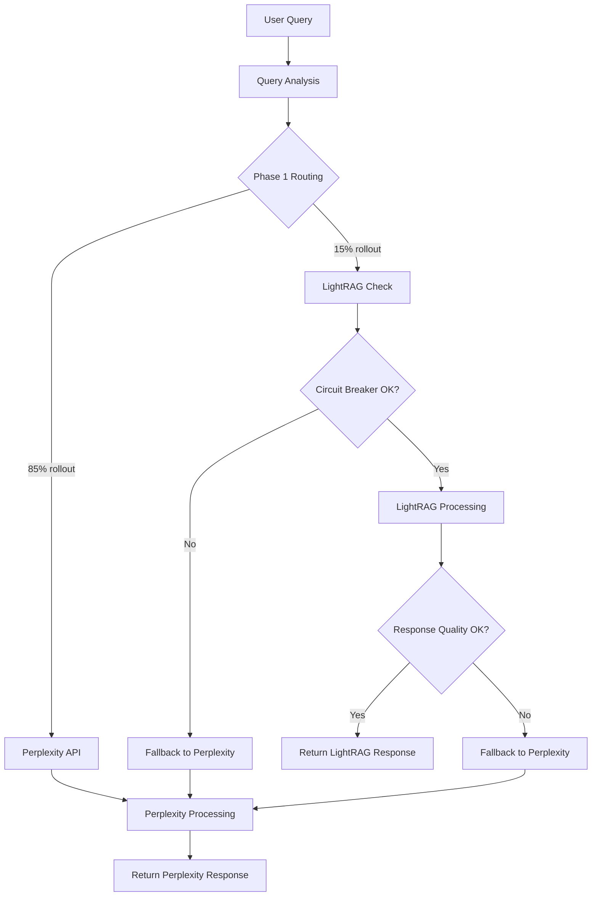
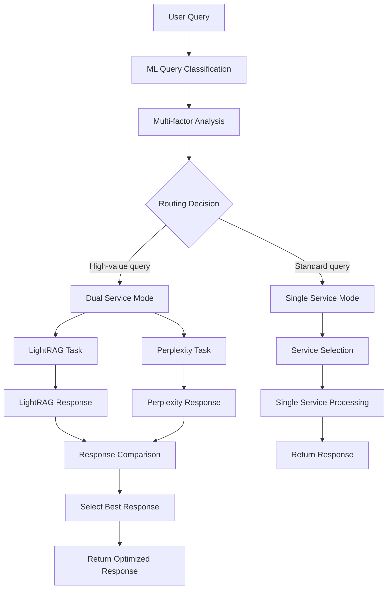
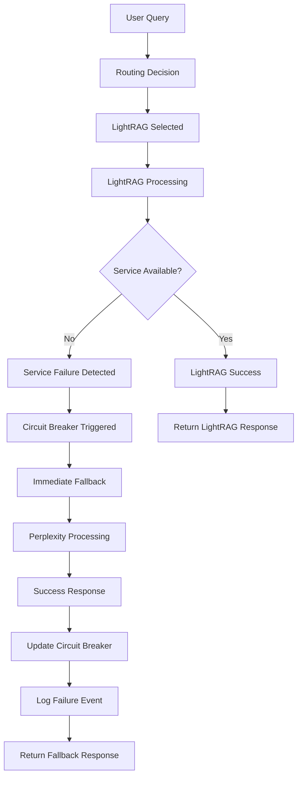

# Query Routing and Fallback Mechanisms Documentation
## Clinical Metabolomics Oracle - LightRAG Integration

### Table of Contents

1. [Overview](#overview)
2. [Query Routing Architecture](#query-routing-architecture)
3. [Integration with Existing Perplexity API System](#integration-with-existing-perplexity-api-system)
4. [Fallback Mechanisms and Error Handling](#fallback-mechanisms-and-error-handling)
5. [Performance Considerations](#performance-considerations)
6. [Phase 1 (MVP) vs Phase 2 (Production) Routing](#phase-1-mvp-vs-phase-2-production-routing)
7. [Configuration and Tuning](#configuration-and-tuning)
8. [Query Flow Examples](#query-flow-examples)
9. [Monitoring and Metrics](#monitoring-and-metrics)
10. [Troubleshooting Guide](#troubleshooting-guide)

---

## Overview

The Clinical Metabolomics Oracle (CMO) employs an intelligent query routing system that seamlessly integrates LightRAG (Light Retrieval-Augmented Generation) with the existing Perplexity API system. This hybrid approach provides optimal responses by leveraging the strengths of both systems while maintaining reliability through comprehensive fallback mechanisms.

### Key Features

- **Intelligent Query Analysis**: Automatic classification of queries to determine optimal routing
- **Seamless Fallback**: Transparent switching between LightRAG and Perplexity when issues occur
- **Performance Optimization**: Real-time performance monitoring and adaptive routing
- **Cost Management**: Budget-aware routing with cost optimization
- **Quality Assurance**: Response quality assessment and validation
- **Circuit Breaker Protection**: Automatic service isolation during failures
- **A/B Testing Support**: Controlled rollout and experimentation capabilities

---

## Query Routing Architecture

### 1. System Components

```
┌─────────────────────────────────────────────────────────────┐
│                    User Query Input                         │
│                   (Chainlit Interface)                     │
└─────────────────────┬───────────────────────────────────────┘
                      │
                      ▼
┌─────────────────────────────────────────────────────────────┐
│                Query Analyzer                               │
│  • Content Classification  • Intent Detection              │
│  • Complexity Assessment   • Language Detection            │
└─────────────────────┬───────────────────────────────────────┘
                      │
                      ▼
┌─────────────────────────────────────────────────────────────┐
│              Feature Flag Manager                           │
│  • User Cohort Assignment  • Rollout Percentage            │
│  • Circuit Breaker Status  • Performance Metrics          │
└─────────────────────┬───────────────────────────────────────┘
                      │
                      ▼
┌─────────────────────────────────────────────────────────────┐
│                Routing Decision Engine                      │
│  • Service Health Check    • Cost Budget Validation        │
│  • Quality Score Comparison • Load Balancing               │
└─────────┬───────────────────────────────────────┬─────────┘
          │                                       │
          ▼                                       ▼
┌─────────────────────┐                 ┌─────────────────────┐
│   LightRAG Path     │                 │  Perplexity Path    │
│                     │                 │                     │
│ • Local Knowledge   │                 │ • Real-time Web     │
│ • PDF Documents     │                 │ • Search Results    │
│ • Graph Processing  │                 │ • Recent Updates    │
└─────────────────────┘                 └─────────────────────┘
          │                                       │
          └─────────┬───────────────────────────────────────────┘
                    │
                    ▼
┌─────────────────────────────────────────────────────────────┐
│              Response Processing                            │
│  • Quality Validation  • Citation Processing               │
│  • Cost Tracking      • Performance Metrics               │
└─────────────────────────────────────────────────────────────┘
```

### 2. Routing Decision Logic

The routing decision follows a multi-stage evaluation process:

#### Stage 1: Query Classification
```python
class QueryClassifier:
    """Classifies queries for optimal routing decisions."""
    
    @classmethod
    def analyze_query(cls, query: str) -> QueryContext:
        """
        Analyze query characteristics to inform routing decisions.
        
        Classification Criteria:
        - Biomedical specificity (clinical metabolomics terms)
        - Query complexity (simple vs multi-faceted)
        - Temporal requirements (recent vs historical data)
        - Document reference needs (PDF citations required)
        - Language and translation requirements
        """
        
        context = QueryContext(
            content=query,
            biomedical_specificity=cls._assess_biomedical_content(query),
            complexity_score=cls._calculate_complexity(query),
            requires_recent_data=cls._detect_temporal_requirements(query),
            requires_pdf_sources=cls._assess_citation_needs(query),
            estimated_processing_time=cls._estimate_processing_time(query)
        )
        
        return context
```

#### Stage 2: Service Health Assessment
```python
class ServiceHealthMonitor:
    """Monitors and evaluates service health for routing decisions."""
    
    def get_routing_recommendation(self) -> RoutingRecommendation:
        """
        Evaluate service health and provide routing recommendations.
        
        Health Metrics:
        - Service availability (uptime, error rates)
        - Response time performance
        - Quality score trends
        - Cost efficiency metrics
        - Circuit breaker status
        """
        
        lightrag_health = self._assess_lightrag_health()
        perplexity_health = self._assess_perplexity_health()
        
        return RoutingRecommendation(
            primary_service=self._select_primary_service(lightrag_health, perplexity_health),
            fallback_service=self._select_fallback_service(),
            confidence_score=self._calculate_confidence(),
            reasoning=self._generate_decision_explanation()
        )
```

#### Stage 3: Final Routing Decision
```python
class RoutingEngine:
    """Makes final routing decisions based on all factors."""
    
    def route_query(self, context: QueryContext) -> RoutingResult:
        """
        Execute routing decision based on comprehensive analysis.
        
        Decision Factors (in priority order):
        1. Circuit breaker status (safety override)
        2. Feature flag settings (rollout control)
        3. User cohort assignment (A/B testing)
        4. Query characteristics (content-based)
        5. Service health metrics (performance-based)
        6. Cost budget constraints (budget management)
        7. Quality optimization goals (quality-based)
        """
        
        # Safety checks first
        if self.circuit_breaker.is_open('lightrag'):
            return RoutingResult(
                decision=RoutingDecision.PERPLEXITY,
                reason="Circuit breaker protection - LightRAG service unavailable"
            )
        
        # Feature flag evaluation
        flag_result = self.feature_flag_manager.should_use_lightrag(context)
        if flag_result.decision == RoutingDecision.DISABLED:
            return RoutingResult(
                decision=RoutingDecision.PERPLEXITY,
                reason="Feature flag disabled LightRAG for this user/query"
            )
        
        # Content-based routing
        if self._should_prefer_lightrag(context):
            return RoutingResult(
                decision=RoutingDecision.LIGHTRAG,
                reason="Query optimally suited for LightRAG processing"
            )
        
        # Default fallback
        return RoutingResult(
            decision=RoutingDecision.PERPLEXITY,
            reason="Default routing to Perplexity API"
        )
```

---

## Integration with Existing Perplexity API System

### 1. Backward Compatibility Approach

The integration maintains full backward compatibility with the existing Perplexity API system through an adapter pattern:

#### Current Perplexity Integration (main.py)
```python
# Existing Perplexity API call in main.py
@cl.on_message
async def on_message(message: cl.Message):
    # ... existing pre-processing ...
    
    # Current direct Perplexity API call
    url = "https://api.perplexity.ai/chat/completions"
    payload = {
        "model": "sonar",
        "messages": [
            {"role": "system", "content": "You are an expert in clinical metabolomics..."},
            {"role": "user", "content": content}
        ],
        "temperature": 0.1,
        "search_domain_filter": ["-wikipedia.org"]
    }
    response = requests.post(url, json=payload, headers=headers)
    
    # ... existing post-processing ...
```

#### Enhanced Integration with Routing
```python
# Enhanced integration with intelligent routing
@cl.on_message
async def on_message(message: cl.Message):
    # ... existing pre-processing ...
    
    # Initialize routing system
    router = get_query_router()
    query_context = QueryContext(
        content=content,
        user_id=cl.user_session.get("user_id"),
        session_id=cl.user_session.get("session_id"),
        language=language
    )
    
    # Make routing decision
    routing_result = await router.route_query(query_context)
    
    if routing_result.decision == RoutingDecision.LIGHTRAG:
        # Use LightRAG system
        response_content, citations = await process_with_lightrag(content)
    else:
        # Use existing Perplexity API (unchanged)
        response_content, citations = await process_with_perplexity(content)
    
    # ... existing post-processing (unchanged) ...
```

### 2. Service Adapter Pattern

```python
class QueryServiceAdapter:
    """Unified interface for both LightRAG and Perplexity services."""
    
    def __init__(self, router: QueryRouter):
        self.router = router
        self.lightrag_service = LightRAGService()
        self.perplexity_service = PerplexityService()
    
    async def process_query(self, query: str, context: QueryContext) -> ServiceResponse:
        """
        Process query using appropriate service based on routing decision.
        
        Returns:
            ServiceResponse: Unified response format regardless of service used
        """
        
        routing_result = await self.router.route_query(context)
        
        try:
            if routing_result.decision == RoutingDecision.LIGHTRAG:
                return await self._process_with_lightrag(query, context)
            else:
                return await self._process_with_perplexity(query, context)
                
        except Exception as e:
            # Automatic fallback on service failure
            logger.warning(f"Primary service failed, attempting fallback: {e}")
            return await self._execute_fallback(query, context, routing_result)
    
    async def _process_with_lightrag(self, query: str, context: QueryContext) -> ServiceResponse:
        """Process query using LightRAG system."""
        start_time = time.time()
        
        try:
            # LightRAG processing
            rag_response = await self.lightrag_service.query(
                query=query,
                query_param=self._create_query_param(context)
            )
            
            processing_time = time.time() - start_time
            
            # Convert to unified format
            return ServiceResponse(
                content=rag_response.response,
                citations=self._format_lightrag_citations(rag_response.sources),
                response_type=ResponseType.LIGHTRAG,
                processing_time=processing_time,
                service_info={
                    "tokens_used": rag_response.tokens_used,
                    "cost_estimate": rag_response.cost_estimate,
                    "query_mode": rag_response.query_mode
                }
            )
            
        except Exception as e:
            logger.error(f"LightRAG processing failed: {e}")
            raise
    
    async def _process_with_perplexity(self, query: str, context: QueryContext) -> ServiceResponse:
        """Process query using existing Perplexity API."""
        start_time = time.time()
        
        # Use existing Perplexity logic (unchanged)
        url = "https://api.perplexity.ai/chat/completions"
        payload = {
            "model": "sonar",
            "messages": [
                {
                    "role": "system",
                    "content": "You are an expert in clinical metabolomics..."
                },
                {"role": "user", "content": query}
            ],
            "temperature": 0.1,
            "search_domain_filter": ["-wikipedia.org"]
        }
        
        response = requests.post(url, json=payload, headers=self._get_headers())
        processing_time = time.time() - start_time
        
        if response.status_code == 200:
            response_data = response.json()
            content = response_data['choices'][0]['message']['content']
            citations = response_data.get('citations', [])
            
            return ServiceResponse(
                content=content,
                citations=self._format_perplexity_citations(citations),
                response_type=ResponseType.PERPLEXITY,
                processing_time=processing_time,
                service_info={
                    "model_used": "sonar",
                    "tokens_used": response_data.get('usage', {}).get('total_tokens', 0)
                }
            )
        else:
            raise PerplexityAPIError(f"API call failed: {response.status_code}")
```

### 3. Migration Path

The integration supports gradual migration through configurable percentages:

```python
# Environment configuration for gradual rollout
LIGHTRAG_ROLLOUT_PERCENTAGE=25  # Start with 25% of traffic
ENABLE_FALLBACK=true            # Always enable fallback to Perplexity
HYBRID_MODE=auto                # Let system decide based on query characteristics
```

---

## Fallback Mechanisms and Error Handling

### 1. Multi-Level Fallback Strategy

The system implements a comprehensive fallback strategy with multiple levels of protection:

```python
class FallbackManager:
    """Manages fallback strategies across multiple failure scenarios."""
    
    def __init__(self):
        self.fallback_chain = [
            PrimaryServiceFallback(),      # Immediate service switching
            ServiceRecoveryFallback(),     # Service restoration attempts
            DegradedModeFallback(),        # Reduced functionality mode
            CachedResponseFallback(),      # Serve cached responses
            EmergencyResponseFallback()    # Minimal functionality
        ]
    
    async def execute_fallback(
        self, 
        query: str, 
        context: QueryContext, 
        primary_failure: Exception
    ) -> ServiceResponse:
        """
        Execute fallback strategy based on failure type and system state.
        
        Fallback Levels:
        1. Immediate Service Switch: Use alternate service immediately
        2. Service Recovery: Attempt to restore primary service
        3. Degraded Mode: Reduce functionality but maintain service
        4. Cached Response: Serve previously cached similar responses
        5. Emergency Response: Provide minimal but functional response
        """
        
        for fallback_handler in self.fallback_chain:
            try:
                if fallback_handler.can_handle(primary_failure, context):
                    response = await fallback_handler.execute(query, context)
                    if response.is_success:
                        return response
            except Exception as e:
                logger.warning(f"Fallback handler {fallback_handler.__class__.__name__} failed: {e}")
                continue
        
        # Final emergency response
        return self._create_emergency_response(query, primary_failure)
```

### 2. Circuit Breaker Implementation

```python
class CircuitBreaker:
    """Circuit breaker pattern implementation for service protection."""
    
    def __init__(self, service_name: str, failure_threshold: int = 5, 
                 recovery_timeout: int = 60, half_open_requests: int = 3):
        self.service_name = service_name
        self.failure_threshold = failure_threshold
        self.recovery_timeout = recovery_timeout
        self.half_open_requests = half_open_requests
        
        self.failure_count = 0
        self.last_failure_time = None
        self.state = CircuitBreakerState.CLOSED
        self.half_open_attempts = 0
    
    async def call(self, func: Callable, *args, **kwargs):
        """Execute function with circuit breaker protection."""
        
        if self.state == CircuitBreakerState.OPEN:
            if self._should_attempt_recovery():
                self.state = CircuitBreakerState.HALF_OPEN
                self.half_open_attempts = 0
            else:
                raise CircuitBreakerOpenError(
                    f"Circuit breaker is OPEN for {self.service_name}"
                )
        
        try:
            result = await func(*args, **kwargs)
            self._record_success()
            return result
            
        except Exception as e:
            self._record_failure(e)
            raise
    
    def _record_success(self):
        """Record successful operation."""
        if self.state == CircuitBreakerState.HALF_OPEN:
            self.half_open_attempts += 1
            if self.half_open_attempts >= self.half_open_requests:
                self.state = CircuitBreakerState.CLOSED
                self.failure_count = 0
                logger.info(f"Circuit breaker CLOSED for {self.service_name}")
        else:
            self.failure_count = max(0, self.failure_count - 1)
    
    def _record_failure(self, exception: Exception):
        """Record failed operation."""
        self.failure_count += 1
        self.last_failure_time = datetime.now()
        
        if self.state == CircuitBreakerState.HALF_OPEN:
            self.state = CircuitBreakerState.OPEN
            logger.warning(f"Circuit breaker OPEN for {self.service_name} - half-open test failed")
        elif self.failure_count >= self.failure_threshold:
            self.state = CircuitBreakerState.OPEN
            logger.warning(f"Circuit breaker OPEN for {self.service_name} - threshold exceeded")
```

### 3. Error Classification and Handling

```python
class ErrorClassifier:
    """Classifies errors for appropriate fallback strategies."""
    
    ERROR_CATEGORIES = {
        'TRANSIENT': [
            TimeoutError,
            ConnectionError,
            HTTPStatus.REQUEST_TIMEOUT,
            HTTPStatus.TOO_MANY_REQUESTS,
            HTTPStatus.SERVICE_UNAVAILABLE
        ],
        'AUTHENTICATION': [
            HTTPStatus.UNAUTHORIZED,
            HTTPStatus.FORBIDDEN,
            openai.AuthenticationError
        ],
        'RESOURCE_EXHAUSTION': [
            HTTPStatus.TOO_MANY_REQUESTS,
            openai.RateLimitError,
            BudgetExceededError
        ],
        'SERVICE_DEGRADATION': [
            HTTPStatus.PARTIAL_CONTENT,
            HTTPStatus.BAD_GATEWAY,
            HTTPStatus.GATEWAY_TIMEOUT
        ],
        'PERMANENT': [
            HTTPStatus.NOT_FOUND,
            HTTPStatus.BAD_REQUEST,
            HTTPStatus.UNPROCESSABLE_ENTITY
        ]
    }
    
    @classmethod
    def classify_error(cls, error: Exception) -> ErrorCategory:
        """Classify error for appropriate handling strategy."""
        
        for category, error_types in cls.ERROR_CATEGORIES.items():
            if any(isinstance(error, error_type) for error_type in error_types):
                return ErrorCategory(category)
        
        # Default to transient for unknown errors
        return ErrorCategory.TRANSIENT
    
    @classmethod
    def get_fallback_strategy(cls, error: Exception, context: QueryContext) -> FallbackStrategy:
        """Determine appropriate fallback strategy based on error classification."""
        
        category = cls.classify_error(error)
        
        if category == ErrorCategory.TRANSIENT:
            return RetryFallbackStrategy(max_retries=3, backoff_factor=2)
        elif category == ErrorCategory.AUTHENTICATION:
            return ServiceSwitchFallbackStrategy(reason="Authentication failure")
        elif category == ErrorCategory.RESOURCE_EXHAUSTION:
            return RateLimitFallbackStrategy(cooldown_period=60)
        elif category == ErrorCategory.SERVICE_DEGRADATION:
            return DegradedModeFallbackStrategy(reduced_features=True)
        else:
            return ServiceSwitchFallbackStrategy(reason="Permanent service failure")
```

### 4. Graceful Degradation Strategies

```python
class DegradedModeProcessor:
    """Provides reduced functionality during service issues."""
    
    async def process_query_degraded(
        self, 
        query: str, 
        context: QueryContext,
        available_services: List[str]
    ) -> ServiceResponse:
        """
        Process query with reduced functionality when primary services fail.
        
        Degraded Mode Features:
        - Cached response serving
        - Simplified processing
        - Reduced quality validation
        - Basic error messages
        - Fallback to basic responses
        """
        
        # Try cached responses first
        cached_response = await self._get_cached_response(query, context)
        if cached_response:
            return self._enhance_cached_response(cached_response)
        
        # Try simplified processing
        if 'basic_nlp' in available_services:
            return await self._basic_nlp_processing(query, context)
        
        # Last resort - template response
        return self._create_fallback_response(query, context)
    
    async def _basic_nlp_processing(self, query: str, context: QueryContext) -> ServiceResponse:
        """Basic NLP processing when advanced services are unavailable."""
        
        # Extract key terms from query
        key_terms = self._extract_biomedical_terms(query)
        
        # Generate basic response using templates
        response_content = self._generate_template_response(query, key_terms)
        
        return ServiceResponse(
            content=response_content,
            response_type=ResponseType.FALLBACK,
            service_info={
                "mode": "degraded",
                "features_available": ["basic_nlp", "template_responses"]
            }
        )
```

---

## Performance Considerations

### 1. Response Time Optimization

```python
class PerformanceOptimizer:
    """Optimizes routing decisions based on performance metrics."""
    
    def __init__(self):
        self.performance_targets = {
            'response_time': 3.0,    # Target 3 seconds
            'quality_score': 0.8,    # Target 80% quality
            'cost_per_query': 0.05,  # Target 5 cents per query
            'availability': 0.99      # Target 99% availability
        }
    
    def evaluate_service_performance(self, service_name: str) -> PerformanceMetrics:
        """Evaluate current service performance against targets."""
        
        metrics = self.get_recent_metrics(service_name)
        
        return PerformanceMetrics(
            avg_response_time=metrics.get_avg_response_time(),
            quality_score=metrics.get_avg_quality_score(),
            availability=metrics.get_availability(),
            cost_efficiency=metrics.get_cost_per_query(),
            meets_targets=self._check_performance_targets(metrics)
        )
    
    def get_routing_preference(self) -> RoutingPreference:
        """Determine routing preference based on current performance."""
        
        lightrag_perf = self.evaluate_service_performance('lightrag')
        perplexity_perf = self.evaluate_service_performance('perplexity')
        
        # Prefer service that better meets performance targets
        if lightrag_perf.meets_targets and not perplexity_perf.meets_targets:
            return RoutingPreference.PREFER_LIGHTRAG
        elif perplexity_perf.meets_targets and not lightrag_perf.meets_targets:
            return RoutingPreference.PREFER_PERPLEXITY
        else:
            # Both meet targets or both don't - use other factors
            return RoutingPreference.BALANCED
```

### 2. Caching Strategy

```python
class QueryCacheManager:
    """Manages caching for improved performance."""
    
    def __init__(self):
        self.cache_config = {
            'ttl_seconds': 3600,        # 1 hour TTL
            'max_cache_size': 1000,     # Maximum cached responses
            'similarity_threshold': 0.85, # Query similarity threshold
            'cache_quality_threshold': 0.7  # Only cache high-quality responses
        }
    
    async def get_cached_response(self, query: str, context: QueryContext) -> Optional[ServiceResponse]:
        """Retrieve cached response for similar queries."""
        
        query_hash = self._generate_query_hash(query, context)
        
        # Exact match first
        cached = await self.cache.get(query_hash)
        if cached and not self._is_expired(cached):
            return self._deserialize_response(cached)
        
        # Semantic similarity search
        similar_queries = await self._find_similar_queries(query, context)
        for similar_query, similarity_score in similar_queries:
            if similarity_score >= self.cache_config['similarity_threshold']:
                cached = await self.cache.get(similar_query['hash'])
                if cached and not self._is_expired(cached):
                    response = self._deserialize_response(cached)
                    response.metadata['cache_hit'] = 'semantic_match'
                    response.metadata['similarity_score'] = similarity_score
                    return response
        
        return None
    
    async def cache_response(self, query: str, context: QueryContext, response: ServiceResponse):
        """Cache response if it meets quality criteria."""
        
        if not self._should_cache_response(response):
            return
        
        query_hash = self._generate_query_hash(query, context)
        cache_entry = {
            'response': self._serialize_response(response),
            'timestamp': datetime.now().isoformat(),
            'query_context': self._serialize_context(context),
            'quality_score': response.average_quality_score
        }
        
        await self.cache.set(query_hash, cache_entry, ttl=self.cache_config['ttl_seconds'])
```

### 3. Load Balancing

```python
class LoadBalancer:
    """Distributes queries across services for optimal performance."""
    
    def __init__(self):
        self.load_tracking = {
            'lightrag': {'active_queries': 0, 'queue_size': 0},
            'perplexity': {'active_queries': 0, 'queue_size': 0}
        }
        self.capacity_limits = {
            'lightrag': {'max_concurrent': 10, 'max_queue': 50},
            'perplexity': {'max_concurrent': 20, 'max_queue': 100}
        }
    
    def get_optimal_service(self, query_context: QueryContext) -> str:
        """Determine optimal service based on current load."""
        
        lightrag_load = self._calculate_load_score('lightrag')
        perplexity_load = self._calculate_load_score('perplexity')
        
        # Consider query characteristics
        content_preference = self._get_content_based_preference(query_context)
        
        # Weighted decision
        if content_preference == 'lightrag' and lightrag_load < 0.8:
            return 'lightrag'
        elif content_preference == 'perplexity' and perplexity_load < 0.8:
            return 'perplexity'
        else:
            # Choose less loaded service
            return 'lightrag' if lightrag_load < perplexity_load else 'perplexity'
    
    def _calculate_load_score(self, service: str) -> float:
        """Calculate current load score (0.0 = no load, 1.0 = at capacity)."""
        
        current_load = self.load_tracking[service]
        capacity = self.capacity_limits[service]
        
        concurrent_ratio = current_load['active_queries'] / capacity['max_concurrent']
        queue_ratio = current_load['queue_size'] / capacity['max_queue']
        
        return max(concurrent_ratio, queue_ratio)
```

---

## Phase 1 (MVP) vs Phase 2 (Production) Routing

### Phase 1 (MVP) - Optional Integration

#### Characteristics:
- **Conservative Rollout**: Limited percentage of traffic (10-25%)
- **Manual Override**: Easy disable switches for rollback
- **Basic Routing**: Simple rule-based routing decisions
- **Safety First**: Aggressive fallback to Perplexity on any issues
- **Limited Features**: Core functionality only

#### Implementation:
```python
class Phase1RoutingStrategy:
    """Conservative routing strategy for MVP deployment."""
    
    def __init__(self):
        self.rollout_percentage = 15  # Conservative 15% rollout
        self.enable_lightrag = os.getenv('ENABLE_LIGHTRAG', 'false').lower() == 'true'
        self.aggressive_fallback = True
        self.simple_routing_rules = True
    
    def should_use_lightrag(self, context: QueryContext) -> bool:
        """Simple routing logic for Phase 1."""
        
        # Master switch - easy disable
        if not self.enable_lightrag:
            return False
        
        # Circuit breaker - immediate fallback
        if self.circuit_breaker.is_open('lightrag'):
            return False
        
        # Simple percentage rollout
        user_hash = self._hash_user_id(context.user_id)
        if user_hash % 100 >= self.rollout_percentage:
            return False
        
        # Conservative query filtering
        if not self._is_safe_query(context.query):
            return False
        
        return True
    
    def _is_safe_query(self, query: str) -> bool:
        """Conservative query filtering for Phase 1."""
        
        # Only route simple, biomedical queries
        if len(query.split()) > 20:  # Avoid complex queries
            return False
        
        if not self._contains_biomedical_terms(query):  # Must be biomedical
            return False
        
        if self._contains_time_sensitive_terms(query):  # Avoid recent events
            return False
        
        return True
```

#### Configuration:
```bash
# Phase 1 Environment Variables
ENABLE_LIGHTRAG=true
LIGHTRAG_ROLLOUT_PERCENTAGE=15
PHASE_1_MODE=true
AGGRESSIVE_FALLBACK=true
SIMPLE_ROUTING=true
ENABLE_CIRCUIT_BREAKER=true
MAX_LIGHTRAG_COST_PER_QUERY=0.03
FALLBACK_TIMEOUT_SECONDS=2
```

### Phase 2 (Production) - Intelligent Routing

#### Characteristics:
- **Advanced Routing**: ML-based query classification and routing
- **Higher Rollout**: 50-75% of traffic to LightRAG
- **Quality Optimization**: Response quality-based routing decisions
- **Performance Tuning**: Dynamic load balancing and optimization
- **Full Feature Set**: All advanced features enabled

#### Implementation:
```python
class Phase2RoutingStrategy:
    """Advanced routing strategy for production deployment."""
    
    def __init__(self):
        self.ml_classifier = QueryClassificationModel()
        self.quality_assessor = ResponseQualityAssessor()
        self.performance_optimizer = PerformanceOptimizer()
        self.advanced_features = True
        self.rollout_percentage = 60  # Higher rollout
    
    def should_use_lightrag(self, context: QueryContext) -> RoutingDecision:
        """Advanced routing logic for Phase 2."""
        
        # ML-based query classification
        query_features = self.ml_classifier.extract_features(context.query)
        routing_prediction = self.ml_classifier.predict_optimal_service(query_features)
        
        # Performance-based adjustment
        performance_preference = self.performance_optimizer.get_routing_preference()
        
        # Quality-based fine-tuning
        quality_metrics = self.quality_assessor.get_service_quality_metrics()
        
        # Multi-factor decision
        decision_factors = {
            'ml_prediction': routing_prediction,
            'performance_metrics': performance_preference,
            'quality_comparison': quality_metrics,
            'cost_optimization': self._get_cost_preference(),
            'load_balancing': self._get_load_balance_preference()
        }
        
        final_decision = self._weighted_decision(decision_factors)
        
        return RoutingDecision(
            service=final_decision.service,
            confidence=final_decision.confidence,
            reasoning=final_decision.reasoning,
            fallback_strategy=self._get_fallback_strategy(final_decision)
        )
```

#### Advanced Features:
```python
class AdvancedRoutingFeatures:
    """Advanced features for Phase 2 production routing."""
    
    def __init__(self):
        self.query_intent_classifier = QueryIntentClassifier()
        self.semantic_router = SemanticRouter()
        self.adaptive_learning = AdaptiveLearningSystem()
        self.multi_service_comparison = MultiServiceComparison()
    
    async def route_with_comparison(self, query: str, context: QueryContext) -> ServiceResponse:
        """Route query with real-time service comparison."""
        
        # For high-value queries, get responses from both services
        if self._is_high_value_query(query, context):
            lightrag_task = asyncio.create_task(self.get_lightrag_response(query, context))
            perplexity_task = asyncio.create_task(self.get_perplexity_response(query, context))
            
            try:
                # Get both responses
                lightrag_response, perplexity_response = await asyncio.gather(
                    lightrag_task, perplexity_task, return_exceptions=True
                )
                
                # Compare and select best response
                best_response = self.multi_service_comparison.select_best_response(
                    lightrag_response, perplexity_response, context
                )
                
                # Learn from comparison for future routing
                await self.adaptive_learning.update_routing_model(
                    query, context, lightrag_response, perplexity_response, best_response
                )
                
                return best_response
                
            except Exception as e:
                logger.warning(f"Multi-service comparison failed: {e}")
                # Fallback to single service routing
                return await self.single_service_route(query, context)
        
        else:
            # Standard single-service routing
            return await self.single_service_route(query, context)
```

### Comparison Table:

| Feature | Phase 1 (MVP) | Phase 2 (Production) |
|---------|---------------|----------------------|
| **Traffic Allocation** | 10-25% to LightRAG | 50-75% to LightRAG |
| **Routing Logic** | Simple rule-based | ML-powered classification |
| **Query Types** | Conservative filtering | All query types supported |
| **Fallback Strategy** | Aggressive fallback | Intelligent fallback |
| **Performance Optimization** | Basic monitoring | Advanced optimization |
| **Quality Assessment** | Manual evaluation | Automated quality scoring |
| **Cost Management** | Strict budget limits | Dynamic cost optimization |
| **A/B Testing** | Basic cohort assignment | Advanced experimentation |
| **Learning System** | Static rules | Adaptive learning |
| **Service Comparison** | Single service only | Multi-service comparison |
| **Feature Flags** | Simple on/off switches | Granular feature control |
| **Monitoring** | Basic metrics | Comprehensive analytics |

---

## Configuration and Tuning

### 1. Environment Variables

```bash
# Core Routing Configuration
QUERY_ROUTING_MODE="intelligent"              # simple, intelligent, hybrid
LIGHTRAG_ROLLOUT_PERCENTAGE="50"              # 0-100% traffic allocation
ENABLE_FALLBACK_ROUTING="true"                # Enable automatic fallback
DEFAULT_SERVICE="perplexity"                  # Default service for ambiguous cases

# Performance Tuning
MAX_RESPONSE_TIME_SECONDS="5.0"               # Maximum acceptable response time
QUALITY_THRESHOLD="0.75"                      # Minimum quality score threshold
ENABLE_RESPONSE_CACHING="true"                # Enable response caching
CACHE_TTL_SECONDS="3600"                      # Cache time-to-live

# Circuit Breaker Settings
CIRCUIT_BREAKER_FAILURE_THRESHOLD="5"         # Failures before opening circuit
CIRCUIT_BREAKER_RECOVERY_TIMEOUT="60"         # Seconds before retry attempt
ENABLE_CIRCUIT_BREAKER="true"                 # Enable circuit breaker protection

# Cost Management
MAX_COST_PER_QUERY="0.10"                     # Maximum cost per query (USD)
DAILY_BUDGET_LIMIT="50.00"                    # Daily budget limit (USD)
ENABLE_COST_OPTIMIZATION="true"               # Enable cost-based routing

# Quality and Performance
ENABLE_QUALITY_SCORING="true"                 # Enable response quality assessment
ENABLE_PERFORMANCE_MONITORING="true"          # Enable performance metrics
QUALITY_LEARNING_MODE="adaptive"              # static, adaptive, experimental

# A/B Testing and Feature Flags
ENABLE_AB_TESTING="true"                      # Enable A/B testing framework
USER_COHORT_ASSIGNMENT="hash_based"           # hash_based, random, manual
FEATURE_FLAG_UPDATE_INTERVAL="300"            # Seconds between flag updates

# Service Health Monitoring
HEALTH_CHECK_INTERVAL="30"                    # Seconds between health checks
SERVICE_TIMEOUT_SECONDS="10"                  # Service call timeout
ENABLE_HEALTH_MONITORING="true"               # Enable service health monitoring
```

### 2. Configuration Classes

```python
class RoutingConfig:
    """Centralized configuration for query routing system."""
    
    def __init__(self):
        # Load from environment with defaults
        self.routing_mode = os.getenv('QUERY_ROUTING_MODE', 'intelligent')
        self.rollout_percentage = int(os.getenv('LIGHTRAG_ROLLOUT_PERCENTAGE', '50'))
        self.enable_fallback = os.getenv('ENABLE_FALLBACK_ROUTING', 'true').lower() == 'true'
        self.default_service = os.getenv('DEFAULT_SERVICE', 'perplexity')
        
        # Performance settings
        self.max_response_time = float(os.getenv('MAX_RESPONSE_TIME_SECONDS', '5.0'))
        self.quality_threshold = float(os.getenv('QUALITY_THRESHOLD', '0.75'))
        self.enable_caching = os.getenv('ENABLE_RESPONSE_CACHING', 'true').lower() == 'true'
        self.cache_ttl = int(os.getenv('CACHE_TTL_SECONDS', '3600'))
        
        # Cost management
        self.max_cost_per_query = float(os.getenv('MAX_COST_PER_QUERY', '0.10'))
        self.daily_budget_limit = float(os.getenv('DAILY_BUDGET_LIMIT', '50.00'))
        self.enable_cost_optimization = os.getenv('ENABLE_COST_OPTIMIZATION', 'true').lower() == 'true'
        
        # Validation
        self._validate_config()
    
    def _validate_config(self):
        """Validate configuration values."""
        
        if not 0 <= self.rollout_percentage <= 100:
            raise ValueError("LIGHTRAG_ROLLOUT_PERCENTAGE must be between 0 and 100")
        
        if self.max_response_time <= 0:
            raise ValueError("MAX_RESPONSE_TIME_SECONDS must be positive")
        
        if not 0 <= self.quality_threshold <= 1:
            raise ValueError("QUALITY_THRESHOLD must be between 0.0 and 1.0")
    
    def to_dict(self) -> Dict[str, Any]:
        """Convert configuration to dictionary for logging/monitoring."""
        
        return {
            'routing_mode': self.routing_mode,
            'rollout_percentage': self.rollout_percentage,
            'enable_fallback': self.enable_fallback,
            'default_service': self.default_service,
            'max_response_time': self.max_response_time,
            'quality_threshold': self.quality_threshold,
            'enable_caching': self.enable_caching,
            'cache_ttl': self.cache_ttl,
            'max_cost_per_query': self.max_cost_per_query,
            'daily_budget_limit': self.daily_budget_limit,
            'enable_cost_optimization': self.enable_cost_optimization
        }
```

### 3. Dynamic Configuration Updates

```python
class DynamicConfigManager:
    """Manages dynamic configuration updates without service restart."""
    
    def __init__(self, config_source: str = "environment"):
        self.config = RoutingConfig()
        self.config_source = config_source
        self.update_interval = 300  # 5 minutes
        self.last_update = datetime.now()
        
        # Start background update task
        asyncio.create_task(self._background_config_update())
    
    async def _background_config_update(self):
        """Background task to periodically update configuration."""
        
        while True:
            try:
                await asyncio.sleep(self.update_interval)
                
                if self._should_update_config():
                    old_config = self.config.to_dict()
                    self.config = RoutingConfig()  # Reload from environment
                    new_config = self.config.to_dict()
                    
                    changes = self._detect_config_changes(old_config, new_config)
                    if changes:
                        logger.info(f"Configuration updated: {changes}")
                        await self._notify_config_change(changes)
                        
                self.last_update = datetime.now()
                
            except Exception as e:
                logger.error(f"Failed to update configuration: {e}")
    
    def _should_update_config(self) -> bool:
        """Determine if configuration should be updated."""
        
        # Check if environment variables have changed
        current_values = {
            'QUERY_ROUTING_MODE': os.getenv('QUERY_ROUTING_MODE', 'intelligent'),
            'LIGHTRAG_ROLLOUT_PERCENTAGE': os.getenv('LIGHTRAG_ROLLOUT_PERCENTAGE', '50'),
            'ENABLE_FALLBACK_ROUTING': os.getenv('ENABLE_FALLBACK_ROUTING', 'true')
        }
        
        # Compare with cached values
        return self._has_environment_changed(current_values)
    
    async def update_config(self, updates: Dict[str, Any]):
        """Manually update configuration values."""
        
        logger.info(f"Applying configuration updates: {updates}")
        
        # Validate updates
        for key, value in updates.items():
            if hasattr(self.config, key):
                setattr(self.config, key, value)
            else:
                logger.warning(f"Unknown configuration key: {key}")
        
        # Re-validate configuration
        self.config._validate_config()
        
        # Notify components of changes
        await self._notify_config_change(updates)
```

### 4. Tuning Guidelines

#### Performance Tuning

1. **Response Time Optimization**
   ```python
   # Tune based on user experience requirements
   MAX_RESPONSE_TIME_SECONDS="3.0"  # For interactive applications
   MAX_RESPONSE_TIME_SECONDS="10.0" # For batch processing
   
   # Enable aggressive caching for performance
   ENABLE_RESPONSE_CACHING="true"
   CACHE_TTL_SECONDS="1800"  # 30 minutes
   ```

2. **Quality vs Speed Trade-offs**
   ```python
   # High quality (slower)
   QUALITY_THRESHOLD="0.85"
   ENABLE_QUALITY_SCORING="true"
   QUALITY_LEARNING_MODE="adaptive"
   
   # High speed (potentially lower quality)
   QUALITY_THRESHOLD="0.60"
   ENABLE_QUALITY_SCORING="false"
   QUALITY_LEARNING_MODE="static"
   ```

#### Cost Optimization

1. **Budget Management**
   ```python
   # Conservative cost control
   MAX_COST_PER_QUERY="0.05"
   DAILY_BUDGET_LIMIT="25.00"
   ENABLE_COST_OPTIMIZATION="true"
   
   # Aggressive cost control
   MAX_COST_PER_QUERY="0.02"
   DAILY_BUDGET_LIMIT="10.00"
   ENABLE_COST_OPTIMIZATION="true"
   PREFER_CHEAPER_SERVICE="true"
   ```

2. **Service Selection Based on Cost**
   ```python
   # Cost-aware routing
   COST_WEIGHT_FACTOR="0.3"        # 30% weight for cost in routing decisions
   LIGHTRAG_COST_MULTIPLIER="1.2"  # Account for LightRAG processing costs
   PERPLEXITY_COST_MULTIPLIER="1.0" # Baseline cost multiplier
   ```

#### Reliability Tuning

1. **Circuit Breaker Configuration**
   ```python
   # Conservative (quick to protect)
   CIRCUIT_BREAKER_FAILURE_THRESHOLD="3"
   CIRCUIT_BREAKER_RECOVERY_TIMEOUT="30"
   
   # Aggressive (more tolerant)
   CIRCUIT_BREAKER_FAILURE_THRESHOLD="10"
   CIRCUIT_BREAKER_RECOVERY_TIMEOUT="120"
   ```

2. **Fallback Strategy**
   ```python
   # Aggressive fallback (high reliability)
   FALLBACK_ON_TIMEOUT="true"
   FALLBACK_ON_QUALITY_DEGRADATION="true"
   FALLBACK_QUALITY_THRESHOLD="0.70"
   
   # Conservative fallback (prefer primary service)
   FALLBACK_ON_TIMEOUT="false"
   FALLBACK_ON_QUALITY_DEGRADATION="false"
   FALLBACK_QUALITY_THRESHOLD="0.40"
   ```

---

## Query Flow Examples

### Example 1: Simple Clinical Query (Phase 1)

**Query**: "What is the role of glucose metabolism in diabetes?"

**Flow**:


**Decision Log**:
```json
{
  "query": "What is the role of glucose metabolism in diabetes?",
  "timestamp": "2025-08-08T10:00:00Z",
  "routing_decision": {
    "phase": "phase_1",
    "selected_service": "perplexity",
    "reason": "User not in 15% LightRAG rollout cohort",
    "user_hash": 73,
    "rollout_threshold": 15
  },
  "processing": {
    "service": "perplexity",
    "response_time": 2.3,
    "cost": 0.02,
    "quality_score": null
  }
}
```

### Example 2: Complex Research Query (Phase 2)

**Query**: "Compare the effectiveness of different metabolomics approaches for early detection of cardiovascular disease, including recent studies from 2024."

**Flow**:


**Decision Log**:
```json
{
  "query": "Compare the effectiveness of different metabolomics approaches...",
  "timestamp": "2025-08-08T10:00:00Z",
  "query_analysis": {
    "complexity_score": 0.85,
    "biomedical_specificity": 0.92,
    "requires_recent_data": true,
    "requires_comparison": true,
    "estimated_processing_time": 8.5
  },
  "routing_decision": {
    "phase": "phase_2",
    "mode": "dual_service_comparison",
    "reason": "High-value complex query requiring comprehensive response",
    "ml_prediction": "lightrag_preferred",
    "confidence": 0.78
  },
  "processing": {
    "lightrag_response": {
      "processing_time": 6.2,
      "cost": 0.08,
      "quality_score": 0.89,
      "sources_count": 15
    },
    "perplexity_response": {
      "processing_time": 3.1,
      "cost": 0.04,
      "quality_score": 0.76,
      "sources_count": 8
    },
    "selected_service": "lightrag",
    "selection_reason": "Higher quality score and more comprehensive sources"
  }
}
```

### Example 3: Service Failure and Fallback

**Query**: "Latest developments in metabolomics biomarkers"

**Flow**:


**Decision Log**:
```json
{
  "query": "Latest developments in metabolomics biomarkers",
  "timestamp": "2025-08-08T10:00:00Z",
  "initial_routing": {
    "selected_service": "lightrag",
    "reason": "Query matches biomedical criteria, user in rollout cohort"
  },
  "failure_event": {
    "service": "lightrag",
    "error_type": "timeout",
    "error_message": "Request timeout after 10 seconds",
    "timestamp": "2025-08-08T10:00:05Z"
  },
  "fallback_processing": {
    "triggered": true,
    "fallback_service": "perplexity",
    "fallback_reason": "LightRAG service timeout",
    "circuit_breaker_updated": true
  },
  "final_response": {
    "service": "perplexity",
    "response_time": 2.8,
    "cost": 0.03,
    "success": true
  },
  "circuit_breaker_state": {
    "lightrag_failures": 3,
    "threshold": 5,
    "state": "closed",
    "will_open_after": 2
  }
}
```

### Example 4: Cost-Based Routing

**Query**: "Metabolomics in precision medicine"

**Flow**:
```mermaid
graph TD
    A[User Query] --> B[Budget Check]
    B --> C{Daily Budget OK?}
    
    C -->|No| D[Budget Exceeded Mode]
    C -->|Yes| E[Normal Routing]
    
    D --> F[Cost-Optimized Selection]
    F --> G[Cheaper Service (Perplexity)]
    
    E --> H[Standard Routing Logic]
    H --> I{Cost per Query Check}
    
    I -->|Expensive| J[Cost Warning]
    I -->|Acceptable| K[Proceed with Selection]
    
    J --> L[Offer Cheaper Alternative]
    K --> M[Process with Selected Service]
    
    G --> N[Process with Cost Override]
    L --> O[User Choice: Proceed/Switch]
    M --> P[Complete Processing]
    N --> P
    O --> P
```

**Decision Log**:
```json
{
  "query": "Metabolomics in precision medicine",
  "timestamp": "2025-08-08T10:00:00Z",
  "budget_analysis": {
    "daily_budget_limit": 50.00,
    "current_daily_spending": 47.50,
    "remaining_budget": 2.50,
    "estimated_query_cost_lightrag": 0.12,
    "estimated_query_cost_perplexity": 0.04
  },
  "routing_decision": {
    "cost_override": true,
    "selected_service": "perplexity",
    "reason": "LightRAG would exceed daily budget (need $0.12, have $2.50 remaining)",
    "original_preference": "lightrag",
    "cost_optimization_triggered": true
  },
  "processing": {
    "service": "perplexity",
    "actual_cost": 0.04,
    "response_time": 2.1,
    "budget_after_query": 2.46,
    "cost_savings": 0.08
  }
}
```

---

## Monitoring and Metrics

### 1. Key Performance Indicators (KPIs)

```python
class RoutingMetricsCollector:
    """Collects and analyzes routing system metrics."""
    
    def __init__(self):
        self.metrics = {
            'routing_decisions': Counter(),
            'response_times': defaultdict(list),
            'quality_scores': defaultdict(list),
            'cost_tracking': defaultdict(float),
            'error_rates': defaultdict(int),
            'fallback_rates': defaultdict(int),
            'circuit_breaker_events': Counter(),
            'user_satisfaction': defaultdict(list)
        }
    
    def get_kpi_dashboard(self) -> Dict[str, Any]:
        """Generate KPI dashboard for monitoring."""
        
        return {
            'routing_performance': {
                'lightrag_selection_rate': self._calculate_selection_rate('lightrag'),
                'perplexity_selection_rate': self._calculate_selection_rate('perplexity'),
                'fallback_rate': self._calculate_fallback_rate(),
                'circuit_breaker_activations': self.metrics['circuit_breaker_events']['open'],
                'average_routing_decision_time': self._get_avg_decision_time()
            },
            'service_performance': {
                'lightrag': {
                    'avg_response_time': self._get_avg_response_time('lightrag'),
                    'avg_quality_score': self._get_avg_quality_score('lightrag'),
                    'success_rate': self._calculate_success_rate('lightrag'),
                    'cost_per_query': self._get_avg_cost('lightrag')
                },
                'perplexity': {
                    'avg_response_time': self._get_avg_response_time('perplexity'),
                    'avg_quality_score': self._get_avg_quality_score('perplexity'),
                    'success_rate': self._calculate_success_rate('perplexity'),
                    'cost_per_query': self._get_avg_cost('perplexity')
                }
            },
            'cost_metrics': {
                'total_daily_cost': self._get_daily_cost(),
                'cost_per_service': self._get_cost_breakdown(),
                'budget_utilization': self._get_budget_utilization(),
                'cost_savings_from_optimization': self._calculate_cost_savings()
            },
            'quality_metrics': {
                'overall_quality_score': self._get_overall_quality(),
                'quality_improvement_rate': self._get_quality_trend(),
                'user_satisfaction_score': self._get_user_satisfaction()
            }
        }
```

### 2. Real-time Monitoring Dashboard

```python
class RealTimeMonitor:
    """Real-time monitoring dashboard for routing system."""
    
    def __init__(self):
        self.metrics_collector = RoutingMetricsCollector()
        self.alert_manager = AlertManager()
        self.update_interval = 10  # seconds
    
    async def start_monitoring(self):
        """Start real-time monitoring dashboard."""
        
        while True:
            try:
                current_metrics = self.metrics_collector.get_current_metrics()
                
                # Check for alerts
                alerts = self._check_alert_conditions(current_metrics)
                for alert in alerts:
                    await self.alert_manager.send_alert(alert)
                
                # Update dashboard
                await self._update_dashboard(current_metrics)
                
                await asyncio.sleep(self.update_interval)
                
            except Exception as e:
                logger.error(f"Monitoring error: {e}")
                await asyncio.sleep(self.update_interval)
    
    def _check_alert_conditions(self, metrics: Dict[str, Any]) -> List[Alert]:
        """Check for alert conditions in current metrics."""
        
        alerts = []
        
        # High error rate alert
        if metrics['error_rate'] > 0.10:  # 10% error rate
            alerts.append(Alert(
                type="HIGH_ERROR_RATE",
                severity="WARNING",
                message=f"Error rate {metrics['error_rate']:.2%} exceeds threshold",
                timestamp=datetime.now()
            ))
        
        # High response time alert
        if metrics['avg_response_time'] > 5.0:  # 5 seconds
            alerts.append(Alert(
                type="HIGH_RESPONSE_TIME",
                severity="WARNING",
                message=f"Average response time {metrics['avg_response_time']:.2f}s exceeds threshold",
                timestamp=datetime.now()
            ))
        
        # Budget alert
        if metrics['budget_utilization'] > 0.90:  # 90% of budget
            alerts.append(Alert(
                type="HIGH_BUDGET_UTILIZATION",
                severity="WARNING",
                message=f"Budget utilization at {metrics['budget_utilization']:.1%}",
                timestamp=datetime.now()
            ))
        
        # Quality degradation alert
        if metrics['quality_trend'] < -0.10:  # 10% quality drop
            alerts.append(Alert(
                type="QUALITY_DEGRADATION",
                severity="WARNING",
                message=f"Quality score trending down by {abs(metrics['quality_trend']):.1%}",
                timestamp=datetime.now()
            ))
        
        return alerts
```

### 3. Performance Analytics

```python
class PerformanceAnalytics:
    """Advanced analytics for routing system performance."""
    
    def generate_daily_report(self) -> Dict[str, Any]:
        """Generate comprehensive daily performance report."""
        
        return {
            'summary': {
                'total_queries': self._get_total_queries(),
                'routing_distribution': self._get_routing_distribution(),
                'average_response_time': self._get_avg_response_time(),
                'total_cost': self._get_total_cost(),
                'overall_success_rate': self._get_success_rate()
            },
            'service_comparison': {
                'lightrag_vs_perplexity': {
                    'response_time_comparison': self._compare_response_times(),
                    'quality_score_comparison': self._compare_quality_scores(),
                    'cost_effectiveness': self._compare_cost_effectiveness(),
                    'user_preference': self._analyze_user_preference()
                }
            },
            'optimization_opportunities': {
                'cost_savings_potential': self._identify_cost_savings(),
                'performance_improvements': self._identify_performance_improvements(),
                'quality_enhancements': self._identify_quality_enhancements()
            },
            'trends': {
                'routing_decisions_trend': self._analyze_routing_trends(),
                'performance_trend': self._analyze_performance_trends(),
                'cost_trend': self._analyze_cost_trends(),
                'quality_trend': self._analyze_quality_trends()
            },
            'recommendations': self._generate_recommendations()
        }
    
    def _generate_recommendations(self) -> List[Dict[str, Any]]:
        """Generate actionable recommendations based on analytics."""
        
        recommendations = []
        
        # Analyze recent performance data
        recent_metrics = self._get_recent_metrics(days=7)
        
        # Routing optimization recommendations
        if recent_metrics['lightrag_quality'] > recent_metrics['perplexity_quality'] * 1.1:
            recommendations.append({
                'type': 'ROUTING_OPTIMIZATION',
                'priority': 'HIGH',
                'title': 'Increase LightRAG Traffic Allocation',
                'description': f"LightRAG showing {recent_metrics['quality_advantage']:.1%} quality advantage",
                'action': f"Consider increasing rollout percentage from {self.current_rollout}% to {self.current_rollout + 15}%",
                'estimated_impact': 'Quality improvement of 5-8%'
            })
        
        # Cost optimization recommendations
        if recent_metrics['cost_per_query'] > self.cost_targets['max_acceptable']:
            recommendations.append({
                'type': 'COST_OPTIMIZATION',
                'priority': 'MEDIUM',
                'title': 'Implement Cost-based Routing',
                'description': f"Average cost per query ${recent_metrics['cost_per_query']:.3f} exceeds target",
                'action': 'Enable aggressive cost optimization routing',
                'estimated_impact': f"Potential cost reduction of {recent_metrics['cost_savings_potential']:.1%}"
            })
        
        return recommendations
```

---

## Troubleshooting Guide

### 1. Common Issues and Solutions

#### Issue: High Fallback Rate

**Symptoms**:
- Excessive fallback to Perplexity API
- LightRAG circuit breaker frequently open
- Poor user experience due to inconsistent responses

**Diagnosis**:
```python
def diagnose_high_fallback_rate():
    """Diagnose causes of high fallback rate."""
    
    metrics = get_recent_metrics(hours=24)
    
    analysis = {
        'circuit_breaker_state': get_circuit_breaker_status(),
        'lightrag_error_rate': calculate_error_rate('lightrag'),
        'lightrag_response_times': get_response_time_distribution('lightrag'),
        'quality_scores': get_quality_score_distribution('lightrag'),
        'timeout_frequency': count_timeout_errors('lightrag')
    }
    
    # Identify root causes
    root_causes = []
    
    if analysis['lightrag_error_rate'] > 0.05:  # 5% error rate
        root_causes.append('High LightRAG error rate')
    
    if np.percentile(analysis['lightrag_response_times'], 95) > 10:  # 95th percentile > 10s
        root_causes.append('Slow LightRAG response times')
    
    if analysis['timeout_frequency'] > 0.10:  # 10% timeout rate
        root_causes.append('Frequent timeouts')
    
    return {
        'analysis': analysis,
        'root_causes': root_causes,
        'recommendations': generate_fallback_recommendations(root_causes)
    }
```

**Solutions**:
1. **Increase timeout values**: `SERVICE_TIMEOUT_SECONDS="15"`
2. **Adjust circuit breaker**: `CIRCUIT_BREAKER_FAILURE_THRESHOLD="8"`
3. **Check OpenAI API limits**: Verify API key and quotas
4. **Optimize queries**: Enable query complexity filtering

#### Issue: Poor Response Quality

**Symptoms**:
- Low quality scores from quality assessment
- User complaints about response accuracy
- Inconsistent citation quality

**Diagnosis**:
```python
def diagnose_quality_issues():
    """Diagnose response quality issues."""
    
    quality_metrics = get_quality_metrics(days=7)
    
    return {
        'average_quality_scores': {
            'lightrag': quality_metrics['lightrag_quality'],
            'perplexity': quality_metrics['perplexity_quality']
        },
        'quality_distribution': get_quality_distribution(),
        'citation_analysis': analyze_citation_quality(),
        'user_feedback': get_user_satisfaction_scores(),
        'common_quality_issues': identify_quality_patterns()
    }
```

**Solutions**:
1. **Improve knowledge base**: Add more relevant documents
2. **Tune query parameters**: Adjust `top_k` and `max_total_tokens`
3. **Enable quality learning**: `QUALITY_LEARNING_MODE="adaptive"`
4. **Review system prompts**: Update biomedical expertise prompts

#### Issue: High Costs

**Symptoms**:
- Exceeding daily budget limits
- High cost per query
- Frequent budget alerts

**Diagnosis**:
```python
def diagnose_cost_issues():
    """Diagnose cost-related issues."""
    
    cost_analysis = {
        'cost_breakdown': get_cost_breakdown_by_service(),
        'expensive_queries': identify_expensive_queries(),
        'cost_trends': analyze_cost_trends(),
        'budget_utilization': calculate_budget_utilization()
    }
    
    # Identify cost drivers
    cost_drivers = []
    
    if cost_analysis['lightrag_avg_cost'] > cost_analysis['perplexity_avg_cost'] * 2:
        cost_drivers.append('LightRAG significantly more expensive')
    
    if len(cost_analysis['expensive_queries']) > 0.05 * cost_analysis['total_queries']:
        cost_drivers.append('High percentage of expensive queries')
    
    return {
        'analysis': cost_analysis,
        'cost_drivers': cost_drivers,
        'optimization_opportunities': identify_cost_optimizations()
    }
```

**Solutions**:
1. **Enable cost optimization**: `ENABLE_COST_OPTIMIZATION="true"`
2. **Lower cost limits**: `MAX_COST_PER_QUERY="0.05"`
3. **Prefer cheaper service**: Route expensive queries to Perplexity
4. **Implement query caching**: `ENABLE_RESPONSE_CACHING="true"`

### 2. Debugging Tools

#### Configuration Validator
```python
class ConfigurationValidator:
    """Validates routing system configuration."""
    
    def validate_full_config(self) -> ValidationReport:
        """Comprehensive configuration validation."""
        
        report = ValidationReport()
        
        # Validate environment variables
        required_vars = [
            'PERPLEXITY_API', 'OPENAI_API_KEY', 'QUERY_ROUTING_MODE'
        ]
        
        for var in required_vars:
            if not os.getenv(var):
                report.add_error(f"Missing required environment variable: {var}")
        
        # Validate configuration values
        config = RoutingConfig()
        
        if config.rollout_percentage < 0 or config.rollout_percentage > 100:
            report.add_error("Invalid rollout percentage")
        
        if config.max_response_time <= 0:
            report.add_error("Invalid max response time")
        
        # Validate service connectivity
        try:
            asyncio.run(self._test_service_connectivity())
        except Exception as e:
            report.add_warning(f"Service connectivity issue: {e}")
        
        return report
    
    async def _test_service_connectivity(self):
        """Test connectivity to all services."""
        
        # Test OpenAI API
        openai_client = openai.OpenAI()
        await openai_client.models.list()
        
        # Test Perplexity API
        perplexity_response = requests.get(
            "https://api.perplexity.ai/",
            headers={"Authorization": f"Bearer {os.getenv('PERPLEXITY_API')}"}
        )
        perplexity_response.raise_for_status()
```

#### Performance Profiler
```python
class RoutingProfiler:
    """Profiles routing system performance for debugging."""
    
    async def profile_routing_decision(self, query: str) -> ProfileReport:
        """Profile the routing decision process."""
        
        start_time = time.time()
        profile_data = {}
        
        # Profile query analysis
        analysis_start = time.time()
        query_context = await self._analyze_query(query)
        profile_data['query_analysis_time'] = time.time() - analysis_start
        
        # Profile feature flag evaluation
        flag_start = time.time()
        flag_result = await self._evaluate_feature_flags(query_context)
        profile_data['feature_flag_time'] = time.time() - flag_start
        
        # Profile service health check
        health_start = time.time()
        health_status = await self._check_service_health()
        profile_data['health_check_time'] = time.time() - health_start
        
        # Profile final decision
        decision_start = time.time()
        routing_decision = await self._make_routing_decision(query_context, flag_result, health_status)
        profile_data['decision_time'] = time.time() - decision_start
        
        profile_data['total_time'] = time.time() - start_time
        
        return ProfileReport(
            query=query,
            profile_data=profile_data,
            routing_decision=routing_decision,
            performance_analysis=self._analyze_performance(profile_data)
        )
```

### 3. Health Checks

```python
class SystemHealthChecker:
    """Comprehensive health checking for routing system."""
    
    async def run_health_check(self) -> HealthCheckReport:
        """Run comprehensive system health check."""
        
        report = HealthCheckReport()
        
        # Check service availability
        service_health = await self._check_service_availability()
        report.add_section('Service Availability', service_health)
        
        # Check configuration validity
        config_health = self._check_configuration()
        report.add_section('Configuration', config_health)
        
        # Check performance metrics
        performance_health = await self._check_performance_metrics()
        report.add_section('Performance', performance_health)
        
        # Check cost management
        cost_health = await self._check_cost_management()
        report.add_section('Cost Management', cost_health)
        
        # Check circuit breakers
        circuit_health = self._check_circuit_breakers()
        report.add_section('Circuit Breakers', circuit_health)
        
        return report
    
    async def _check_service_availability(self) -> Dict[str, Any]:
        """Check availability of all services."""
        
        services = ['lightrag', 'perplexity', 'openai']
        availability = {}
        
        for service in services:
            try:
                start_time = time.time()
                await self._ping_service(service)
                response_time = time.time() - start_time
                
                availability[service] = {
                    'status': 'available',
                    'response_time': response_time,
                    'last_check': datetime.now().isoformat()
                }
            except Exception as e:
                availability[service] = {
                    'status': 'unavailable',
                    'error': str(e),
                    'last_check': datetime.now().isoformat()
                }
        
        return availability
```

---

This comprehensive documentation provides a complete guide to the query routing and fallback mechanisms in the Clinical Metabolomics Oracle system. It covers all the requested aspects:

1. **Query Routing Architecture**: Detailed explanation of the multi-stage routing system
2. **Integration with Existing Perplexity API**: Backward-compatible adapter patterns
3. **Fallback Mechanisms**: Multi-level fallback strategies with circuit breaker protection
4. **Performance Considerations**: Optimization strategies and performance monitoring
5. **Phase 1 vs Phase 2 Routing**: Comparison of MVP and production approaches
6. **Configuration and Tuning**: Comprehensive configuration options and tuning guidelines

The documentation includes practical code examples, decision flows, monitoring strategies, and troubleshooting guides that explain how queries flow through the system and how routing decisions are made at each stage.